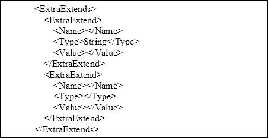
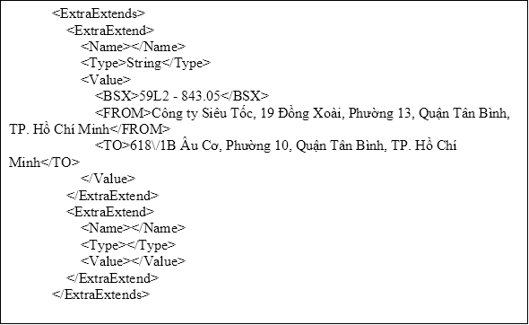

||||
| :- | :- | -: |

**CÔNG TY CỔ PHẦN DỊCH VỤ T-VAN HILO**

**DỰ ÁN: HÓA ĐƠN ĐIỆN TỬ**

**API Tích hợp**

Project code: HDDT

Document code: API Tích hợp

**Version 1.0**

|**Ngày** |**Version**|**Người cập nhật**|**Mô tả**|
| :- | :- | :- | :- |
|28/12/2022|1\.0|HuyenNT|Tạo mới|
|11/09/2023|1\.0.1|Gianglt|Cập nhật|
|25/9/2023|1\.0.2|HuyenNT|Cập nhật|
|25/3/2024|1\.0.3|HuyenNT|Cập nhật|
|17/5/2024|1\.0.4|HuyenNT|Cập nhật phần biên lai|
|24/07/2024|1\.0.5|Gianglt|Cập nhật bảng kê|

**Mục lục**

[**1**	**Giới thiệu	6****](#_toc172730830)**

[1.1	Mục đích sử dụng	6](#_toc172730831)

[1.2	Đối tượng sử dụng	6](#_toc172730832)

[1.3	Danh sách từ khóa viết tắt trong tài liệu	6](#_toc172730833)

[**2**	**Phương thức tích hợp	7****](#_toc172730834)

[2.1	Quy định chuẩn chung	7](#_toc172730835)

[2.1.1	Chuẩn định dạng dữ liệu	7](#_toc172730836)

[2.1.2	Mã lỗi	7](#_toc172730837)

[2.2	Tạo giá trị Authentication	8](#_toc172730838)

[2.2.1	Tạo giá trị Authen cho hóa đơn kí bằng HSM	8](#_toc172730839)

[2.2.2	Tạo chuỗi Authentication cho API phát hành hóa đơn bằng Token	10](#_toc172730840)

[2.3	Mô hình luồng của một số API	12](#_toc172730841)

[2.4	API tạo dự thảo hóa đơn	14](#_toc172730842)

[2.4.1	Mô hình tích hợp	15](#_toc172730843)

[2.4.2	Thông tin request	15](#_toc172730844)

[2.4.3	Thông tin response	22](#_toc172730845)

[2.5	API cập nhật hóa đơn dự thảo	27](#_toc172730846)

[2.5.1	Thông tin request	27](#_toc172730847)

[2.5.2	Thông tin response	34](#_toc172730848)

[2.6	API phát hành hóa đơn	39](#_toc172730849)

[2.6.1	Mô hình tích hợp	40](#_toc172730850)

[2.6.2	Thông tin request	40](#_toc172730851)

[2.6.3	Thông tin response	47](#_toc172730852)

[2.7	API phát hành hóa đơn đính kèm bảng kê	52](#_toc172730853)

[2.7.1	Mô hình tích hợp	53](#_toc172730854)

[2.7.2	Thông tin request	53](#_toc172730855)

[*2.7.2.1*	*xmlData:  thẻ <Invoice/>	53**](#_toc172730856)

[*2.7.2.2*	*xmlCatalog :  thẻ <Invoice/>	56**](#_toc172730857)

[*2.7.2.3*	*xmlData:  thẻ <Product/>	58**](#_toc172730858)

[*2.7.2.4*	*xmlCatalog :  thẻ <Product/>	59**](#_toc172730859)

[*2.7.2.5*	*thẻ <ExtraExtend/> nằm trong thẻ <ExtraExtends/>	60**](#_toc172730860)

[2.7.3	Thông tin response	64](#_toc172730861)

[2.8	API phát hành hóa đơn điện tử từ máy tính tiền không cần ký số	69](#_toc172730862)

[2.8.1	Thông tin request	69](#_toc172730863)

[2.8.2	Thông tin response	69](#_toc172730864)

[2.9	API phát hành phiếu xuất kho	70](#_toc172730865)

[2.9.1	Thông tin request	70](#_toc172730866)

[2.9.2	Thông tin response	72](#_toc172730867)

[2.10	API điều chỉnh hóa đơn	77](#_toc172730868)

[2.10.1	Thông tin request	77](#_toc172730869)

[2.10.2	Thông tin response	84](#_toc172730870)

[2.11	API thay thế hóa đơn	88](#_toc172730871)

[2.11.1	Thông tin request	88](#_toc172730872)

[2.11.2	Thông tin response	95](#_toc172730873)

[2.12	API ký hóa đơn bằng HSM	99](#_toc172730874)

[2.12.1	Thông tin request	99](#_toc172730875)

[2.12.2	Thông tin response	100](#_toc172730876)

[2.13	API ký hóa đơn bằng Token	100](#_toc172730877)

[2.13.1	API phát hành hóa đơn	100](#_toc172730878)

[*2.13.1.1*	*Thông tin request	101**](#_toc172730879)

[*2.13.1.2*	*Thông tin response	101**](#_toc172730880)

[*2.13.1.3*	*Thông tin request	102**](#_toc172730881)

[*2.13.1.4*	*Thông tin response	102**](#_toc172730882)

[2.13.2	Thay thế/Điều chỉnh hóa đơn	103](#_toc172730883)

[*2.13.2.1*	*Thông tin request	103**](#_toc172730884)

[*2.13.2.2*	*Thông tin response	104**](#_toc172730885)

[*2.13.2.3*	*Thông tin request	105**](#_toc172730886)

[*2.13.2.4*	*Thông tin response	106**](#_toc172730887)

[2.14	API tạo dự thảo biên bản hóa đơn có sai sót	107](#_toc172730888)

[2.14.1	Thông tin request	107](#_toc172730889)

[2.14.2	Thông tin response	109](#_toc172730890)

[2.15	Tạo và phát hành biên bản hóa đơn có sai sót	109](#_toc172730891)

[2.15.1	Thông tin request	109](#_toc172730892)

[2.15.2	Thông tin response	112](#_toc172730893)

[2.16	API Tạo dự thảo thông báo sai sót	112](#_toc172730894)

[2.16.1	Thông tin request	112](#_toc172730895)

[2.16.1	Thông tin response	113](#_toc172730896)

[2.17	Tạo và phát hành thông báo sai sót	114](#_toc172730897)

[2.17.1	Thông tin request	114](#_toc172730898)

[2.17.2	Thông tin response	115](#_toc172730899)

[2.18	Lấy thông tin thông báo sai sót	115](#_toc172730900)

[2.18.1	Thông tin request	115](#_toc172730901)

[2.18.1	Thông tin response	116](#_toc172730902)

[2.19	Xóa hóa đơn	116](#_toc172730903)

[2.19.1	Thông tin request	116](#_toc172730904)

[2.19.2	Thông tin response	116](#_toc172730905)

[2.20	Hủy hóa đơn	117](#_toc172730906)

[2.20.1	Thông tin request	117](#_toc172730907)

[2.20.2	Thông tin response	117](#_toc172730908)

[2.21	Một số API xử lý chung	118](#_toc172730909)

[2.21.1	API chuyển đổi hóa đơn	118](#_toc172730910)

[*2.21.1.1*	*Thông tin request	118**](#_toc172730911)

[*2.21.1.2*	*Thông tin response	118**](#_toc172730912)

[2.21.2	Lấy hóa đơn dạng pdf	118](#_toc172730913)

[*2.21.2.1*	*Thông tin request	118**](#_toc172730914)

[*2.21.2.2*	*Thông tin response	119**](#_toc172730915)

[2.21.3	Lấy hóa đơn dạng xml	119](#_toc172730916)

[*2.21.3.1*	*Thông tin request	119**](#_toc172730917)

[*2.21.3.2*	*Thông tin response	119**](#_toc172730918)

[2.21.4	Lấy hóa đơn dạng html	120](#_toc172730919)

[*2.21.4.1*	*Thông tin request	120**](#_toc172730920)

[*2.21.4.2*	*Thông tin response	120**](#_toc172730921)

[2.21.5	Lấy bảng kê dạng html	120](#_toc172730922)

[*2.21.5.1*	*Thông tin request	121**](#_toc172730923)

[*2.21.5.2*	*Thông tin response	121**](#_toc172730924)

[2.21.6	Xem thông tin 1 hóa đơn	121](#_toc172730925)

[*2.21.6.1*	*Thông tin request	121**](#_toc172730926)

[*2.21.6.2*	*Thông tin response	121**](#_toc172730927)

[2.21.7	Lấy danh sách hóa đơn	122](#_toc172730928)

[*2.21.7.1*	*Thông tin request	122**](#_toc172730929)

[*2.21.7.2*	*Thông tin response	122**](#_toc172730930)

[2.21.8	Tạo 1 mục Webhook để lấy thông tin hóa đơn:	123](#_toc172730931)

[2.21.9	Lấy thông tin dải hóa đơn còn tồn	124](#_toc172730932)

[2.21.10	Lấy thông tin chữ ký số sắp hết hạn	125](#_toc172730933)

[**3**	**API dành cho biên lai	126****](#_toc172730934)

[3.1	Tạo biên lai dự thảo	126](#_toc172730935)

[3.1.1	Thông tin request	126](#_toc172730936)

[3.1.2	Thông tin response	128](#_toc172730937)

[3.2	Tạo và phát hành biên lai	129](#_toc172730938)

[3.2.1	Thông tin request	129](#_toc172730939)

[3.2.2	Thông tin response	131](#_toc172730940)

[3.3	API ký biên lai bằng HSM	131](#_toc172730941)

[3.3.1	Thông tin request	131](#_toc172730942)

[3.3.2	Thông tin response	132](#_toc172730943)

[**4**	**Phụ lục:	133****](#_toc172730944)

[4.1	Danh mục  tính chất	133](#_toc172730945)

[4.2	Danh mục phương thức thanh toán	133](#_toc172730946)

[4.3	Danh mục thuế suất	134](#_toc172730947)

[**5**	**Error Code	134****](#_toc172730948)

1. # **GIỚI THIỆU**
   1. ## **Mục đích sử dụng**
- Tài liệu Tài liệu đặc tả service ký số được thiết kế để mô tả giải pháp tích hợp hệ thống hóa đơn điện tử  của Hilo với các hệ thống bán hàng, kế toán của doanh nghiệp sử dụng dịch vụ hóa đơn điện tử của Hilo.
  1. ## **Đối tượng sử dụng**
- Đội lập trình dự án Hilo Einvoice,
- Đội kỹ thuật của dự án thuộc đối tác, khách hàng mua sản phẩm gói phầm mềm hóa đơn của HiLo.
  1. ## **Danh sách từ khóa viết tắt trong tài liệu**

|**No.**|
**Terminologies** 

**Used**
|**Description**|
| :-: | :-: | :-: |
|1|HDDT|Phần mềm hóa đơn điện tử của Hilo|
|2|PMTH|Phần mềm kế toán của PMTH|
|3|HiLo|Công ty Cổ phần Dịch vụ T-Van Hilo|
||||

1. # **PHƯƠNG THỨC TÍCH HỢP**
- Giao thức trao đổi thông tin giữa phần mềm và hệ thống HDDT: Thông qua cuộc gọi hàm API, Webservice.
- API\_URI, username, password: được cung cấp để có thể tích hợp với hệ thống HDDT.
  1. ## **Quy định chuẩn chung**
     1. ### **Chuẩn định dạng dữ liệu**
- Dữ liệu message được trao đổi qua Web API theo định dạng JSON. 

Ví dụ về định dạng message theo json như sau:

|**Mô tả trường**|**json**|
| :-: | :-: |
|id:int value:string isValue:boolean|{ `   `“id”:123, `   `“value”:”toto”, `   `“isValue”:true }|
1. ### **Mã lỗi**

|**Mã lỗi**|**Mô tả mã lỗi**|
| :-: | :-: |
|200 OK|Success|
|201 Created|Success of a resource creation when using the POST method|
|400 Bad Request|The request parameters are incomplete or missing|
|403 Forbidden|The action or the request URI is not allowed by the system|
|404 Not Found|The resource referenced by the URI was not found|
|422 Unprocessable Entity|One of the requested action has generated an error|
|429 Too Many Requests|Your application is making too many requests and is being rate limited|
|500 Internal Server Error|Used in case of time out or when the request, otherwise correct, was not able to complete.|
1. ## **Tạo giá trị Authentication**
   1. ### **Tạo giá trị Authen cho hóa đơn kí bằng HSM**
Cần thêm Header “taxcode”, mã số thuế đơn vị phát hành hóa đơn. Để việc gọi API được bảo mật thì việc gọi API sẽ cần thêm Header "**Authentication**" với nội dung cụ thể như sau:

|**#**|**Bước**|**Chi tiết**|
| :- | :- | :- |
|1|
Bước 1: chuẩn bị các input

|
**{username}:** tài khoản được cấp để gọi hàm api.

**{password}:** mật khẩu được cấp để gọi hàm api.

**{nonce}:** là chuỗi sinh ra chỉ 1 lần duy nhất (ví dụ: Guid.NewGuid().ToString("N").ToLower()).

|
|2|Bước 2: tính {value}|
{**authenString**} = {**username**}:{**password**}:{**nonce**}

{**value**} = **Base64String**(mảng byte của {**authenString**})

|
|3|Bước 3: tạo header “Authentication’|Add header cho Request với tên: “Authentication” và giá trị là {value}|

- Example Java code:

|
- DefaultHttpClient httpClient = new DefaultHttpClient();

- HttpPost postRequest = new HttpPost(url);

- StringEntity input = new StringEntity(requestInvData, "UTF-8");

- postRequest.setEntity(input);

- postRequest.addHeader("Cache-Control", "no-cache");

- postRequest.addHeader("Accept", "\*/\*");

- postRequest.addHeader("TaxCode", "0106713804");

- String encodeString = "apidemo:apidemo123456:" + UUID.randomUUID().toString().toLowerCase();

- String encoding = Base64.getUrlEncoder().encodeToString(encodeString.getBytes());

- postRequest.addHeader("Authentication", encoding);

- postRequest.addHeader("Content-Type", "application/json");

- HttpResponse response1 = httpClient.execute(postRequest);
|
| :- |

- Example C# code:

|
- public class APIHelper

- `    `{

- `        `static string API\_URI = ConfigurationManager.AppSettings["API\_URI"];

- `        `static string API\_USER = ConfigurationManager.AppSettings["API\_USER"];

- `        `static string API\_PASS = ConfigurationManager.AppSettings["API\_PASS"];

- `        `public static string CallApi(string action, string data, out HttpStatusCode status)

- `        `{

- `            `var client = new RestClient(API\_URI);

- `            `var request = new RestRequest(action);

- `            `request.Method = Method.POST;

- `            `request.AddHeader("TaxCode", "0106713804");

- `            `request.AddHeader("Content-Type", "application/json");

- `            `request.AddHeader("Authentication", GenAuthentication(API\_USER, API\_PASS));

- `            `if (data != null)

- `                `request.AddParameter("application/json", data, ParameterType.RequestBody);

- `            `IRestResponse response = client.Execute(request);

- `            `status = response.StatusCode;

- `            `return response.Content;

- `        `}

- `        `static string GenAuthentication(string username, string password)

- `        `{

- `            `//Mã duy nhất

- `            `string nonce = Guid.NewGuid().ToString("N").ToLower();

- `            `//Tạo dữ liệu mã hóa

- `            `string value = String.Format("{0}:{1}:{2}", username, password, nonce);

- `            `string strBase64= Convert.ToBase64String(UnicodeEncoding.Default.GetBytes(value));

- `            `return strBase64;

- `        `}

- `    `}
|
| :- |
1. ### **Tạo chuỗi Authentication cho API phát hành hóa đơn bằng Token** 
`	`Cần thêm Header “taxcode”, mã số thuế đơn vị phát hành hóa đơn. Để việc gọi API được bảo mật thì việc gọi API sẽ cần thêm Header "**Authentication**" với nội dung cụ thể như sau:

|**#**|**Bước**|**Chi tiết**|
| :- | :- | :- |
|1|
Bước 1: chuẩn bị các input

|
**{username}:** tài khoản được cấp để gọi hàm api.

**{password}:** mật khẩu được cấp để gọi hàm api.

**{method}:** phương thức call api (ví dụ :post, put … )

|
|2|Bước 2: tính {value}|
{**authenString**} =

` `**{Chuỗi Hash}:**{**nonce**}**:**{**username**}:{**password**}

**{value} =** {**authenString**}
|
|3|Bước 3: tạo header “Authentication’|Add header cho Request với tên: “Authentication” và giá trị là {value}|

- Example C# code:

|
- public class APIHelper

- `    `{

- `        `static string API\_URI = ConfigurationManager.AppSettings["API\_URI"];

- `        `static string API\_USER = ConfigurationManager.AppSettings["API\_USER"];

- `        `static string API\_PASS = ConfigurationManager.AppSettings["API\_PASS"];

- `        `public static string CallApi(string method, string data, out HttpStatusCode status)

- `        `{

- `            `var client = new RestClient(API\_URI);

- `            `var request = new RestRequest(action);

- `            `request.Method = method;

- `            `request.AddHeader("TaxCode", "0106713804");

- `            `request.AddHeader("Content-Type", "application/json");

- `            `request.AddHeader("Authentication", getAuthentication (method,API\_USER, API\_PASS));

- `            `if (data != null)

- `                `request.AddParameter("application/json", data, ParameterType.RequestBody);

- `            `IRestResponse response = client.Execute(request);

- `            `status = response.StatusCode;

- `            `return response.Content;

- `        `}

- public String getAuthentication(String method, String User, String Password)

- {

- // Dữ liệu đầu vào

- String value = String.Format("{0}:{1}:{2}", User, Password, Guid.NewGuid().ToString("N").ToLower());

- // Mã duy nhất 

- var nonce = Guid.NewGuid().ToString("N").ToLower();

- DateTime epochStart = new DateTime(1970, 01, 01, 0, 0, 0, 0, DateTimeKind.Utc);

- TimeSpan currentTimes = DateTime.UtcNow - epochStart;

- var serverTotalSeconds = Convert.ToInt32(currentTimes.TotalSeconds);

- string data = String.Format("{0}{1}{2}", method, serverTotalSeconds, nonce);

- //Giá trị trả về 

- value = String.Format("{0}:{1}:{2}:{3}:{4}", getHashedData(data), nonce, serverTotalSeconds, User, Password);

- return value;

- }

- // Chuỗi băm

- static string getHashedData(string data)

- {

- MD5 md5 = MD5.Create();

- var hash = md5.ComputeHash(Encoding.Default.GetBytes(data));

- return Convert.ToBase64String(hash);

- `        `}
|
| :- |
||

1. ## **Mô hình luồng của một số API**

1. ## **API tạo dự thảo hóa đơn**

|**API**|**api/hoadon/taohoadon**|
| :- | :- |

Data: {“xmlData”:””,”pattern”:””,”serial”:””, “convert”: ,”UserCreate”:”” }

Method: POST

**Mô tả**

- **xmlData**: String XML dữ liệu hóa đơn (không được để trống)
- **pattern**: String - Mẫu số của hóa đơn. (không được để trống)
- **serial**: String - Ký hiệu của hóa đơn (không được để trống).
- **convert**: Boolean - Chuyển đổi font chữ sang Unicode (mặc định là false).
- **UserCreate**: Tên tài khoản của người lập hóa đơn (có thể null)** 
- **Trả về**: Json kết quả { ‘success’: true/false,’error’:’’, ‘messages’:’’, ‘data’:’’}
  1. ### **Mô hình tích hợp**

- ![ref1]Mô hình

**PMTH** gửi request yêu cầu đồng bộ dữ liệu danh mục từ phía **HDDT**;

**HDDT** thực hiện xử lý dữ liệu để trả thông tin qua response cho **PMTH**
1. ### **Thông tin request**

|**#**|**Tên chỉ tiêu**|**Bắt buộc**|**Kiểu dữ liệu**|**Thông tin**|
| :- | :- | :- | :- | :- |
||key|x|String|
Thông tin Key xác định hóa đơn: vidu: id bản ghi trên PMTH

Key= Unique

Key là key PMTH; - HDDT lưu key này lại;
|
||Fkey|x|String|Mã tra cứu hóa đơn|
||InvPattern|x|String|Mẫu số hóa đơn|
||InvSerial|x|String|Ký hiệu hóa đơn|
||Type||String|Loại hóa đơn|
||ComTaxCode||String|MST đơn vị phát hành|
||` `ComName||String|` `Tên đơn vị phát hành|
||ComAddress||String|Địa chỉ đơn vị phát hành|
||ComFax||String|Fax của đơn vị phát hành|
||CusCode||String|Mã khách hàng|
||CusTaxCode||String|MST khách hàng|
||CusName||String|Tên đơn vị mua hàng|
||Buyer||String|Họ tên người mua hàng|
||CusAddress||String|Địa chỉ đơn vị mua hàng|
||CusPhone||String|Số điện thoại đơn vị mua hàng|
||CusEmail||String|Email đơn vị mua hàng|
||CusBankName||String|Tên ngân hàng của đơn vị mua hàng|
||CusBankNo||String|Tài khoản ngân hàng đơn vị mua hàng|
||PaymentMethod|x|String|
Phương thức thanh toán

Tham khảo: ***3.2	[Danh mục phương thức thanh toán***](C:\Users\Admin\Documents\0. Mẫu tài liệu hệ thống \(003\)\0. Mẫu tài liệu hệ thống\6. HDDT_API Tích hợpdang lam.docx#Danh mục phương thức thanh toán)***
|
||Products|x|String|
Hàng hóa dịch vụ

Tham khảo [bảng dữ liệu Hàng hóa dịch vụ](C:\Users\Admin\Documents\0. Mẫu tài liệu hệ thống \(003\)\0. Mẫu tài liệu hệ thống\6. HDDT_API Tích hợpdang lam.docx#hanghoa)
|
||Fees||String|Phí|
||Discount||Number|Chiết khấu sản phẩm|
||DiscountAmount||Number|Tiền chiết khấu SP|
||VATRate||Number|
Thuế suất 

Tham khảo: ***3.3	[Danh mục thuế suất***](C:\Users\Admin\Documents\0. Mẫu tài liệu hệ thống \(003\)\0. Mẫu tài liệu hệ thống\6. HDDT_API Tích hợpdang lam.docx#Danh mục thuế suất)***
|
||VATAmount|x|Number|
Tiền thuế

19 ký tự, Số dương
|
||Total|x|Number|
Tiền trước thuế

19 ký tự, Số dương
|
||Amount|x|Number|
Tổng tiền sau thuế

19 ký tự, Số dương
|
||AmountInWords|x|String|
Số tiền bằng chữ

19 ký tự, Số dương
|
||ArisingDate|x|Date|Ngày phát sinh hóa đơn (mặc định là ngày hiện tại)|
||Currency|x|String|
Đơn vị tiền tệ

3 ký tự
|
||Note||String|Ghi chú|
||GrossValue||Number|Tiền trước thuế (đối với các trường hợp KCT, KKKTNT, )|
||GrossValue0||Number|Tiền trước thuế với mức thuế suất 0%|
||VatAmount0||Number|Tiền thuế với thuế suất 0%|
||GrossValue5||Number|Tiền trước thuế với mức thuế suất 5%|
||VatAmount5||Number|Tiền thuế với thuế suất 5%|
||GrossValue8||Number|Tiền trước thuế với mức thuế suất 8%|
||VatAmount8||Number|Tiền thuế với thuế suất 8%|
||GrossValue10||Number|Tiền trước thuế với mức thuế suất 10%|
||VatAmount10||Number|Tiền thuế với thuế suất 10%|

- Dữ liệu hàng hóa dịch vụ:

|**#**|**Tên chỉ tiêu**|**Băt buộc**|**Kiểu dữ liệu**|**Thông tin**|
| :- | :- | :- | :- | :- |
||OrderBy||Number|Sắp xếp thứ tự sản phầm|
||Code||String|Mã sản phẩm|
||ProdName|x|String|Tên sản phẩm|
||ProdPrice||Number|Đơn giá|
||ProdQuantity||Number|Số lượng|
||ProdUnit||String|Đơn vị tính|
||Total||Number|Tổng tiền sản phẩm|
||VATRate||Number|
Thuế suất sản phẩm

Tham khảo: ***[3.7	Danh mục thuế suất***](C:\Users\Admin\Documents\0. Mẫu tài liệu hệ thống \(003\)\0. Mẫu tài liệu hệ thống\6. HDDT_API Tích hợpdang lam.docx#Danh mục thuế suất)***
|
||VATAmount||Number|Tiền thuế sản phẩm|
||IsSum||True/False|Check sản phẩm chiết khấu/ không chiết khấu|
||Discount||Number|Chiết khấu sản phẩm|
||DiscountAmount||Number|Tiền chiết khấu SP|
||Amount||Number|Tổng tiền|
||Characteristic||Number|[Tính chất sản phẩm](C:\Users\Admin\Documents\0. Mẫu tài liệu hệ thống \(003\)\0. Mẫu tài liệu hệ thống\6. HDDT_API Tích hợpdang lam.docx#Danh mục  tính chất)|
||Extra01||String|Trường mở rộng|
||Extra02||String|Trường mở rộng|

- *Lưu ý: Thông tin khách hàng:*

- Để xác định được thông tin người mua, hệ thống bắt buộc dữ liệu phải tồn tại 1 trong 2 thông tin sau:

<table><tr><th colspan="1" valign="top"><b>#</b></th><th colspan="1" valign="top"><b>Phân loại</b></th><th colspan="1" valign="top"><b>Thông tin</b></th><th colspan="1" valign="top"><b>Ý nghĩa</b></th></tr>
<tr><td colspan="1" rowspan="3" valign="top">1</td><td colspan="1" rowspan="3" valign="top">Khách hàng doanh nghiệp</td><td colspan="1" valign="top">CusTaxCode</td><td colspan="1" valign="top">Mã số thuế</td></tr>
<tr><td colspan="1" valign="top">CusName</td><td colspan="1" valign="top">Tên đơn vị mua hàng</td></tr>
<tr><td colspan="1" valign="top">CusAddress</td><td colspan="1" valign="top">Địa chỉ đơn vị mua hàng</td></tr>
<tr><td colspan="1" valign="top">2</td><td colspan="1" valign="top">Khách hàng cá nhân</td><td colspan="1" valign="top">Buyer</td><td colspan="1" valign="top">Tên người mua hàng</td></tr>
</table>

- Nếu tồn tại 1 trong ba thông tin (CusTaxCode,CusName,CusAddress) thì phải check tồn tại đồng thời 3 chỉ tiêu (CusTaxCode,CusName,CusAddress);

- Nếu không tồn tại chỉ tiêu nào trong 3 chỉ tiêu (CusTaxCode,CusName,CusAddress) thì phải check tồn tại buyer

- Mẫu nội dung Xml data:

|
- <Invoices>

- `	`<Inv>

- `		`<key>Giá trị khóa để xác định cho hóa đơn là duy nhất</key>

- `		`<Invoice>

- `			`<InvPattern>Mẫu số hóa đơn</InvPattern>

- `			`<InvSerial>Ký hiệu hóa đơn</InvSerial>

- `			`<Fkey>Mã tra cứu hóa đơn</Fkey>

- `			`<ComName>Tên doanh nghiệp</ComName>

- `			`<ComAddress>Địa chỉ doanh nghiệp</ComAddress>

- `			`<ComTaxCode>Mã số thuế doanh nghiệp</ComTaxCode>

- `			`<ComFax>Fax doanh nghiệp</ComFax>

- `			`<CusCode>Mã khách hàng</CusCode>

- `			`<CusName>Tên khách hàng\*</CusName>

- `			`<CusAddress>Địa chỉ khách hàng</CusAddress>

- `			`<CusPhone>Điện thoại khách hàng</CusPhone>

- `			`<CusEmail>Mail khách hàng (mail nhận thông báo)</CusEmail>

- `	`<CusTaxCode>Mã số thuế KH (Bắt buộc với KH là Doanh nghiệp) </CusTaxCode>

- `			`<CusBankNo>Số tài khoản ngân hàng</CusBankNo>

- `			`<CusBankName>Tên ngân hàng</CusBankName>

- `			`<CusFax>Fax khách hàng</CusFax>

- `			`<Buyer>Họ tên người mua hàng</Buyer>

- `			`<PaymentMethod>Phương thức thanh toán\*</PaymentMethod>

- `			`<Products>

- `				`<Product>

- `					`<OrderBy>Sắp xếp thứ tự sản phẩm</OrderBy>

- `					`<Code>Mã sản phẩm</Code>

- `					`<ProdName>Tên sản phẩm\*</ProdName>

- `					`<ProdUnit>Đơn vị tính</ProdUnit>

- `					`<ProdQuantity>Số lượng</ProdQuantity>

- `	`<ProdPrice>Đơn giá</ProdPrice>

- `	`<Extra></Extra>

- `	`<Remark></Remark>

- `	`<Total>Tiền trước thuế\*</Total>

- <VATRate> </ VATRate>

- `	`<Amount>Tổng tiền\*</Amount>

- `	`<VATAmount>Tiền thuế</VATAmount>

- `	`<Discount>Chiết khấu</Discount>

- `	`<DiscountAmount>Tiền chiết khấu</DiscountAmount>

- `	`<IsSum>Check sản phẩm chiết khấu</IsSum>

- `	`<Extra01></Extra01>

- `	`<Extra02></Extra02>

- </Product>

- `			`</Products>

- <Fees>

- `	`<Fee>

- `		`<Name>Tên loại phí</Name>

- `		`<Value>Số tiền phí</Value>

- `	`</Fee>

- </Fees>

- <Discount>Chiết khấu</Discount>

- <DiscountAmount>Tiền chiết khấu</DiscountAmount>

- <Total>Tiền trước thuế\*</Total>

- <VATRate>Thuế suất (%)(-1: Không tính thuế, 0: Thuế = 0%, 10: thuế = 10%, 8: Thuế =8% ,5: Thuế = 5%, -2: Không kê khai, tính nộp thuế GTGT, -3: Trường hợp khác)</ VATRate>

- <VATAmount>Tiền thuế GTGT\*</VATAmount>

- <Amount>Tổng tiền\*</Amount>

- <AmountInWords>Số tiền viết bằng chữ\*</AmountInWords>

- <Extra></Extra>

- <ArisingDate>Ngày phát sinh hóa đơn (mặc định là ngày hiện tại)\*</ArisingDate>

- `	`<Note>Ghi chú</Note>

- `	`<OrderNo></OrderNo>

- `	`<OrderDate></OrderDate>

- `	`<GrossValue></GrossValue>

- `	`<GrossValue0></GrossValue0>

- `	`<VatAmount0></VatAmount0>

- `	`<GrossValue5></GrossValue5>

- `	`<VatAmount5></VatAmount5>

- `	`<GrossValue10></GrossValue10>

- `	`<VatAmount10></VatAmount10>

- `	`<Remark></Remark>

- `	`<InvoiceType></InvoiceType>

- `	`<Currency>Tiền tệ</Currency>

- `	`<Extra>Tỷ giá</Extra>

- `		`</Invoice>

- `	`</Inv>

- `	`<Inv>...</Inv>

- </Invoices>
|
| :- |
1. ### **Thông tin response**

|**Kết quả trả về**|**Mô tả**|**Detail Error**|**Detail Message**|**Ghi chú**|
| :- | :- | :- | :- | :- |
|
success: true

data: [{“fkey”: “chuỗi định dạng của hóa đơn”,”key”: “Mã duy nhất của hóa đơn”, “serial”: Ký hiệu hóa đơn điện tử,”pattern”: Mẫu số hóa đơn, “no”: số hóa đơn}, {…}]
|
- Đã phát hành hóa đơn thành công.

- data trả về danh sách thông tin số hóa đơn tương ứng với mã giao dịch: Ký hiệu HDDT, Mẫu số
|
success

|
success

||
|
success: false

message: Input data is invalid
|Dữ liệu đầu vào không hợp lệ|
E\_InvPattern\_Null

|
Pattern is null

|Pattern không được để trống|
|
success: false

message: Input data is invalid
|Dữ liệu đầu vào không hợp lệ|
E\_InvSerial\_Null

|
Serial is null

|Serial không được để trống|
|
success: false

message: Input data is invalid
|Dữ liệu đầu vào không hợp lệ|
E\_PublishInvoice\_Not\_Exist

|
PublishInvoice is not exists

|
Dải hóa đơn hết số, bị hủy hoặc không tồn tại

|
|
success: false

message: Input data is invalid
|Dữ liệu đầu vào không hợp lệ|
E\_Batch\_Exceed

|
Batch exceed the maximum

|
Số lượng lô hóa đơn > 1000

|
|
success: false

message: Input data is invalid

|Dữ liệu đầu vào không hợp lệ|
E\_PublishInvoice\_Not\_Enough

|
Avaiable publishInvoice is not enough

|
Số lượng lô hóa đơn > số lượng hóa đơn còn lại của dải

|
|
success: false

message: Input data is invalid
|Dữ liệu đầu vào không hợp lệ|
E\_CreateUser\_Invalid

|
CreateUser is not exists

|
CreateUser không tồn tại trong csdl

|
|
success: false

message: Input data is invalid
|Dữ liệu đầu vào không hợp lệ|
E\_Fkey\_Null

|
Fkey is null

|Fkey không được trống|
|
success: false

message: Input data is invalid
|Dữ liệu đầu vào không hợp lệ|E\_FKey\_Duplicate|FKey existed|Fkey đã tồn tại trong cơ sở dữ liệu|
|
success: false

message: Input data is invalid
|Dữ liệu đầu vào không hợp lệ|
E\_Customer\_Null

|
E\_Customer is null

|
Cả buyer và customer đều không được trống

|
|
success: false

message: Input data is invalid
|Dữ liệu đầu vào không hợp lệ|
E\_CusAddress\_Null

|
CusAddress is null

|CusAddress không được trống|
|
success: false

message: Input data is invalid
|Dữ liệu đầu vào không hợp lệ|
E\_PaymentMethod\_Null

|
PaymentMethod is null

|PaymentMethod không được trống|
|
success: false

message: Input data is invalid
|Dữ liệu đầu vào không hợp lệ|
E\_PaymentMethod\_Invalid

|
PaymentMethod is invalid value

|PaymentMethod phải là 1 trong: TM, CK, TM/CK, TTD, Nội bộ, Bù trừ|
|
success: false

message: Input data is invalid
|Dữ liệu đầu vào không hợp lệ|
E\_VATRate\_Null

|
VATRate is null

|VATRate không được trống|
|
success: false

message: Input data is invalid
|Dữ liệu đầu vào không hợp lệ|
E\_VATRate\_Invalid

|
VATRate is invalid value

|
VATRate phải là 1 trong: -1, 0, 5, 10

|
|
success: false

message: Input data is invalid
|Dữ liệu đầu vào không hợp lệ|
E\_Total\_Null

|
Total is null

|Total không được trống|
|
success: false

message: Input data is invalid
|Dữ liệu đầu vào không hợp lệ|
E\_Total\_Invalid

|
Total is invalid value

|
Total phải là số và > 0

|
|
success: false

message: Input data is invalid
|Dữ liệu đầu vào không hợp lệ|
E\_VATAmount\_Null

|
VATAmount is null

|VATAmount không được trống|
|
success: false

message: Input data is invalid
|Dữ liệu đầu vào không hợp lệ|
E\_VATAmount\_Invalid

|
VATAmount is invalid value

|
VATAmount phải là số và > 0

|
|
success: false

message: Input data is invalid
|Dữ liệu đầu vào không hợp lệ|
E\_Amount\_Null

|
Amount is null

|Amount không được trống|
|
success: false

message: Input data is invalid
|Dữ liệu đầu vào không hợp lệ|
E\_Amount\_Invalid

|
Amount is invalid value

|
Amount phải là số và > 0

|
|
success: false

message: Input data is invalid
|Dữ liệu đầu vào không hợp lệ|
E\_Currency\_Null

|
Currency is null

|Currency không được trống|

**Mẫu response thành công:**

|
{

`    `"data": [

`        `{

`            `"pattern": "mẫu số hóa đơn",

`            `"serial": "ký hiệu hóa đơn",

`            `"fkey": "mã tra cứu hóa đơn",

`            `"key": "mã tra cứu hóa đơn",

`            `"no": "Số hóa đơn",

`            `"detailError": **chi tiết lỗi**,

`            `"detailMessages": **Thông báo lỗi chi tiết**

`        `}

`    `],

`    `"lstXmlData": **null**,

`    `"Code": Mã lỗi,

`    `"success": **true**,

`    `"error": **null**,

`    `"messages": **null**,

`    `"Message": **null**

}

|
| :- |
**Mẫu response không thành công**

|
{

`    `"Code": Mã,

`    `"success": **false**,

`    `"error": "Mã lỗi",

`    `"messages": "Thông báo lỗi",

`    `"Message": " Thông báo lỗi ",

`    `"Data": [

`        `{

`            `"fkey": "mã tra cứu hóa đơn",

`            `"no": "số hóa đơn",

`            `"pattern": "mẫu số hóa đơn",

`            `"serial": "ký hiệu hóa đơn"

`        `}

`    `]

}

|
| :- |

1. ## **API cập nhật hóa đơn dự thảo**

|**API**|**api/hoadon/update**|
| :- | :- |

Method: POST

**Mô tả**

- **xmlData**: String XML dữ liệu hóa đơn (không được để trống)
- **pattern**: String - Mẫu số của hóa đơn. (không được để trống)
- **serial**: String - Ký hiệu của hóa đơn (không được để trống).
- **convert**: Boolean - Chuyển đổi font chữ sang Unicode (mặc định là false).
- **Trả về**: Json kết quả { ‘success’: true/false,’error’:’’, ‘messages’:’’, ‘data’:’’}
  1. ### **Thông tin request**

|**#**|**Tên chỉ tiêu**|**Bắt buộc**|**Kiểu dữ liệu**|**Thông tin**|
| :- | :- | :- | :- | :- |
||key|x|String|Mã tra cứu của hóa đơn cần cập nhật|
||InvPattern|x|String|Mẫu số hóa đơn|
||InvSerial|x|String|Ký hiệu hóa đơn|
||ComTaxCode||String|MST đơn vị phát hành|
||` `ComName||String|` `Tên đơn vị phát hành|
||ComAddress||String|Địa chỉ đơn vị phát hành|
||ComFax||String|Fax của đơn vị phát hành|
||CusCode||String|Mã khách hàng|
||CusTaxCode||String|MST khách hàng|
||CusName||String|Tên đơn vị mua hàng|
||Buyer||String|Họ tên người mua hàng|
||CusAddress||String|Địa chỉ đơn vị mua hàng|
||CusPhone||String|Số điện thoại đơn vị mua hàng|
||CusEmail||String|Email đơn vị mua hàng|
||CusBankName||String|Tên ngân hàng của đơn vị mua hàng|
||CusBankNo||String|Tài khoản ngân hàng đơn vị mua hàng|
||PaymentMethod|x|String|
Phương thức thanh toán

Tham khảo: ***3.5	[Danh mục phương thức thanh toán***](C:\Users\Admin\Documents\0. Mẫu tài liệu hệ thống \(003\)\0. Mẫu tài liệu hệ thống\6. HDDT_API Tích hợpdang lam.docx#Danh mục phương thức thanh toán)***
|
||Products|x|String|
Hàng hóa dịch vụ

Tham khảo [bảng dữ liệu Hàng hóa dịch vụ](C:\Users\Admin\Documents\0. Mẫu tài liệu hệ thống \(003\)\0. Mẫu tài liệu hệ thống\6. HDDT_API Tích hợpdang lam.docx#hanghoa)
|
||Fees||String|Phí|
||Discount||Number|Chiết khấu sản phẩm|
||DiscountAmount||Number|Tiền chiết khấu SP|
||VATRate||Number|
Thuế suất 

Tham khảo: ***3.7	Danh mục thuế suất***
|
||VATAmount|x|Number|
Tiền thuế

19 ký tự, Số dương
|
||Total|x|Number|
Tiền trước thuế

19 ký tự, Số dương
|
||Amount|x|Number|
Tổng tiền sau thuế

19 ký tự, Số dương
|
||AmountInWords|x|String|
Số tiền bằng chữ

19 ký tự, Số dương
|
||ArisingDate|x|Date|Ngày phát sinh hóa đơn (mặc định là ngày hiện tại)|
||Currency|x|String|
Đơn vị tiền tệ

3 ký tự
|
||Note||String|Ghi chú|
||GrossValue||Number|Tiền trước thuế (đối với các trường hợp KCT, KKKTNT, )|
||GrossValue0||Number|Tiền trước thuế với mức thuế suất 0%|
||VatAmount0||Number|Tiền thuế với thuế suất 0%|
||GrossValue5||Number|Tiền trước thuế với mức thuế suất 5%|
||VatAmount5||Number|Tiền thuế với thuế suất 5%|
||GrossValue8||Number|Tiền trước thuế với mức thuế suất 8%|
||VatAmount8||Number|Tiền thuế với thuế suất 8%|
||GrossValue10||Number|Tiền trước thuế với mức thuế suất 10%|
||VatAmount10||Number|Tiền thuế với thuế suất 10%|

- Dữ liệu hàng hóa dịch vụ:

|**#**|**Tên chỉ tiêu**|**Băt buộc**|**Kiểu dữ liệu**|**Thông tin**|
| :- | :- | :- | :- | :- |
||OrderBy||Number|Sắp xếp thứ tự sản phầm|
||Code||String|Mã sản phẩm|
||ProdName|x|String|Tên sản phẩm|
||ProdPrice||Number|Đơn giá|
||ProdQuantity||Number|Số lượng|
||ProdUnit||String|Đơn vị tính|
||Total||Number|Tổng tiền sản phẩm|
||VATRate||Number|
Thuế suất sản phẩm

Tham khảo: ***[3.7	Danh mục thuế suất***](C:\Users\Admin\Documents\0. Mẫu tài liệu hệ thống \(003\)\0. Mẫu tài liệu hệ thống\6. HDDT_API Tích hợpdang lam.docx#Danh mục thuế suất)***
|
||VATAmount||Number|Tiền thuế sản phẩm|
||IsSum||True/False|Check sản phẩm chiết khấu/ không chiết khấu|
||Discount||Number|Chiết khấu sản phẩm|
||DiscountAmount||Number|Tiền chiết khấu SP|
||Amount||Number|Tổng tiền|
||Characteristic||Number|[Tính chất sản phẩm](C:\Users\Admin\Documents\0. Mẫu tài liệu hệ thống \(003\)\0. Mẫu tài liệu hệ thống\6. HDDT_API Tích hợpdang lam.docx#Danh mục  tính chất)|
||Extra01||String|Trường mở rộng|
||Extra02||String|Trường mở rộng|

- *Lưu ý: Thông tin khách hàng:*

- Để xác định được thông tin người mua, hệ thống bắt buộc dữ liệu phải tồn tại 1 trong 2 thông tin sau:

<table><tr><th colspan="1" valign="top"><b>#</b></th><th colspan="1" valign="top"><b>Phân loại</b></th><th colspan="1" valign="top"><b>Thông tin</b></th><th colspan="1" valign="top"><b>Ý nghĩa</b></th></tr>
<tr><td colspan="1" rowspan="3" valign="top">1</td><td colspan="1" rowspan="3" valign="top">Khách hàng doanh nghiệp</td><td colspan="1" valign="top">CusTaxCode</td><td colspan="1" valign="top">Mã số thuế</td></tr>
<tr><td colspan="1" valign="top">CusName</td><td colspan="1" valign="top">Tên đơn vị mua hàng</td></tr>
<tr><td colspan="1" valign="top">CusAddress</td><td colspan="1" valign="top">Địa chỉ đơn vị mua hàng</td></tr>
<tr><td colspan="1" valign="top">2</td><td colspan="1" valign="top">Khách hàng cá nhân</td><td colspan="1" valign="top">Buyer</td><td colspan="1" valign="top">Tên người mua hàng</td></tr>
</table>

- Nếu tồn tại 1 trong ba thông tin (CusTaxCode,CusName,CusAddress) thì phải check tồn tại đồng thời 3 chỉ tiêu (CusTaxCode,CusName,CusAddress);

- Nếu không tồn tại chỉ tiêu nào trong 3 chỉ tiêu (CusTaxCode,CusName,CusAddress) thì phải check tồn tại buyer

- Method: POST

- Mẫu nội dung Xml data:

|
- <Invoices>

- `	`<Inv>

- `		`<key>Giá trị khóa để xác định cho hóa đơn là duy nhất</key>

- `		`<Invoice>

- `			`<InvPattern>Mẫu số hóa đơn</InvPattern>

- `			`<InvSerial>Ký hiệu hóa đơn</InvSerial>

- `			`<Fkey>Mã tra cứu hóa đơn</Fkey>

- `			`<ComName>Tên doanh nghiệp</ComName>

- `			`<ComAddress>Địa chỉ doanh nghiệp</ComAddress>

- `			`<ComTaxCode>Mã số thuế doanh nghiệp</ComTaxCode>

- `			`<ComFax>Fax doanh nghiệp</ComFax>

- `			`<CusCode>Mã khách hàng</CusCode>

- `			`<CusName>Tên khách hàng\*</CusName>

- `			`<CusAddress>Địa chỉ khách hàng</CusAddress>

- `			`<CusPhone>Điện thoại khách hàng</CusPhone>

- `			`<CusEmail>Mail khách hàng (mail nhận thông báo)</CusEmail>

- `	`<CusTaxCode>Mã số thuế KH (Bắt buộc với KH là Doanh nghiệp) </CusTaxCode>

- `			`<CusBankNo>Số tài khoản ngân hàng</CusBankNo>

- `			`<CusBankName>Tên ngân hàng</CusBankName>

- `			`<CusFax>Fax khách hàng</CusFax>

- `			`<Buyer>Họ tên người mua hàng</Buyer>

- `			`<PaymentMethod>Phương thức thanh toán\*</PaymentMethod>

- `			`<Products>

- `				`<Product>

- `					`<OrderBy>Sắp xếp thứ tự sản phẩm</OrderBy>

- `					`<Code>Mã sản phẩm</Code>

- `					`<ProdName>Tên sản phẩm\*</ProdName>

- `					`<ProdUnit>Đơn vị tính</ProdUnit>

- `					`<ProdQuantity>Số lượng</ProdQuantity>

- `	`<ProdPrice>Đơn giá</ProdPrice>

- `	`<Extra></Extra>

- `	`<Remark></Remark>

- `	`<Total>Tiền trước thuế\*</Total>

- <VATRate>Thuế suất (%)(-1: Không tính thuế, 0: Thuế = 0%, 10: thuế = 10%, 8: Thuế =8% ,5: Thuế = 5%, -2: Không kê khai, tính nộp thuế GTGT, -3: Trường hợp khác)</ VATRate>

- `	`<Amount>Tổng tiền\*</Amount>

- `	`<VATAmount>Tiền thuế</VATAmount>

- `	`<Discount>Chiết khấu</Discount>

- `	`<DiscountAmount>Tiền chiết khấu</DiscountAmount>

- `	`<IsSum>Check sản phẩm chiết khấu</IsSum>

- `	`<Extra01></Extra01>

- `	`<Extra02></Extra02>

- </Product>

- `			`</Products>

- <Fees>

- `	`<Fee>

- `		`<Name>Tên loại phí</Name>

- `		`<Value>Số tiền phí</Value>

- `	`</Fee>

- </Fees>

- <Discount>Chiết khấu</Discount>

- <DiscountAmount>Tiền chiết khấu</DiscountAmount>

- <Total>Tiền trước thuế\*</Total>

- <VATRate>Thuế suất (%)(-1: Không tính thuế, 0: Thuế = 0%, 10: thuế = 10%, 8: Thuế =8% ,5: Thuế = 5%, -2: Không kê khai, tính nộp thuế GTGT, -3: Trường hợp khác)</ VATRate>

- <VATAmount>Tiền thuế GTGT\*</VATAmount>

- <Amount>Tổng tiền\*</Amount>

- <AmountInWords>Số tiền viết bằng chữ\*</AmountInWords>

- <Extra></Extra>

- <ArisingDate>Ngày phát sinh hóa đơn (mặc định là ngày hiện tại)\*</ArisingDate>

- `	`<Note>Ghi chú</Note>

- `	`<OrderNo></OrderNo>

- `	`<OrderDate></OrderDate>

- `	`<GrossValue></GrossValue>

- `	`<GrossValue0></GrossValue0>

- `	`<VatAmount0></VatAmount0>

- `	`<GrossValue5></GrossValue5>

- `	`<VatAmount5></VatAmount5>

- `	`<GrossValue10></GrossValue10>

- `	`<VatAmount10></VatAmount10>

- `	`<Remark></Remark>

- `	`<InvoiceType></InvoiceType>

- `	`<Currency>Tiền tệ</Currency>

- `	`<Extra>Tỷ giá</Extra>

- `		`</Invoice>

- `	`</Inv>

- `	`<Inv>...</Inv>

- </Invoices>
|
| :- |
1. ### **Thông tin response**

|**Kết quả trả về**|**Mô tả**|**Detail Error**|**Detail Message**|**Ghi chú**|
| :- | :- | :- | :- | :- |
|
success: true

data: [{“fkey”: “chuỗi định dạng của hóa đơn”,”key”: “Mã duy nhất của hóa đơn”, “serial”: Ký hiệu hóa đơn điện tử,”pattern”: Mẫu số hóa đơn, “no”: số hóa đơn}, {…}]
|
- Đã phát hành hóa đơn thành công.

- data trả về danh sách thông tin số hóa đơn tương ứng với mã giao dịch: Ký hiệu HDDT, Mẫu số
|
success

|
success

||
|
success: false

message: Input data is invalid
|Dữ liệu đầu vào không hợp lệ|
E\_InvPattern\_Null

|
Pattern is null

|Pattern không được để trống|
|
success: false

message: Input data is invalid
|Dữ liệu đầu vào không hợp lệ|
E\_InvSerial\_Null

|
Serial is null

|Serial không được để trống|
|
success: false

message: Input data is invalid
|Dữ liệu đầu vào không hợp lệ|
E\_PublishInvoice\_Not\_Exist

|
PublishInvoice is not exists

|
Dải hóa đơn hết số, bị hủy hoặc không tồn tại

|
|
success: false

message: Input data is invalid
|Dữ liệu đầu vào không hợp lệ|
E\_Batch\_Exceed

|
Batch exceed the maximum

|
Số lượng lô hóa đơn > 1000

|
|
success: false

message: Input data is invalid

|Dữ liệu đầu vào không hợp lệ|
E\_PublishInvoice\_Not\_Enough

|
Avaiable publishInvoice is not enough

|
Số lượng lô hóa đơn > số lượng hóa đơn còn lại của dải

|
|
success: false

message: Input data is invalid
|Dữ liệu đầu vào không hợp lệ|
E\_CreateUser\_Invalid

|
CreateUser is not exists

|
CreateUser không tồn tại trong csdl

|
|
success: false

message: Input data is invalid
|Dữ liệu đầu vào không hợp lệ|
E\_Fkey\_Null

|
Fkey is null

|Fkey không được trống|
|
success: false

message: Input data is invalid
|Dữ liệu đầu vào không hợp lệ|E\_FKey\_Duplicate|FKey existed|Fkey đã tồn tại trong cơ sở dữ liệu|
|
success: false

message: Input data is invalid
|Dữ liệu đầu vào không hợp lệ|
E\_Customer\_Null

|
E\_Customer is null

|
Cả buyer và customer đều không được trống

|
|
success: false

message: Input data is invalid
|Dữ liệu đầu vào không hợp lệ|
E\_CusAddress\_Null

|
CusAddress is null

|CusAddress không được trống|
|
success: false

message: Input data is invalid
|Dữ liệu đầu vào không hợp lệ|
E\_PaymentMethod\_Null

|
PaymentMethod is null

|PaymentMethod không được trống|
|
success: false

message: Input data is invalid
|Dữ liệu đầu vào không hợp lệ|
E\_PaymentMethod\_Invalid

|
PaymentMethod is invalid value

|PaymentMethod phải là 1 trong: TM, CK, TM/CK, TTD, Nội bộ, Bù trừ|
|
success: false

message: Input data is invalid
|Dữ liệu đầu vào không hợp lệ|
E\_VATRate\_Null

|
VATRate is null

|VATRate không được trống|
|
success: false

message: Input data is invalid
|Dữ liệu đầu vào không hợp lệ|
E\_VATRate\_Invalid

|
VATRate is invalid value

|
VATRate phải là 1 trong: -1, 0, 5, 10

|
|
success: false

message: Input data is invalid
|Dữ liệu đầu vào không hợp lệ|
E\_Total\_Null

|
Total is null

|Total không được trống|
|
success: false

message: Input data is invalid
|Dữ liệu đầu vào không hợp lệ|
E\_Total\_Invalid

|
Total is invalid value

|
Total phải là số và > 0

|
|
success: false

message: Input data is invalid
|Dữ liệu đầu vào không hợp lệ|
E\_VATAmount\_Null

|
VATAmount is null

|VATAmount không được trống|
|
success: false

message: Input data is invalid
|Dữ liệu đầu vào không hợp lệ|
E\_VATAmount\_Invalid

|
VATAmount is invalid value

|
VATAmount phải là số và > 0

|
|
success: false

message: Input data is invalid
|Dữ liệu đầu vào không hợp lệ|
E\_Amount\_Null

|
Amount is null

|Amount không được trống|
|
success: false

message: Input data is invalid
|Dữ liệu đầu vào không hợp lệ|
E\_Amount\_Invalid

|
Amount is invalid value

|
Amount phải là số và > 0

|
|
success: false

message: Input data is invalid
|Dữ liệu đầu vào không hợp lệ|
E\_Currency\_Null

|
Currency is null

|Currency không được trống|

**Mẫu response thành công:**

|
{

`    `"data": [

`        `{

`            `"pattern": "mẫu số hóa đơn",

`            `"serial": "ký hiệu hóa đơn",

`            `"fkey": "mã tra cứu hóa đơn",

`            `"key": "mã tra cứu hóa đơn",

`            `"no": "Số hóa đơn",

`            `"detailError": **chi tiết lỗi**,

`            `"detailMessages": **Thông báo lỗi chi tiết**

`        `}

`    `],

`    `"lstXmlData": **null**,

`    `"Code": Mã lỗi,

`    `"success": **true**,

`    `"error": **null**,

`    `"messages": **null**,

`    `"Message": **null**

}

|
| :- |
**Mẫu response không thành công**

|
{

`    `"Code": Mã,

`    `"success": **false**,

`    `"error": "Mã lỗi",

`    `"messages": "Thông báo lỗi",

`    `"Message": " Thông báo lỗi ",

`    `"Data": [

`        `{

`            `"fkey": "mã tra cứu hóa đơn",

`            `"no": "số hóa đơn",

`            `"pattern": "mẫu số hóa đơn",

`            `"serial": "ký hiệu hóa đơn"

`        `}

`    `]

}

|
| :- |

- Note: 

**Tiền tố ERR à có lỗi khi thực hiện hàm**
1. ## **API phát hành hóa đơn** 

|**API**|**api/hoadon/xuathoadon**|
| :- | :- |

Data: {“xmlData”:””,”pattern”:””,”serial”:””, “convert”: ,”UserCreate”:”” }

Method: POST

**Mô tả**

- **xmlData**: String XML dữ liệu hóa đơn (không được để trống)
- **pattern**: String - Mẫu số của hóa đơn. (không được để trống)
- **serial**: String - Ký hiệu của hóa đơn (không được để trống).
- **convert**: Boolean - Chuyển đổi font chữ sang Unicode (mặc định là false).
- **UserCreate**: Tên tài khoản của người lập hóa đơn (có thể null)** 
- **Trả về**: Json kết quả { ‘success’: true/false,’error’:’’, ‘messages’:’’, ‘data’:’’}
  1. ### **Mô hình tích hợp**

- ![ref1]Mô hình

**PMTH** gửi request yêu cầu đồng bộ dữ liệu danh mục từ phía **HDDT**;

**HDDT** thực hiện xử lý dữ liệu để trả thông tin qua response cho **PMTH**
1. ### **Thông tin request**

|**#**|**Tên chỉ tiêu**|**Bắt buộc**|**Kiểu dữ liệu**|**Thông tin**|
| :- | :- | :- | :- | :- |
||key|x|String|
Thông tin Key xác định hóa đơn: vidu: id bản ghi trên PMTH

Key= Unique

Key là key PMTH; - HDDT lưu key này lại;
|
||Fkey|x|String|Mã tra cứu hóa đơn|
||InvPattern|x|String|Mẫu số hóa đơn|
||InvSerial|x|String|Ký hiệu hóa đơn|
||ComTaxCode||String|MST đơn vị phát hành|
||` `ComName||String|` `Tên đơn vị phát hành|
||ComAddress||String|Địa chỉ đơn vị phát hành|
||ComFax||String|Fax của đơn vị phát hành|
||CusCode||String|Mã khách hàng|
||CusTaxCode||String|MST khách hàng|
||CusName||String|Tên đơn vị mua hàng|
||Buyer||String|Họ tên người mua hàng|
||CusAddress||String|Địa chỉ đơn vị mua hàng|
||CusPhone||String|Số điện thoại đơn vị mua hàng|
||CusEmail||String|Email đơn vị mua hàng|
||CusBankName||String|Tên ngân hàng của đơn vị mua hàng|
||CusBankNo||String|Tài khoản ngân hàng đơn vị mua hàng|
||PaymentMethod|x|String|
Phương thức thanh toán

Tham khảo: ***3.5	[Danh mục phương thức thanh toán***](C:\Users\Admin\Documents\0. Mẫu tài liệu hệ thống \(003\)\0. Mẫu tài liệu hệ thống\6. HDDT_API Tích hợpdang lam.docx#Danh mục phương thức thanh toán)***
|
||Products|x|String|
Hàng hóa dịch vụ

Tham khảo [bảng dữ liệu Hàng hóa dịch vụ](C:\Users\Admin\Documents\0. Mẫu tài liệu hệ thống \(003\)\0. Mẫu tài liệu hệ thống\6. HDDT_API Tích hợpdang lam.docx#hanghoa)
|
||Fees||String|Phí|
||Discount||Number|Chiết khấu sản phẩm|
||DiscountAmount||Number|Tiền chiết khấu SP|
||VATRate||Number|
Thuế suất 

Tham khảo: ***3.7	Danh mục thuế suất***
|
||VATAmount|x|Number|
Tiền thuế

19 ký tự, Số dương
|
||Total|x|Number|
Tiền trước thuế

19 ký tự, Số dương
|
||Amount|x|Number|
Tổng tiền sau thuế

19 ký tự, Số dương
|
||AmountInWords|x|String|
Số tiền bằng chữ

19 ký tự, Số dương
|
||ArisingDate|x|Date|Ngày phát sinh hóa đơn (mặc định là ngày hiện tại)|
||Currency|x|String|
Đơn vị tiền tệ

3 ký tự
|
||Note||String|Ghi chú|
||GrossValue||Number|Tiền trước thuế (đối với các trường hợp KCT, KKKTNT, )|
||GrossValue0||Number|Tiền trước thuế với mức thuế suất 0%|
||VatAmount0||Number|Tiền thuế với thuế suất 0%|
||GrossValue5||Number|Tiền trước thuế với mức thuế suất 5%|
||VatAmount5||Number|Tiền thuế với thuế suất 5%|
||GrossValue8||Number|Tiền trước thuế với mức thuế suất 8%|
||VatAmount8||Number|Tiền thuế với thuế suất 8%|
||GrossValue10||Number|Tiền trước thuế với mức thuế suất 10%|
||VatAmount10||Number|Tiền thuế với thuế suất 10%|

- Dữ liệu hàng hóa dịch vụ:

|**#**|**Tên chỉ tiêu**|**Băt buộc**|**Kiểu dữ liệu**|**Thông tin**|
| :- | :- | :- | :- | :- |
||OrderBy||Number|Sắp xếp thứ tự sản phầm|
||Code||String|Mã sản phẩm|
||ProdName|x|String|Tên sản phẩm|
||ProdPrice||Number|Đơn giá|
||ProdQuantity||Number|Số lượng|
||ProdUnit||String|Đơn vị tính|
||Total||Number|Tổng tiền sản phẩm|
||VATRate||Number|
Thuế suất sản phẩm

Tham khảo: ***[3.7	Danh mục thuế suất***](C:\Users\Admin\Documents\0. Mẫu tài liệu hệ thống \(003\)\0. Mẫu tài liệu hệ thống\6. HDDT_API Tích hợpdang lam.docx#Danh mục thuế suất)***
|
||VATAmount||Number|Tiền thuế sản phẩm|
||IsSum||True/False|Check sản phẩm chiết khấu/ không chiết khấu|
||Discount||Number|Chiết khấu sản phẩm|
||DiscountAmount||Number|Tiền chiết khấu SP|
||Amount||Number|Tổng tiền|
||Characteristic||Number|[Tính chất sản phẩm](C:\Users\Admin\Documents\0. Mẫu tài liệu hệ thống \(003\)\0. Mẫu tài liệu hệ thống\6. HDDT_API Tích hợpdang lam.docx#Danh mục  tính chất)|
||Extra01||String|Trường mở rộng|
||Extra02||String|Trường mở rộng|

- *Lưu ý: Thông tin khách hàng:*

- Để xác định được thông tin người mua, hệ thống bắt buộc dữ liệu phải tồn tại 1 trong 2 thông tin sau:

<table><tr><th colspan="1" valign="top"><b>#</b></th><th colspan="1" valign="top"><b>Phân loại</b></th><th colspan="1" valign="top"><b>Thông tin</b></th><th colspan="1" valign="top"><b>Ý nghĩa</b></th></tr>
<tr><td colspan="1" rowspan="3" valign="top">1</td><td colspan="1" rowspan="3" valign="top">Khách hàng doanh nghiệp</td><td colspan="1" valign="top">CusTaxCode</td><td colspan="1" valign="top">Mã số thuế</td></tr>
<tr><td colspan="1" valign="top">CusName</td><td colspan="1" valign="top">Tên đơn vị mua hàng</td></tr>
<tr><td colspan="1" valign="top">CusAddress</td><td colspan="1" valign="top">Địa chỉ đơn vị mua hàng</td></tr>
<tr><td colspan="1" valign="top">2</td><td colspan="1" valign="top">Khách hàng cá nhân</td><td colspan="1" valign="top">Buyer</td><td colspan="1" valign="top">Tên người mua hàng</td></tr>
</table>

- Nếu tồn tại 1 trong ba thông tin (CusTaxCode,CusName,CusAddress) thì phải check tồn tại đồng thời 3 chỉ tiêu (CusTaxCode,CusName,CusAddress);

- Nếu không tồn tại chỉ tiêu nào trong 3 chỉ tiêu (CusTaxCode,CusName,CusAddress) thì phải check tồn tại buyer

- Method: POST

- Mẫu nội dung Xml data:

|
- <Invoices>

- `	`<Inv>

- `		`<key>Giá trị khóa để xác định cho hóa đơn là duy nhất</key>

- `		`<Invoice>

- `			`<InvPattern>Mẫu số hóa đơn</InvPattern>

- `			`<InvSerial>Ký hiệu hóa đơn</InvSerial>

- `			`<Fkey>Mã tra cứu hóa đơn</Fkey>

- `			`<ComName>Tên doanh nghiệp</ComName>

- `			`<ComAddress>Địa chỉ doanh nghiệp</ComAddress>

- `			`<ComTaxCode>Mã số thuế doanh nghiệp</ComTaxCode>

- `			`<ComFax>Fax doanh nghiệp</ComFax>

- `			`<CusCode>Mã khách hàng</CusCode>

- `			`<CusName>Tên khách hàng\*</CusName>

- `			`<CusAddress>Địa chỉ khách hàng</CusAddress>

- `			`<CusPhone>Điện thoại khách hàng</CusPhone>

- `			`<CusEmail>Mail khách hàng (mail nhận thông báo)</CusEmail>

- `	`<CusTaxCode>Mã số thuế KH (Bắt buộc với KH là Doanh nghiệp) </CusTaxCode>

- `			`<CusBankNo>Số tài khoản ngân hàng</CusBankNo>

- `			`<CusBankName>Tên ngân hàng</CusBankName>

- `			`<CusFax>Fax khách hàng</CusFax>

- `			`<Buyer>Họ tên người mua hàng</Buyer>

- `			`<PaymentMethod>Phương thức thanh toán\*</PaymentMethod>

- `			`<Products>

- `				`<Product>

- `					`<OrderBy>Sắp xếp thứ tự sản phẩm</OrderBy>

- `					`<Code>Mã sản phẩm</Code>

- `					`<ProdName>Tên sản phẩm\*</ProdName>

- `					`<ProdUnit>Đơn vị tính</ProdUnit>

- `					`<ProdQuantity>Số lượng</ProdQuantity>

- `	`<ProdPrice>Đơn giá</ProdPrice>

- `	`<Extra></Extra>

- `	`<Remark></Remark>

- `	`<Total>Tiền trước thuế\*</Total>

- <VATRate>Thuế suất (%)(-1: Không tính thuế, 0: Thuế = 0%, 10: thuế = 10%, 8: Thuế =8% ,5: Thuế = 5%, -2: Không kê khai, tính nộp thuế GTGT, -3: Trường hợp khác)</ VATRate>

- `	`<Amount>Tổng tiền\*</Amount>

- `	`<VATAmount>Tiền thuế</VATAmount>

- `	`<Discount>Chiết khấu</Discount>

- `	`<DiscountAmount>Tiền chiết khấu</DiscountAmount>

- `	`<IsSum>Check sản phẩm chiết khấu</IsSum>

- `	`<Extra01></Extra01>

- `	`<Extra02></Extra02>

- </Product>

- `			`</Products>

- <Fees>

- `	`<Fee>

- `		`<Name>Tên loại phí</Name>

- `		`<Value>Số tiền phí</Value>

- `	`</Fee>

- </Fees>

- <Discount>Chiết khấu</Discount>

- <DiscountAmount>Tiền chiết khấu</DiscountAmount>

- <Total>Tiền trước thuế\*</Total>

- <VATRate>Thuế suất (%)(-1: Không tính thuế, 0: Thuế = 0%, 10: thuế = 10%, 8: Thuế =8% ,5: Thuế = 5%, -2: Không kê khai, tính nộp thuế GTGT, -3: Trường hợp khác)</ VATRate>

- <VATAmount>Tiền thuế GTGT\*</VATAmount>

- <Amount>Tổng tiền\*</Amount>

- <AmountInWords>Số tiền viết bằng chữ\*</AmountInWords>

- <Extra></Extra>

- <ArisingDate>Ngày phát sinh hóa đơn (mặc định là ngày hiện tại)\*</ArisingDate>

- `	`<Note>Ghi chú</Note>

- `	`<OrderNo></OrderNo>

- `	`<OrderDate></OrderDate>

- `	`<GrossValue></GrossValue>

- `	`<GrossValue0></GrossValue0>

- `	`<VatAmount0></VatAmount0>

- `	`<GrossValue5></GrossValue5>

- `	`<VatAmount5></VatAmount5>

- `	`<GrossValue10></GrossValue10>

- `	`<VatAmount10></VatAmount10>

- `	`<Remark></Remark>

- `	`<InvoiceType></InvoiceType>

- `	`<Currency>Tiền tệ</Currency>

- `	`<Extra>Tỷ giá</Extra>

- `		`</Invoice>

- `	`</Inv>

- `	`<Inv>...</Inv>

- </Invoices>
|
| :- |
1. ### **Thông tin response**

|**Kết quả trả về**|**Mô tả**|**Detail Error**|**Detail Message**|**Ghi chú**|
| :- | :- | :- | :- | :- |
|
success: true

data: [{“fkey”: “chuỗi định dạng của hóa đơn”,”key”: “Mã duy nhất của hóa đơn”, “serial”: Ký hiệu hóa đơn điện tử,”pattern”: Mẫu số hóa đơn, “no”: số hóa đơn}, {…}]
|
- Đã phát hành hóa đơn thành công.

- data trả về danh sách thông tin số hóa đơn tương ứng với mã giao dịch: Ký hiệu HDDT, Mẫu số
|
success

|
success

||
|
success: false

message: Input data is invalid
|Dữ liệu đầu vào không hợp lệ|
E\_InvPattern\_Null

|
Pattern is null

|Pattern không được để trống|
|
success: false

message: Input data is invalid
|Dữ liệu đầu vào không hợp lệ|
E\_InvSerial\_Null

|
Serial is null

|Serial không được để trống|
|
success: false

message: Input data is invalid
|Dữ liệu đầu vào không hợp lệ|
E\_PublishInvoice\_Not\_Exist

|
PublishInvoice is not exists

|
Dải hóa đơn hết số, bị hủy hoặc không tồn tại

|
|
success: false

message: Input data is invalid
|Dữ liệu đầu vào không hợp lệ|
E\_Batch\_Exceed

|
Batch exceed the maximum

|
Số lượng lô hóa đơn > 1000

|
|
success: false

message: Input data is invalid

|Dữ liệu đầu vào không hợp lệ|
E\_PublishInvoice\_Not\_Enough

|
Avaiable publishInvoice is not enough

|
Số lượng lô hóa đơn > số lượng hóa đơn còn lại của dải

|
|
success: false

message: Input data is invalid
|Dữ liệu đầu vào không hợp lệ|
E\_CreateUser\_Invalid

|
CreateUser is not exists

|
CreateUser không tồn tại trong csdl

|
|
success: false

message: Input data is invalid
|Dữ liệu đầu vào không hợp lệ|
E\_Fkey\_Null

|
Fkey is null

|Fkey không được trống|
|
success: false

message: Input data is invalid
|Dữ liệu đầu vào không hợp lệ|E\_FKey\_Duplicate|FKey existed|Fkey đã tồn tại trong cơ sở dữ liệu|
|
success: false

message: Input data is invalid
|Dữ liệu đầu vào không hợp lệ|
E\_Customer\_Null

|
E\_Customer is null

|
Cả buyer và customer đều không được trống

|
|
success: false

message: Input data is invalid
|Dữ liệu đầu vào không hợp lệ|
E\_CusAddress\_Null

|
CusAddress is null

|CusAddress không được trống|
|
success: false

message: Input data is invalid
|Dữ liệu đầu vào không hợp lệ|
E\_PaymentMethod\_Null

|
PaymentMethod is null

|PaymentMethod không được trống|
|
success: false

message: Input data is invalid
|Dữ liệu đầu vào không hợp lệ|
E\_PaymentMethod\_Invalid

|
PaymentMethod is invalid value

|PaymentMethod phải là 1 trong: TM, CK, TM/CK, TTD, Nội bộ, Bù trừ|
|
success: false

message: Input data is invalid
|Dữ liệu đầu vào không hợp lệ|
E\_VATRate\_Null

|
VATRate is null

|VATRate không được trống|
|
success: false

message: Input data is invalid
|Dữ liệu đầu vào không hợp lệ|
E\_VATRate\_Invalid

|
VATRate is invalid value

|
VATRate phải là 1 trong: -1, 0, 5, 10

|
|
success: false

message: Input data is invalid
|Dữ liệu đầu vào không hợp lệ|
E\_Total\_Null

|
Total is null

|Total không được trống|
|
success: false

message: Input data is invalid
|Dữ liệu đầu vào không hợp lệ|
E\_Total\_Invalid

|
Total is invalid value

|
Total phải là số và > 0

|
|
success: false

message: Input data is invalid
|Dữ liệu đầu vào không hợp lệ|
E\_VATAmount\_Null

|
VATAmount is null

|VATAmount không được trống|
|
success: false

message: Input data is invalid
|Dữ liệu đầu vào không hợp lệ|
E\_VATAmount\_Invalid

|
VATAmount is invalid value

|
VATAmount phải là số và > 0

|
|
success: false

message: Input data is invalid
|Dữ liệu đầu vào không hợp lệ|
E\_Amount\_Null

|
Amount is null

|Amount không được trống|
|
success: false

message: Input data is invalid
|Dữ liệu đầu vào không hợp lệ|
E\_Amount\_Invalid

|
Amount is invalid value

|
Amount phải là số và > 0

|
|
success: false

message: Input data is invalid
|Dữ liệu đầu vào không hợp lệ|
E\_Currency\_Null

|
Currency is null

|Currency không được trống|

**Mẫu response thành công:**

|
{

`    `"data": [

`        `{

`            `"pattern": "mẫu số hóa đơn",

`            `"serial": "ký hiệu hóa đơn",

`            `"fkey": "mã tra cứu hóa đơn",

`            `"key": "mã tra cứu hóa đơn",

`            `"no": "Số hóa đơn",

`            `"detailError": **chi tiết lỗi**,

`            `"detailMessages": **Thông báo lỗi chi tiết**

`        `}

`    `],

`    `"lstXmlData": **null**,

`    `"Code": Mã lỗi,

`    `"success": **true**,

`    `"error": **null**,

`    `"messages": **null**,

`    `"Message": **null**

}

|
| :- |
**Mẫu response không thành công**

|
{

`    `"Code": Mã,

`    `"success": **false**,

`    `"error": "Mã lỗi",

`    `"messages": "Thông báo lỗi",

`    `"Message": " Thông báo lỗi ",

`    `"Data": [

`        `{

`            `"fkey": "mã tra cứu hóa đơn",

`            `"no": "số hóa đơn",

`            `"pattern": "mẫu số hóa đơn",

`            `"serial": "ký hiệu hóa đơn"

`        `}

`    `]

}

|
| :- |

- Note: 

**Tiền tố ERR à có lỗi khi thực hiện hàm**

**Tiền tố OK à thực hiện phát hành hóa đơn thành công**

**Chỉ chấp nhận phát hành lô tối đa 1000 hóa đơn.**
1. ## **API phát hành hóa đơn đính kèm bảng kê**

|**API**|**api/hoadon/xuathoadon**|
| :- | :- |

Data: {“xmlData”:””, “xmlCatalog”:””,”pattern”:””,”serial”:””, “convert”: ,”UserCreate”:”” }

Method: POST

**Mô tả**

- **xmlData**: String XML dữ liệu hóa đơn (không được để trống)
- **xmlCatalog**: String XML dữ liệu bảng kê (không được để trống)
- **pattern**: String - Mẫu số của hóa đơn. (không được để trống)
- **serial**: String - Ký hiệu của hóa đơn (không được để trống).
- **convert**: Boolean - Chuyển đổi font chữ sang Unicode (mặc định là false).
- **UserCreate**: Tên tài khoản của người lập hóa đơn (có thể null)** 
- **Trả về**: Json kết quả { ‘success’: true/false,’error’:’’, ‘messages’:’’, ‘data’:’’}

1. ### **Mô hình tích hợp**
- Mô hình

- ![ref1]

**PMTH** gửi request yêu cầu đồng bộ dữ liệu danh mục từ phía **HDDT**;

**HDDT** thực hiện xử lý dữ liệu để trả thông tin qua response cho **PMTH**
1. ### **Thông tin request**
   1. #### **xmlData:  thẻ <Invoice/>**

|**#**|**Tên chỉ tiêu**|**Bắt buộc**|**Kiểu dữ liệu**|**Thông tin**|
| :- | :- | :- | :- | :- |
||key|x|String|
Thông tin Key xác định hóa đơn: vidu: id bản ghi trên PMTH

Key= Unique

Key là key PMTH; - HDDT lưu key này lại;
|
||Fkey|x|String|Mã tra cứu hóa đơn|
||InvPattern|x|String|Mẫu số hóa đơn|
||InvSerial|x|String|Ký hiệu hóa đơn|
||ComTaxCode||String|MST đơn vị phát hành|
||` `ComName||String|` `Tên đơn vị phát hành|
||ComAddress||String|Địa chỉ đơn vị phát hành|
||ComFax||String|Fax của đơn vị phát hành|
||CusCode||String|Mã khách hàng|
||CusTaxCode||String|MST khách hàng|
||CusName||String|Tên đơn vị mua hàng|
||Buyer||String|Họ tên người mua hàng|
||CusAddress||String|Địa chỉ đơn vị mua hàng|
||CusPhone||String|Số điện thoại đơn vị mua hàng|
||CusEmail||String|Email đơn vị mua hàng|
||CusBankName||String|Tên ngân hàng của đơn vị mua hàng|
||CusBankNo||String|Tài khoản ngân hàng đơn vị mua hàng|
||PaymentMethod|x|String|
Phương thức thanh toán

Tham khảo: ***3.5	[Danh mục phương thức thanh toán***](C:\Users\Admin\Documents\0. Mẫu tài liệu hệ thống \(003\)\0. Mẫu tài liệu hệ thống\6. HDDT_API Tích hợpdang lam.docx#Danh mục phương thức thanh toán)***
|
||Products|x|String|
Hàng hóa dịch vụ

Tham khảo [bảng dữ liệu Hàng hóa dịch vụ](C:\Users\Admin\Documents\0. Mẫu tài liệu hệ thống \(003\)\0. Mẫu tài liệu hệ thống\6. HDDT_API Tích hợpdang lam.docx#hanghoa)
|
||Fees||String|Phí|
||Discount||Number|Chiết khấu sản phẩm|
||DiscountAmount||Number|Tiền chiết khấu SP|
||VATRate||Number|
Thuế suất 

Tham khảo: ***3.7	Danh mục thuế suất***
|
||VATAmount|x|Number|
Tiền thuế

19 ký tự, Số dương
|
||Total|x|Number|
Tiền trước thuế

19 ký tự, Số dương
|
||Amount|x|Number|
Tổng tiền sau thuế

19 ký tự, Số dương
|
||AmountInWords|x|String|
Số tiền bằng chữ

19 ký tự, Số dương
|
||ArisingDate|x|Date|Ngày phát sinh hóa đơn (mặc định là ngày hiện tại)|
||Currency|x|String|
Đơn vị tiền tệ

3 ký tự
|
||Note||String|Ghi chú|
||GrossValue||Number|Tiền trước thuế (đối với các trường hợp KCT, KKKTNT, )|
||GrossValue0||Number|Tiền trước thuế với mức thuế suất 0%|
||VatAmount0||Number|Tiền thuế với thuế suất 0%|
||GrossValue5||Number|Tiền trước thuế với mức thuế suất 5%|
||VatAmount5||Number|Tiền thuế với thuế suất 5%|
||GrossValue8||Number|Tiền trước thuế với mức thuế suất 8%|
||VatAmount8||Number|Tiền thuế với thuế suất 8%|
||GrossValue10||Number|Tiền trước thuế với mức thuế suất 10%|
||VatAmount10||Number|Tiền thuế với thuế suất 10%|
||Extra01…||Number|Trường mở rộng|
||Extra12||Number|Trường mở rộng|
||ExtraExtends||String|Thông tin khác|

1. #### **xmlCatalog :  thẻ <Invoice/>**

|**#**|**Tên chỉ tiêu**|**Bắt buộc**|**Kiểu dữ liệu**|**Thông tin**|
| :- | :- | :- | :- | :- |
||CusCode||String|Mã khách hàng|
||CusTaxCode||String|MST khách hàng|
||CusName||String|Tên đơn vị mua hàng|
||Buyer||String|Họ tên người mua hàng|
||CusAddress||String|Địa chỉ đơn vị mua hàng|
||CusPhone||String|Số điện thoại đơn vị mua hàng|
||CusEmail||String|Email đơn vị mua hàng|
||CusBankName||String|Tên ngân hàng của đơn vị mua hàng|
||CusBankNo||String|Tài khoản ngân hàng đơn vị mua hàng|
||PaymentMethod|x|String|
Phương thức thanh toán

Tham khảo: ***3.5	[Danh mục phương thức thanh toán***](C:\Users\Admin\Documents\0. Mẫu tài liệu hệ thống \(003\)\0. Mẫu tài liệu hệ thống\6. HDDT_API Tích hợpdang lam.docx#Danh mục phương thức thanh toán)***
|
||Products|x|String|
Hàng hóa dịch vụ

Tham khảo [bảng dữ liệu Hàng hóa dịch vụ](C:\Users\Admin\Documents\0. Mẫu tài liệu hệ thống \(003\)\0. Mẫu tài liệu hệ thống\6. HDDT_API Tích hợpdang lam.docx#hanghoa)
|
||VATRate||Number|
Thuế suất 

Tham khảo: ***3.7	Danh mục thuế suất***
|
||VATAmount|x|Number|
Tiền thuế

19 ký tự, Số dương
|
||Total|x|Number|
Tiền trước thuế

19 ký tự, Số dương
|
||Amount|x|Number|
Tổng tiền sau thuế

19 ký tự, Số dương
|
||AmountInWords|x|String|
Số tiền bằng chữ

19 ký tự, Số dương
|
||ArisingDate|x|Date|Ngày phát sinh hóa đơn (mặc định là ngày hiện tại)|
||Currency|x|String|
Đơn vị tiền tệ

3 ký tự
|
||ExtraExtends||String|Thông tin khác|

- Dữ liệu hàng hóa dịch vụ:
  1. #### **xmlData:  thẻ <Product/>**

|**#**|**Tên chỉ tiêu**|**Băt buộc**|**Kiểu dữ liệu**|**Thông tin**|
| :- | :- | :- | :- | :- |
||OrderBy||Number|Sắp xếp thứ tự sản phầm|
||Code||String|Mã sản phẩm|
||ProdName|x|String|Tên sản phẩm|
||ProdPrice||Number|Đơn giá|
||ProdQuantity||Number|Số lượng|
||ProdUnit||String|Đơn vị tính|
||Total||Number|Tổng tiền sản phẩm|
||VATRate||Number|
Thuế suất sản phẩm

Tham khảo: ***[3.7	Danh mục thuế suất***](C:\Users\Admin\Documents\0. Mẫu tài liệu hệ thống \(003\)\0. Mẫu tài liệu hệ thống\6. HDDT_API Tích hợpdang lam.docx#Danh mục thuế suất)***
|
||VATAmount||Number|Tiền thuế sản phẩm|
||IsSum||True/False|Check sản phẩm chiết khấu/ không chiết khấu|
||Discount||Number|Chiết khấu sản phẩm|
||DiscountAmount||Number|Tiền chiết khấu SP|
||Amount||Number|Tổng tiền|
||Characteristic||Number|[Tính chất sản phẩm](C:\Users\Admin\Documents\0. Mẫu tài liệu hệ thống \(003\)\0. Mẫu tài liệu hệ thống\6. HDDT_API Tích hợpdang lam.docx#Danh mục  tính chất)|
||Extra01…||String|Trường mở rộng|
||Extra10||String|Trường mở rộng|
||ExtraExtends||String|Thông tin khác|

1. #### **xmlCatalog :  thẻ <Product/>**

|**#**|**Tên chỉ tiêu**|**Băt buộc**|**Kiểu dữ liệu**|**Thông tin**|
| :- | :- | :- | :- | :- |
||OrderBy||Number|Sắp xếp thứ tự sản phầm|
||Code||String|Mã sản phẩm|
||ProdName|x|String|Tên sản phẩm|
||ProdPrice||Number|Đơn giá|
||ProdQuantity||Number|Số lượng|
||ProdUnit||String|Đơn vị tính|
||Total||Number|Tổng tiền sản phẩm|
||VATRate||Number|
Thuế suất sản phẩm

Tham khảo: ***[3.7	Danh mục thuế suất***](C:\Users\Admin\Documents\0. Mẫu tài liệu hệ thống \(003\)\0. Mẫu tài liệu hệ thống\6. HDDT_API Tích hợpdang lam.docx#Danh mục thuế suất)***
|
||VATAmount||Number|Tiền thuế sản phẩm|
||Amount||Number|Tổng tiền|
||Characteristic||Number|[Tính chất sản phẩm](C:\Users\Admin\Documents\0. Mẫu tài liệu hệ thống \(003\)\0. Mẫu tài liệu hệ thống\6. HDDT_API Tích hợpdang lam.docx#Danh mục  tính chất)|
||ExtraExtends||String|Thông tin khác|

1. #### **thẻ <ExtraExtend/> nằm trong thẻ <ExtraExtends/>**

Ví dụ

- *Lưu ý: Thông tin khách hàng:*

- Để xác định được thông tin người mua, hệ thống bắt buộc dữ liệu phải tồn tại 1 trong 2 thông tin sau:

<table><tr><th colspan="1" valign="top"><b>#</b></th><th colspan="1" valign="top"><b>Phân loại</b></th><th colspan="1" valign="top"><b>Thông tin</b></th><th colspan="1" valign="top"><b>Ý nghĩa</b></th></tr>
<tr><td colspan="1" rowspan="3" valign="top">1</td><td colspan="1" rowspan="3" valign="top">Khách hàng doanh nghiệp</td><td colspan="1" valign="top">CusTaxCode</td><td colspan="1" valign="top">Mã số thuế</td></tr>
<tr><td colspan="1" valign="top">CusName</td><td colspan="1" valign="top">Tên đơn vị mua hàng</td></tr>
<tr><td colspan="1" valign="top">CusAddress</td><td colspan="1" valign="top">Địa chỉ đơn vị mua hàng</td></tr>
<tr><td colspan="1" valign="top">2</td><td colspan="1" valign="top">Khách hàng cá nhân</td><td colspan="1" valign="top">Buyer</td><td colspan="1" valign="top">Tên người mua hàng</td></tr>
</table>

- Nếu tồn tại 1 trong ba thông tin (CusTaxCode,CusName,CusAddress) thì phải check tồn tại đồng thời 3 chỉ tiêu (CusTaxCode,CusName,CusAddress);

- Nếu không tồn tại chỉ tiêu nào trong 3 chỉ tiêu (CusTaxCode,CusName,CusAddress) thì phải check tồn tại buyer

- Method: POST

- Mẫu nội dung Xml data:

|
- <Invoices>

- `	`<Inv>

- `		`<key>Giá trị khóa để xác định cho hóa đơn là duy nhất</key>

- `		`<Invoice>

- `			`<InvPattern>Mẫu số hóa đơn</InvPattern>

- `			`<InvSerial>Ký hiệu hóa đơn</InvSerial>

- `			`<Fkey>Mã tra cứu hóa đơn</Fkey>

- `			`<ComName>Tên doanh nghiệp</ComName>

- `			`<ComAddress>Địa chỉ doanh nghiệp</ComAddress>

- `			`<ComTaxCode>Mã số thuế doanh nghiệp</ComTaxCode>

- `			`<ComFax>Fax doanh nghiệp</ComFax>

- `			`<CusCode>Mã khách hàng</CusCode>

- `			`<CusName>Tên khách hàng\*</CusName>

- `			`<CusAddress>Địa chỉ khách hàng</CusAddress>

- `			`<CusPhone>Điện thoại khách hàng</CusPhone>

- `			`<CusEmail>Mail khách hàng (mail nhận thông báo)</CusEmail>

- `	`<CusTaxCode>Mã số thuế KH (Bắt buộc với KH là Doanh nghiệp) </CusTaxCode>

- `			`<CusBankNo>Số tài khoản ngân hàng</CusBankNo>

- `			`<CusBankName>Tên ngân hàng</CusBankName>

- `			`<CusFax>Fax khách hàng</CusFax>

- `			`<Buyer>Họ tên người mua hàng</Buyer>

- `			`<PaymentMethod>Phương thức thanh toán\*</PaymentMethod>

- `			`<Products>

- `				`<Product>

- `					`<OrderBy>Sắp xếp thứ tự sản phẩm</OrderBy>

- `					`<Code>Mã sản phẩm</Code>

- `					`<ProdName>Tên sản phẩm\*</ProdName>

- `					`<ProdUnit>Đơn vị tính</ProdUnit>

- `					`<ProdQuantity>Số lượng</ProdQuantity>

- `	`<ProdPrice>Đơn giá</ProdPrice>

- `	`<Extra></Extra>

- `	`<Remark></Remark>

- `	`<Total>Tiền trước thuế\*</Total>

- <VATRate>Thuế suất (%)(-1: Không tính thuế, 0: Thuế = 0%, 10: thuế = 10%, 8: Thuế =8% ,5: Thuế = 5%, -2: Không kê khai, tính nộp thuế GTGT, -3: Trường hợp khác)</ VATRate>

- `	`<Amount>Tổng tiền\*</Amount>

- `	`<VATAmount>Tiền thuế</VATAmount>

- `	`<Discount>Chiết khấu</Discount>

- `	`<DiscountAmount>Tiền chiết khấu</DiscountAmount>

- `	`<IsSum>Check sản phẩm chiết khấu</IsSum>

- `	`<Extra01></Extra01>

- `	`<Extra02></Extra02>

- </Product>

- `			`</Products>

- <Fees>

- `	`<Fee>

- `		`<Name>Tên loại phí</Name>

- `		`<Value>Số tiền phí</Value>

- `	`</Fee>

- </Fees>

- <Discount>Chiết khấu</Discount>

- <DiscountAmount>Tiền chiết khấu</DiscountAmount>

- <Total>Tiền trước thuế\*</Total>

- <VATRate>Thuế suất (%)(-1: Không tính thuế, 0: Thuế = 0%, 10: thuế = 10%, 8: Thuế =8% ,5: Thuế = 5%, -2: Không kê khai, tính nộp thuế GTGT, -3: Trường hợp khác)</ VATRate>

- <VATAmount>Tiền thuế GTGT\*</VATAmount>

- <Amount>Tổng tiền\*</Amount>

- <AmountInWords>Số tiền viết bằng chữ\*</AmountInWords>

- <Extra></Extra>

- <ArisingDate>Ngày phát sinh hóa đơn (mặc định là ngày hiện tại)\*</ArisingDate>

- `	`<Note>Ghi chú</Note>

- `	`<OrderNo></OrderNo>

- `	`<OrderDate></OrderDate>

- `	`<GrossValue></GrossValue>

- `	`<GrossValue0></GrossValue0>

- `	`<VatAmount0></VatAmount0>

- `	`<GrossValue5></GrossValue5>

- `	`<VatAmount5></VatAmount5>

- `	`<GrossValue10></GrossValue10>

- `	`<VatAmount10></VatAmount10>

- `	`<Remark></Remark>

- `	`<InvoiceType></InvoiceType>

- `	`<Currency>Tiền tệ</Currency>

- `	`<Extra>Tỷ giá</Extra>

- `		`</Invoice>

- `	`</Inv>

- `	`<Inv>...</Inv>

- </Invoices>
|
| :- |
1. ### **Thông tin response**

|**Kết quả trả về**|**Mô tả**|**Detail Error**|**Detail Message**|**Ghi chú**|
| :- | :- | :- | :- | :- |
|
success: true

data: [{“fkey”: “chuỗi định dạng của hóa đơn”,”key”: “Mã duy nhất của hóa đơn”, “serial”: Ký hiệu hóa đơn điện tử,”pattern”: Mẫu số hóa đơn, “no”: số hóa đơn}, {…}]
|
- Đã phát hành hóa đơn thành công.

- data trả về danh sách thông tin số hóa đơn tương ứng với mã giao dịch: Ký hiệu HDDT, Mẫu số
|
success

|
success

||
|
success: false

message: Input data is invalid
|Dữ liệu đầu vào không hợp lệ|
E\_InvPattern\_Null

|
Pattern is null

|Pattern không được để trống|
|
success: false

message: Input data is invalid
|Dữ liệu đầu vào không hợp lệ|
E\_InvSerial\_Null

|
Serial is null

|Serial không được để trống|
|
success: false

message: Input data is invalid
|Dữ liệu đầu vào không hợp lệ|
E\_PublishInvoice\_Not\_Exist

|
PublishInvoice is not exists

|
Dải hóa đơn hết số, bị hủy hoặc không tồn tại

|
|
success: false

message: Input data is invalid
|Dữ liệu đầu vào không hợp lệ|
E\_Batch\_Exceed

|
Batch exceed the maximum

|
Số lượng lô hóa đơn > 1000

|
|
success: false

message: Input data is invalid

|Dữ liệu đầu vào không hợp lệ|
E\_PublishInvoice\_Not\_Enough

|
Avaiable publishInvoice is not enough

|
Số lượng lô hóa đơn > số lượng hóa đơn còn lại của dải

|
|
success: false

message: Input data is invalid
|Dữ liệu đầu vào không hợp lệ|
E\_CreateUser\_Invalid

|
CreateUser is not exists

|
CreateUser không tồn tại trong csdl

|
|
success: false

message: Input data is invalid
|Dữ liệu đầu vào không hợp lệ|
E\_Fkey\_Null

|
Fkey is null

|Fkey không được trống|
|
success: false

message: Input data is invalid
|Dữ liệu đầu vào không hợp lệ|E\_FKey\_Duplicate|FKey existed|Fkey đã tồn tại trong cơ sở dữ liệu|
|
success: false

message: Input data is invalid
|Dữ liệu đầu vào không hợp lệ|
E\_Customer\_Null

|
E\_Customer is null

|
Cả buyer và customer đều không được trống

|
|
success: false

message: Input data is invalid
|Dữ liệu đầu vào không hợp lệ|
E\_CusAddress\_Null

|
CusAddress is null

|CusAddress không được trống|
|
success: false

message: Input data is invalid
|Dữ liệu đầu vào không hợp lệ|
E\_PaymentMethod\_Null

|
PaymentMethod is null

|PaymentMethod không được trống|
|
success: false

message: Input data is invalid
|Dữ liệu đầu vào không hợp lệ|
E\_PaymentMethod\_Invalid

|
PaymentMethod is invalid value

|PaymentMethod phải là 1 trong: TM, CK, TM/CK, TTD, Nội bộ, Bù trừ|
|
success: false

message: Input data is invalid
|Dữ liệu đầu vào không hợp lệ|
E\_VATRate\_Null

|
VATRate is null

|VATRate không được trống|
|
success: false

message: Input data is invalid
|Dữ liệu đầu vào không hợp lệ|
E\_VATRate\_Invalid

|
VATRate is invalid value

|
VATRate phải là 1 trong: -1, 0, 5, 10

|
|
success: false

message: Input data is invalid
|Dữ liệu đầu vào không hợp lệ|
E\_Total\_Null

|
Total is null

|Total không được trống|
|
success: false

message: Input data is invalid
|Dữ liệu đầu vào không hợp lệ|
E\_Total\_Invalid

|
Total is invalid value

|
Total phải là số và > 0

|
|
success: false

message: Input data is invalid
|Dữ liệu đầu vào không hợp lệ|
E\_VATAmount\_Null

|
VATAmount is null

|VATAmount không được trống|
|
success: false

message: Input data is invalid
|Dữ liệu đầu vào không hợp lệ|
E\_VATAmount\_Invalid

|
VATAmount is invalid value

|
VATAmount phải là số và > 0

|
|
success: false

message: Input data is invalid
|Dữ liệu đầu vào không hợp lệ|
E\_Amount\_Null

|
Amount is null

|Amount không được trống|
|
success: false

message: Input data is invalid
|Dữ liệu đầu vào không hợp lệ|
E\_Amount\_Invalid

|
Amount is invalid value

|
Amount phải là số và > 0

|
|
success: false

message: Input data is invalid
|Dữ liệu đầu vào không hợp lệ|
E\_Currency\_Null

|
Currency is null

|Currency không được trống|

**Mẫu response thành công:**

|
{

`    `"data": [

`        `{

`            `"pattern": "mẫu số hóa đơn",

`            `"serial": "ký hiệu hóa đơn",

`            `"fkey": "mã tra cứu hóa đơn",

`            `"key": "mã tra cứu hóa đơn",

`            `"no": "Số hóa đơn",

`            `"detailError": **chi tiết lỗi**,

`            `"detailMessages": **Thông báo lỗi chi tiết**

`        `}

`    `],

`    `"lstXmlData": **null**,

`    `"Code": Mã lỗi,

`    `"success": **true**,

`    `"error": **null**,

`    `"messages": **null**,

`    `"Message": **null**

}

|
| :- |
**Mẫu response không thành công**

|
{

`    `"Code": Mã,

`    `"success": **false**,

`    `"error": "Mã lỗi",

`    `"messages": "Thông báo lỗi",

`    `"Message": " Thông báo lỗi ",

`    `"Data": [

`        `{

`            `"fkey": "mã tra cứu hóa đơn",

`            `"no": "số hóa đơn",

`            `"pattern": "mẫu số hóa đơn",

`            `"serial": "ký hiệu hóa đơn"

`        `}

`    `]

}

|
| :- |

- Note: 

**Tiền tố ERR à có lỗi khi thực hiện hàm**

**Tiền tố OK à thực hiện phát hành hóa đơn thành công**

**Lưu ý: Phát hành 1 hóa đơn, 1 bảng kê. Và cũng không chấp nhận phát hành lô hóa đơn, lô bảng kê**

1. ## **API phát hành hóa đơn điện tử từ máy tính tiền không cần ký số**
Mục đích: Phát hành hóa đơn máy tính tiền từ hóa đơn dự thảo mà không cần ký số

|API|API/BUSINESS/PUBLISHMTTNOSIGN|
| :- | :- |
|Method: POST||
1. ### **Thông tin request**

|**#**|**Tên chỉ tiêu**|**Bắt buộc**|**Kiểu dữ liệu**|**Thông tin**|
| :- | :- | :- | :- | :- |
||Fkeys|x|String|chứa danh sách các Fkey cần phát hành(1 hoặc nhiều)|
||Pattern|x|String|Mẫu số của hoá đơn|
||Serial|x|String|Ký hiệu của hoá đơn|

- Mẫu Request

|
{

`    `"Fkeys":[""],

`    `"Pattern":"",

`    `"Serial":"",

}
|
| :- |
1. ### **Thông tin response**
**Mẫu response thành công:**

|
{

`    `"data": [

`        `{

`            `"pattern": "mẫu số hóa đơn",

`            `"serial": "ký hiệu hóa đơn",

`            `"fkey": "mã tra cứu hóa đơn",

`            `"key": "mã tra cứu hóa đơn",

`            `"no": "Số hóa đơn",

`             `"TaxOfCode":"mã CQT của hóa đơn",

`            `"detailError": **chi tiết lỗi**,

`            `"detailMessages": **Thông báo lỗi chi tiết**

`        `}

`    `],

`    `"lstXmlData": **null**,

`    `"Code": Mã lỗi,

`    `"success": **true**,

`    `"error": **null**,

`    `"messages": **"Phát hành hóa đơn thành công",**

`    `"Message": **null**

}

|
| :- |
**Mẫu response không thành công**

|
{

`    `"Code": Mã,

`    `"success": **false**,

`    `"error": "Mã lỗi",

`    `"messages": "Thông báo lỗi",

`    `"Message": " Thông báo lỗi ",

`    `"Data": [

`    `]

}

|
| :- |

1. ## **API phát hành phiếu xuất kho**

|**API**|**api/hoadon/xuathoadon**|
| :- | :- |

Data: {“xmlData”:””,”pattern”:””,”serial”:””, “type”: “PXK” , “convert”: true/false, “Usercreate”: “”}

Method
1. ### **Thông tin request**

|**#**|**Tên chỉ tiêu**|**Bắt buộc**|**Kiểu dữ liệu**|**Thông tin**|
| :- | :- | :- | :- | :- |
||Fkey|x|string|Giá trị khóa để xác định cho PXK là duy nhất|
||ArisingDate|x|date|Ngày phát sinh hóa đơn (là ngày hiện tại)|
||Contract||Number|Số hợp đồng|
||Type|X|String|Loại hóa đơn|
||DeliveryOrder|x|String|Lệnh điều động nội bộ|
||DeliveryOrderDate||Date|Ngày điều động|
||DeliveryOrderOwner||String|Đơn vị chuyển hàng hóa|
||TransportVehicle|x|String|Phương tiện vận chuyển|
||Transporter||String|Họ tên người vận chuyển|
||ProductCode||String|Mã hàng|
||ProductName|x|String|Tên hàng hóa|
||Unit||String|Đơn vị tính|
||InQuantity||Number|Số lượng nhập|
||OutQuantity||Number|Số lượng xuất|
||Price||Number|Đơn giá|
||Amount||Number|Thành tiền|
||Total||Number|Tổng tiền|
||InputInventory|x|String|Kho nhập|
||OutputInventory|x|String|Kho xuất|

Mẫu nội dung xml data:

|
<InventoryDV>

`	`<Fkey> **Giá trị khóa để xác định cho PXK** **là duy nhất** </Fkey>

<ArisingDate> **Ngày phát sinh hóa đơn (là ngày hiện tại)**</ArisingDate>

`	`<Contract>**Số hợp đồng**</Contract>

`	`<DeliveryOrder>**Số lệnh điều động**</DeliveryOrder>

`	`<DeliveryOrderDate>**Ngày điều động**</DeliveryOrderDate>

`	`<DeliveryOrderOwner>**Đơn vị chuyển hàng hóa**</DeliveryOrderOwner>

`	`<TransportVehicle>**Phương tiện vận chuyển**</TransportVehicle>

`	`<Transporter>**Họ tên người vận chuyển**</Transporter>

`		`<IDVDetails>

`		`<IDVDetail>

`			`<ProductCode>**Mã hàng**</ProductCode>

`			`<ProductName>**Tên hàng hóa**</ProductName>

`			`<Unit>**Đơn vị tính**</Unit>

`			`<InQuantity>**Số lượng thực nhập**</InQuantity>

`			`<OutQuantity>**Số lượng thực xuất**</OutQuantity>

`			`<Price>**Đơn giá**</Price>

`			`<Amount>**Thành tiền**</Amount>

`		`</IDVDetail>

`	`</IDVDetails>

<Total>**Tổng tiền**</Total>

<Amount>**Thành tiền**</Amount>

`	`<InputInventory>**Kho nhập**</InputInventory>

`	`<OutputInventory>**Kho xuất**</OutputInventory>

</InventoryDV>

|
| :- |
1. ### **Thông tin response**

|**Kết quả trả về**|**Mô tả**|**Detail Error**|**Detail Message**|**Ghi chú**|
| :- | :- | :- | :- | :- |
|
success: true

data: [{“fkey”: “chuỗi định dạng của hóa đơn”,”key”: “Mã duy nhất của hóa đơn”, “serial”: Ký hiệu hóa đơn điện tử,”pattern”: Mẫu số hóa đơn, “no”: số hóa đơn}, {…}]
|
- Đã phát hành hóa đơn thành công.

- data trả về danh sách thông tin số hóa đơn tương ứng với mã giao dịch: Ký hiệu HDDT, Mẫu số
|
success

|
success

||
|
success: false

message: Input data is invalid
|Dữ liệu đầu vào không hợp lệ|
E\_InvPattern\_Null

|
Pattern is null

|Pattern không được để trống|
|
success: false

message: Input data is invalid
|Dữ liệu đầu vào không hợp lệ|
E\_InvSerial\_Null

|
Serial is null

|Serial không được để trống|
|
success: false

message: Input data is invalid
|Dữ liệu đầu vào không hợp lệ|
E\_PublishInvoice\_Not\_Exist

|
PublishInvoice is not exists

|
Dải hóa đơn hết số, bị hủy hoặc không tồn tại

|
|
success: false

message: Input data is invalid
|Dữ liệu đầu vào không hợp lệ|
E\_Batch\_Exceed

|
Batch exceed the maximum

|
Số lượng lô hóa đơn > 1000

|
|
success: false

message: Input data is invalid

|Dữ liệu đầu vào không hợp lệ|
E\_PublishInvoice\_Not\_Enough

|
Avaiable publishInvoice is not enough

|
Số lượng lô hóa đơn > số lượng hóa đơn còn lại của dải

|
|
success: false

message: Input data is invalid
|Dữ liệu đầu vào không hợp lệ|
E\_CreateUser\_Invalid

|
CreateUser is not exists

|
CreateUser không tồn tại trong csdl

|
|
success: false

message: Input data is invalid
|Dữ liệu đầu vào không hợp lệ|
E\_Fkey\_Null

|
Fkey is null

|Fkey không được trống|
|
success: false

message: Input data is invalid
|Dữ liệu đầu vào không hợp lệ|E\_FKey\_Duplicate|FKey existed|Fkey đã tồn tại trong cơ sở dữ liệu|
|
success: false

message: Input data is invalid
|Dữ liệu đầu vào không hợp lệ|
E\_Customer\_Null

|
E\_Customer is null

|
Cả buyer và customer đều không được trống

|
|
success: false

message: Input data is invalid
|Dữ liệu đầu vào không hợp lệ|
E\_CusAddress\_Null

|
CusAddress is null

|CusAddress không được trống|
|
success: false

message: Input data is invalid
|Dữ liệu đầu vào không hợp lệ|
E\_PaymentMethod\_Null

|
PaymentMethod is null

|PaymentMethod không được trống|
|
success: false

message: Input data is invalid
|Dữ liệu đầu vào không hợp lệ|
E\_PaymentMethod\_Invalid

|
PaymentMethod is invalid value

|PaymentMethod phải là 1 trong: TM, CK, TM/CK, TTD, Nội bộ, Bù trừ|
|
success: false

message: Input data is invalid
|Dữ liệu đầu vào không hợp lệ|
E\_VATRate\_Null

|
VATRate is null

|VATRate không được trống|
|
success: false

message: Input data is invalid
|Dữ liệu đầu vào không hợp lệ|
E\_VATRate\_Invalid

|
VATRate is invalid value

|
VATRate phải là 1 trong: -1, 0, 5, 10

|
|
success: false

message: Input data is invalid
|Dữ liệu đầu vào không hợp lệ|
E\_Total\_Null

|
Total is null

|Total không được trống|
|
success: false

message: Input data is invalid
|Dữ liệu đầu vào không hợp lệ|
E\_Total\_Invalid

|
Total is invalid value

|
Total phải là số và > 0

|
|
success: false

message: Input data is invalid
|Dữ liệu đầu vào không hợp lệ|
E\_VATAmount\_Null

|
VATAmount is null

|VATAmount không được trống|
|
success: false

message: Input data is invalid
|Dữ liệu đầu vào không hợp lệ|
E\_VATAmount\_Invalid

|
VATAmount is invalid value

|
VATAmount phải là số và > 0

|
|
success: false

message: Input data is invalid
|Dữ liệu đầu vào không hợp lệ|
E\_Amount\_Null

|
Amount is null

|Amount không được trống|
|
success: false

message: Input data is invalid
|Dữ liệu đầu vào không hợp lệ|
E\_Amount\_Invalid

|
Amount is invalid value

|
Amount phải là số và > 0

|
|
success: false

message: Input data is invalid
|Dữ liệu đầu vào không hợp lệ|
E\_Currency\_Null

|
Currency is null

|Currency không được trống|

**Mẫu response thành công:**

|
{

`    `"data": [

`        `{

`            `"pattern": "mẫu số hóa đơn",

`            `"serial": "ký hiệu hóa đơn",

`            `"fkey": "mã tra cứu hóa đơn",

`            `"key": "mã tra cứu hóa đơn",

`            `"no": "Số hóa đơn",

`            `"detailError": **chi tiết lỗi**,

`            `"detailMessages": **Thông báo lỗi chi tiết**

`        `}

`    `],

`    `"lstXmlData": **null**,

`    `"Code": Mã lỗi,

`    `"success": **true**,

`    `"error": **null**,

`    `"messages": **null**,

`    `"Message": **null**

}

|
| :- |
**Mẫu response không thành công**

|
{

`    `"Code": Mã,

`    `"success": **false**,

`    `"error": "Mã lỗi",

`    `"messages": "Thông báo lỗi",

`    `"Message": " Thông báo lỗi ",

`    `"Data": [

`        `{

`            `"fkey": "mã tra cứu hóa đơn",

`            `"no": "số hóa đơn",

`            `"pattern": "mẫu số hóa đơn",

`            `"serial": "ký hiệu hóa đơn"

`        `}

`    `]

}

|
| :- |
1. ## **API điều chỉnh hóa đơn**

|**API**|**api/business/adjustinv**|
| :- | :- |

Data: {“xmldata”:””,”fkey”:””,”serial”:””,”pattern”:””,”convert”: true or false}

Method: POST

**Mô tả**

- **xmldata**: String XML dữ liệu 01 hóa đơn(không được để trống)
- **fkey**: String – mã tra cứu của hóa đơn cần điều chỉnh. (không được để trống)
- **pattern**: String - Mẫu số của hóa đơn (không được để trống).
- **serial**: String - Ký hiệu của hóa đơn (không được để trống).
- **convert**: Boolean - Chuyển đổi font chữ sang Unicode(mặc định là false).
- **Trả về**: Json kết quả { ‘success’: true/false,’error’:’’, ‘messages’:’’, ‘data’:’’}
  1. ### **Thông tin request**

|**#**|**Tên chỉ tiêu**|**Bắt buộc**|**Kiểu dữ liệu**|**Thông tin**|
| :- | :- | :- | :- | :- |
||key|x|String|
Thông tin Key xác định hóa đơn: vidu: id bản ghi trên PMTH

Key= Unique

Key là key PMTH; - HDDT lưu key này lại;
|
||Fkey|x|String|Mã tra cứu hóa đơn|
||InvPattern|x|String|Mẫu số hóa đơn|
||InvSerial|x|String|Ký hiệu hóa đơn|
||ComTaxCode||String|MST đơn vị phát hành|
||` `ComName||String|` `Tên đơn vị phát hành|
||ComAddress||String|Địa chỉ đơn vị phát hành|
||ComFax||String|Fax của đơn vị phát hành|
||CusCode||String|Mã khách hàng|
||CusTaxCode||String|MST khách hàng|
||CusName||String|Tên đơn vị mua hàng|
||Buyer||String|Họ tên người mua hàng|
||CusAddress||String|Địa chỉ đơn vị mua hàng|
||CusPhone||String|Số điện thoại đơn vị mua hàng|
||CusEmail||String|Email đơn vị mua hàng|
||CusBankName||String|Tên ngân hàng của đơn vị mua hàng|
||CusBankNo||String|Tài khoản ngân hàng đơn vị mua hàng|
||PaymentMethod|x|String|
Phương thức thanh toán

Tham khảo: ***3.5	[Danh mục phương thức thanh toán***](C:\Users\Admin\Documents\0. Mẫu tài liệu hệ thống \(003\)\0. Mẫu tài liệu hệ thống\6. HDDT_API Tích hợpdang lam.docx#Danh mục phương thức thanh toán)***
|
|19 1|Type|x|Number|Loại hóa đơn chỉnh sửa(int-mặc định lấy là 2)  2-Điều chỉnh tăng, 3-Điều chỉnh giảm, 4- Hóa đơn điều chỉnh thông tin|
||TypeofAdj|x|Number|Tiêu chí điều chỉnh 1: Điều chỉnh số lượng, 2: Điều chỉnh đơn giá, 3: Điều chỉnh thuế suất, 4: Điều chỉnh tiền thuế, 5: Điều chỉnh thành tiền|
||Products|X|String|
Hàng hóa dịch vụ

Tham khảo [bảng dữ liệu Hàng hóa dịch vụ](C:\Users\Admin\Documents\0. Mẫu tài liệu hệ thống \(003\)\0. Mẫu tài liệu hệ thống\6. HDDT_API Tích hợpdang lam.docx#hanghoa)
|
||Fees||String|Phí|
||Discount||Number|Chiết khấu sản phẩm|
||DiscountAmount||Number|Tiền chiết khấu SP|
||VATRate||Number|
Thuế suất 

Tham khảo: ***3.7	Danh mục thuế suất***
|
||VATAmount|x|Number|
Tiền thuế

19 ký tự, Số dương
|
||Total|x|Number|
Tiền trước thuế

19 ký tự, Số dương
|
||Amount|x|Number|
Tổng tiền sau thuế

19 ký tự, Số dương
|
||AmountInWords|x|String|
Số tiền bằng chữ

19 ký tự, Số dương
|
||ArisingDate|x|Date|Ngày phát sinh hóa đơn (mặc định là ngày hiện tại)|
||Currency|x|String|
Đơn vị tiền tệ

3 ký tự
|
||Note||String|Ghi chú|
||GrossValue||Number|Tiền trước thuế (đối với các trường hợp KCT, KKKTNT, )|
||GrossValue0||Number|Tiền trước thuế với mức thuế suất 0%|
||VatAmount0||Number|Tiền thuế với thuế suất 0%|
||GrossValue5||Number|Tiền trước thuế với mức thuế suất 5%|
||VatAmount5||Number|Tiền thuế với thuế suất 5%|
||GrossValue8||Number|Tiền trước thuế với mức thuế suất 8%|
||VatAmount8||Number|Tiền thuế với thuế suất 8%|
||GrossValue10||Number|Tiền trước thuế với mức thuế suất 10%|
||VatAmount10||Number|Tiền thuế với thuế suất 10%|

- Dữ liệu hàng hóa dịch vụ:

|**#**|**Tên chỉ tiêu**|**Băt buộc**|**Kiểu dữ liệu**|**Thông tin**|
| :- | :- | :- | :- | :- |
|1|OrderBy||Number|Sắp xếp thứ tự sản phầm|
|2|Code||String|Mã sản phẩm|
|3|ProdName|x|String|Tên sản phẩm|
|4|ProdPrice||Number|Đơn giá|
|4|ProdQuantity||Number|Số lượng|
|5|ProdUnit||String|Đơn vị tính|
|6|Total||Number|Tổng tiền sản phẩm|
|7|VATRate||Number|
Thuế suất sản phẩm

Tham khảo: ***[3.7	Danh mục thuế suất***](C:\Users\Admin\Documents\0. Mẫu tài liệu hệ thống \(003\)\0. Mẫu tài liệu hệ thống\6. HDDT_API Tích hợpdang lam.docx#Danh mục thuế suất)***
|
|8|VATAmount||Number|Tiền thuế sản phẩm|
|9|IsSum||True/False|Check sản phẩm chiết khấu/ không chiết khấu|
|10|Discount||Number|Chiết khấu sản phẩm|
|11|DiscountAmount||Number|Tiền chiết khấu SP|
|12|Amount||Number|Tổng tiền|
|13|Characteristic||Number|[Tính chất sản phẩm](C:\Users\Admin\Documents\0. Mẫu tài liệu hệ thống \(003\)\0. Mẫu tài liệu hệ thống\6. HDDT_API Tích hợpdang lam.docx#Danh mục  tính chất)|
|14|Extra01||String|Trường mở rộng|
|15|Extra02||String|Trường mở rộng|

- *Lưu ý: Thông tin khách hàng:*

- Để xác định được thông tin người mua, hệ thống bắt buộc dữ liệu phải tồn tại 1 trong 2 thông tin sau:

<table><tr><th colspan="1" valign="top"><b>#</b></th><th colspan="1" valign="top"><b>Phân loại</b></th><th colspan="1" valign="top"><b>Thông tin</b></th><th colspan="1" valign="top"><b>Ý nghĩa</b></th></tr>
<tr><td colspan="1" rowspan="3" valign="top">1</td><td colspan="1" rowspan="3" valign="top">Khách hàng doanh nghiệp</td><td colspan="1" valign="top">CusTaxCode</td><td colspan="1" valign="top">Mã số thuế</td></tr>
<tr><td colspan="1" valign="top">CusName</td><td colspan="1" valign="top">Tên đơn vị mua hàng</td></tr>
<tr><td colspan="1" valign="top">CusAddress</td><td colspan="1" valign="top">Địa chỉ đơn vị mua hàng</td></tr>
<tr><td colspan="1" valign="top">2</td><td colspan="1" valign="top">Khách hàng cá nhân</td><td colspan="1" valign="top">Buyer</td><td colspan="1" valign="top">Tên người mua hàng</td></tr>
</table>

- Nếu tồn tại 1 trong ba thông tin (CusTaxCode,CusName,CusAddress) thì phải check tồn tại đồng thời 3 chỉ tiêu (CusTaxCode,CusName,CusAddress);

- Nếu không tồn tại chỉ tiêu nào trong 3 chỉ tiêu (CusTaxCode,CusName,CusAddress) thì phải check tồn tại buyer

- Mẫu nội dung Xml data:

|
- <AdjustInv>

- `	`<key> </key>

- <Fkey> </Fkey>

- <InvPattern> </InvPattern>

- <InvSerial> </InvSerial>

- <ComName> </ComName>

- <ComAddress> </ComAddress>

- <ComTaxCode> </ComTaxCode>

- <ComFax> </ComFax>

- <CusCode> </CusCode>

- <CusName> </CusName>

- <CusAddress> </CusAddress>

- <CusPhone> </CusPhone>

- <CusEmail> </CusEmail>

- <CusTaxCode> </CusTaxCode>

- <Buyer> </Buyer>

- <CusBankNo> </CusBankNo>

- <CusBankName> </CusBankName>

- <PaymentMethod> </PaymentMethod>

- <Type> </Type>

- <TypeofAdj> </TypeofAdj>

- <Products>

- <Product>

- `	`<OrderBy>Sắp xếp thứ tự sản phẩm</OrderBy>

- <Code>Mã sản phẩm</Code>

- <ProdName>Tên sản phẩm\*</ProdName>

- <ProdUnit>Đơn vị tính</ProdUnit>

- <ProdQuantity>Số lượng</ProdQuantity>

- <ProdPrice>Đơn giá</ProdPrice>

- <Amount>Tổng tiền\*</Amount>

- <Extra></Extra>

- <Remark></Remark>

- <Total>Tiền trước thuế</Total>

- <VATRate> </ VATRate>

- <VATAmount>Tiền thuế</VATAmount>

- <!--Extra field-->

- <Extra01></Extra01>

- <Extra02></Extra02>

- </Product>

- </Products>

- <Fees>

- `	`<Fee>

- `		`<Name>Tên loại phí</Name>

- `		`<Value>Số tiền phí</Value>

- `	`</Fee>

- </Fees>

- <Discount>Chiết khấu</Discount>

- <DiscountAmount>Tiền chiết khấu</DiscountAmount>

- <Total>Tổng tiền trước thuế\*</Total>

- <VATRate> </VATRate>

- <VATAmount>Tiền thuế GTGT\*</VATAmount>

- <Amount>Tổng tiền\*</Amount>

- <AmountInWords>Số tiền viết bằng chữ\*</AmountInWords>

- <Extra></Extra>

- <ArisingDate>Ngày phát sinh hóa đơn ( là ngày hiện tại)</ArisingDate>

- <Note>Ghi chú</Note>

- <ResourceCode></ResourceCode>

- <OrderNo></OrderNo>

- <OrderDate></OrderDate>

- <GrossValue></GrossValue>

- `	`<GrossValue0></GrossValue0>

- `	`<VatAmount0></VatAmount0>

- `	`<GrossValue5></GrossValue5>

- `	`<VatAmount5></VatAmount5>

- `	`<GrossValue10></GrossValue10>

- `	`<VatAmount10></VatAmount10>

- `	`<Remark></Remark>

- <Currency>Tiền tệ</Currency>

- <Extra>Tỷ giá</Extra>

- </AdjustInv>
|
| :- |
1. ### **Thông tin response**

|**Kết quả trả về**|**Mô tả**|**Detail Error**|**Detail Message**|**Ghi chú**|
| :- | :- | :- | :- | :- |
|
success: true

data: [{“fkey”: “chuỗi định dạng của hóa đơn”,”key”: “Mã duy nhất của hóa đơn”, “serial”: Ký hiệu hóa đơn điện tử,”pattern”: Mẫu số hóa đơn, “no”: số hóa đơn}, {…}]
|
- Đã phát hành hóa đơn thành công.

- data trả về danh sách thông tin số hóa đơn tương ứng với mã giao dịch: Ký hiệu HDDT, Mẫu số
|
success

|
success

||
|
success: false

message: Input data is invalid
|Dữ liệu đầu vào không hợp lệ|
E\_InvPattern\_Null

|
Pattern is null

|Pattern không được để trống|
|
success: false

message: Input data is invalid
|Dữ liệu đầu vào không hợp lệ|
E\_InvSerial\_Null

|
Serial is null

|Serial không được để trống|
|
success: false

message: Input data is invalid
|Dữ liệu đầu vào không hợp lệ|
E\_PublishInvoice\_Not\_Exist

|
PublishInvoice is not exists

|
Dải hóa đơn hết số, bị hủy hoặc không tồn tại

|
|
success: false

message: Input data is invalid
|Dữ liệu đầu vào không hợp lệ|
E\_Batch\_Exceed

|
Batch exceed the maximum

|
Số lượng lô hóa đơn > 1000

|
|
success: false

message: Input data is invalid

|Dữ liệu đầu vào không hợp lệ|
E\_PublishInvoice\_Not\_Enough

|
Avaiable publishInvoice is not enough

|
Số lượng lô hóa đơn > số lượng hóa đơn còn lại của dải

|
|
success: false

message: Input data is invalid
|Dữ liệu đầu vào không hợp lệ|
E\_CreateUser\_Invalid

|
CreateUser is not exists

|
CreateUser không tồn tại trong csdl

|
|
success: false

message: Input data is invalid
|Dữ liệu đầu vào không hợp lệ|
E\_Fkey\_Null

|
Fkey is null

|Fkey không được trống|
|
success: false

message: Input data is invalid
|Dữ liệu đầu vào không hợp lệ|E\_FKey\_Duplicate|FKey existed|Fkey đã tồn tại trong cơ sở dữ liệu|
|
success: false

message: Input data is invalid
|Dữ liệu đầu vào không hợp lệ|
E\_Customer\_Null

|
E\_Customer is null

|
Cả buyer và customer đều không được trống

|
|
success: false

message: Input data is invalid
|Dữ liệu đầu vào không hợp lệ|
E\_CusAddress\_Null

|
CusAddress is null

|CusAddress không được trống|
|
success: false

message: Input data is invalid
|Dữ liệu đầu vào không hợp lệ|
E\_PaymentMethod\_Null

|
PaymentMethod is null

|PaymentMethod không được trống|
|
success: false

message: Input data is invalid
|Dữ liệu đầu vào không hợp lệ|
E\_PaymentMethod\_Invalid

|
PaymentMethod is invalid value

|PaymentMethod phải là 1 trong: TM, CK, TM/CK, TTD, Nội bộ, Bù trừ|
|
success: false

message: Input data is invalid
|Dữ liệu đầu vào không hợp lệ|
E\_VATRate\_Null

|
VATRate is null

|VATRate không được trống|
|
success: false

message: Input data is invalid
|Dữ liệu đầu vào không hợp lệ|
E\_VATRate\_Invalid

|
VATRate is invalid value

|
VATRate phải là 1 trong: -1, 0, 5, 10

|
|
success: false

message: Input data is invalid
|Dữ liệu đầu vào không hợp lệ|
E\_Total\_Null

|
Total is null

|Total không được trống|
|
success: false

message: Input data is invalid
|Dữ liệu đầu vào không hợp lệ|
E\_Total\_Invalid

|
Total is invalid value

|
Total phải là số và > 0

|
|
success: false

message: Input data is invalid
|Dữ liệu đầu vào không hợp lệ|
E\_VATAmount\_Null

|
VATAmount is null

|VATAmount không được trống|
|
success: false

message: Input data is invalid
|Dữ liệu đầu vào không hợp lệ|
E\_VATAmount\_Invalid

|
VATAmount is invalid value

|
VATAmount phải là số và > 0

|
|
success: false

message: Input data is invalid
|Dữ liệu đầu vào không hợp lệ|
E\_Amount\_Null

|
Amount is null

|Amount không được trống|
|
success: false

message: Input data is invalid
|Dữ liệu đầu vào không hợp lệ|
E\_Amount\_Invalid

|
Amount is invalid value

|
Amount phải là số và > 0

|
|
success: false

message: Input data is invalid
|Dữ liệu đầu vào không hợp lệ|
E\_Currency\_Null

|
Currency is null

|Currency không được trống|

**Mẫu response thành công:**

|
{

`    `"data": [

`        `{

`            `"pattern": "mẫu số hóa đơn",

`            `"serial": "ký hiệu hóa đơn",

`            `"fkey": "mã tra cứu hóa đơn",

`            `"key": "mã tra cứu hóa đơn",

`            `"no": "Số hóa đơn",

`            `"detailError": chi tiết lỗi,

`            `"detailMessages": Thông báo lỗi chi tiết

`        `}

`    `],

`    `"lstXmlData": null,

`    `"Code": Mã lỗi,

`    `"success": true,

`    `"error": null,

`    `"messages": null,

`    `"Message": null

}

|
| :- |
**Mẫu response không thành công**

|
{

`    `"Code": Mã,

`    `"success": false,

`    `"error": "Mã lỗi",

`    `"messages": "Thông báo lỗi",

`    `"Message": " Thông báo lỗi ",

`    `"Data": [

`        `{

`            `"fkey": "mã tra cứu hóa đơn",

`            `"no": "số hóa đơn",

`            `"pattern": "mẫu số hóa đơn",

`            `"serial": "ký hiệu hóa đơn"

`        `}

`    `]

}

|
| :- |
1. ## **API thay thế hóa đơn**

|**API**|**api/business/replaceInv**|
| :- | :- |

Data: {“xmlData”:””,”fkey”:””,”pattern”:””,”serial”:””,”convert”: true or false}

Method: POST

**Mô tả**

- **xmlData**: String XML dữ liệu hóa đơn (không được để trống)
- **fkey:** chuỗi định dang của hóa đơn cần thay thế (không được để trống)
- **pattern**: Mẫu số của hóa đơn. (không được để trống)
- **serial**: Ký hiệu của hóa đơn (không được để trống)
- **convert**: Boolean - Chuyển đổi font chữ sang Unicode (mặc định là false).
- **Trả về**: Json kết quả { ‘success’: true/false,’error’:’’, ‘messages’:’’, ‘data’:’’}
  1. ### **Thông tin request**

|**#**|**Tên chỉ tiêu**|**Bắt buộc**|**Kiểu dữ liệu**|**Thông tin**|
| :- | :- | :- | :- | :- |
||key|x|String|
Thông tin Key xác định hóa đơn: vidu: id bản ghi trên PMTH

Key= Unique

Key là key PMTH; - HDDT lưu key này lại;
|
||Fkey|x|String|Mã tra cứu hóa đơn|
||InvPattern|x|String|Mẫu số hóa đơn|
||InvSerial|x|String|Ký hiệu hóa đơn|
||ComTaxCode||String|MST đơn vị phát hành|
||` `ComName||String|` `Tên đơn vị phát hành|
||ComAddress||String|Địa chỉ đơn vị phát hành|
||ComFax||String|Fax của đơn vị phát hành|
||CusCode||String|Mã khách hàng|
||CusTaxCode||String|MST khách hàng|
||CusName||String|Tên đơn vị mua hàng|
||Buyer||String|Họ tên người mua hàng|
||CusAddress||String|Địa chỉ đơn vị mua hàng|
||CusPhone||String|Số điện thoại đơn vị mua hàng|
||CusEmail||String|Email đơn vị mua hàng|
||CusBankName||String|Tên ngân hàng của đơn vị mua hàng|
||CusBankNo||String|Tài khoản ngân hàng đơn vị mua hàng|
||PaymentMethod|x|String|
Phương thức thanh toán

Tham khảo: ***3.5	[Danh mục phương thức thanh toán***](C:\Users\Admin\Documents\0. Mẫu tài liệu hệ thống \(003\)\0. Mẫu tài liệu hệ thống\6. HDDT_API Tích hợpdang lam.docx#Danh mục phương thức thanh toán)***
|
||Products|x|String|
Hàng hóa dịch vụ

Tham khảo [bảng dữ liệu Hàng hóa dịch vụ](C:\Users\Admin\Documents\0. Mẫu tài liệu hệ thống \(003\)\0. Mẫu tài liệu hệ thống\6. HDDT_API Tích hợpdang lam.docx#hanghoa)
|
||Fees||String|Phí|
||Discount||Number|Chiết khấu sản phẩm|
||DiscountAmount||Number|Tiền chiết khấu SP|
||VATRate|x|Number|
Thuế suất 

Tham khảo: ***3.7	Danh mục thuế suất***
|
||VATAmount|x|Number|
Tiền thuế

19 ký tự, Số dương
|
||Total|x|Number|
Tiền trước thuế

19 ký tự, Số dương
|
||Amount|x|Number|
Tổng tiền sau thuế

19 ký tự, Số dương
|
||AmountInWords|x|String|
Số tiền bằng chữ

19 ký tự, Số dương
|
||ArisingDate|x|Date|Ngày phát sinh hóa đơn (mặc định là ngày hiện tại)|
||Currency|x|String|
Đơn vị tiền tệ

3 ký tự
|
||Note||String|Ghi chú|
||GrossValue||Number|Tiền trước thuế (đối với các trường hợp KCT, KKKTNT)|
||GrossValue0||Number|Tiền trước thuế với mức thuế suất 0%|
||VatAmount0||Number|Tiền thuế với thuế suất 0%|
||GrossValue5||Number|Tiền trước thuế với mức thuế suất 5%|
||VatAmount5||Number|Tiền thuế với thuế suất 5%|
||GrossValue8||Number|Tiền trước thuế với mức thuế suất 8%|
||VatAmount8||Number|Tiền thuế với thuế suất 8%|
||GrossValue10||Number|Tiền trước thuế với mức thuế suất 10%|
||VatAmount10||Number|Tiền thuế với thuế suất 10%|

- Dữ liệu hàng hóa dịch vụ:

|**#**|**Tên chỉ tiêu**|**Băt buộc**|**Kiểu dữ liệu**|**Thông tin**|
| :- | :- | :- | :- | :- |
||OrderBy||Number|Sắp xếp thứ tự sản phầm|
||Code||String|Mã sản phẩm|
||ProdName|x|String|Tên sản phẩm|
||ProdPrice||Number|Đơn giá|
||ProdQuantity||Number|Số lượng|
||ProdUnit||String|Đơn vị tính|
||Total||Number|Tổng tiền sản phẩm|
||VATRate||Number|
Thuế suất sản phẩm

Tham khảo: ***[3.7	Danh mục thuế suất***](C:\Users\Admin\Documents\0. Mẫu tài liệu hệ thống \(003\)\0. Mẫu tài liệu hệ thống\6. HDDT_API Tích hợpdang lam.docx#Danh mục thuế suất)***
|
||VATAmount||Number|Tiền thuế sản phẩm|
||IsSum||True/False|Check sản phẩm chiết khấu/ không chiết khấu|
||Discount||Number|Chiết khấu sản phẩm|
||DiscountAmount||Number|Tiền chiết khấu SP|
||Amount||Number|Tổng tiền|
||Characteristic||Number|[Tính chất sản phẩm](C:\Users\Admin\Documents\0. Mẫu tài liệu hệ thống \(003\)\0. Mẫu tài liệu hệ thống\6. HDDT_API Tích hợpdang lam.docx#Danh mục  tính chất)|
||Extra01||String|Trường mở rộng|
||Extra02||String|Trường mở rộng|

- *Lưu ý: Thông tin khách hàng:*

- Để xác định được thông tin người mua, hệ thống bắt buộc dữ liệu phải tồn tại 1 trong 2 thông tin sau:

<table><tr><th colspan="1" valign="top"><b>#</b></th><th colspan="1" valign="top"><b>Phân loại</b></th><th colspan="1" valign="top"><b>Thông tin</b></th><th colspan="1" valign="top"><b>Ý nghĩa</b></th></tr>
<tr><td colspan="1" rowspan="3" valign="top">1</td><td colspan="1" rowspan="3" valign="top">Khách hàng doanh nghiệp</td><td colspan="1" valign="top">CusTaxCode</td><td colspan="1" valign="top">Mã số thuế</td></tr>
<tr><td colspan="1" valign="top">CusName</td><td colspan="1" valign="top">Tên đơn vị mua hàng</td></tr>
<tr><td colspan="1" valign="top">CusAddress</td><td colspan="1" valign="top">Địa chỉ đơn vị mua hàng</td></tr>
<tr><td colspan="1" valign="top">2</td><td colspan="1" valign="top">Khách hàng cá nhân</td><td colspan="1" valign="top">Buyer</td><td colspan="1" valign="top">Tên người mua hàng</td></tr>
</table>

- Nếu tồn tại 1 trong ba thông tin (CusTaxCode,CusName,CusAddress) thì phải check tồn tại đồng thời 3 chỉ tiêu (CusTaxCode,CusName,CusAddress);

- Nếu không tồn tại chỉ tiêu nào trong 3 chỉ tiêu (CusTaxCode,CusName,CusAddress) thì phải check tồn tại buyer

- Mẫu nội dung Xml data:

|
- <ReplaceInv>

- `	`<key> Giá trị khóa để xác định cho hóa đơn là duy nhất </key>

- <Fkey>Mã duy nhất của hóa đơn</Fkey>

- <InvPattern>Mẫu số hóa đơn</InvPattern>

- <InvSerial>Ký hiệu hóa đơn</InvSerial>

- <CreateBy>Người tạo</CreateBy>

- <ComName>Tên doanh nghiệp</ComName>

- <ComAddress>Địa chỉ doanh nghiệp</ComAddress>

- <ComTaxCode>Mã số thuế doanh nghiệp</ComTaxCode>

- <ComFax>Fax doanh nghiệp</ComFax>

- <CusCode>Mã khách hàng</CusCode>

- <CusName>Tên khách hàng\*</CusName>

- <CusAddress>Địa chỉ khách hàng</CusAddress>

- <CusPhone>Điện thoại khách hàng</CusPhone>

- <CusEmail>Mail khách hàng</CusEmail>

- <CusTaxCode>Mã số thuế KH (Bắt buộc với KH là Doanh nghiệp) </CusTaxCode>

- <CusBankNo>STK ngân hàng</CusBankNo>

- <CusBankName>Tên ngân hàng</CusBankName>

- <Buyer>Họ tên người mua hàng</Buyer>

- <PaymentMethod>Phương thức thanh toán</PaymentMethod>

- <Products>

- <Product>

- `	`<OrderBy>Sắp xếp thứ tự sản phẩm</OrderBy>

- `	`<Code>Mã sản phẩm</Code>

- <ProdName>Tên sản phẩm\*</ProdName>

- <ProdUnit>Đơn vị tính</ProdUnit>

- <ProdQuantity>Số lượng</ProdQuantity>

- <ProdPrice>Đơn giá</ProdPrice>

- <Amount>Tổng tiền\*</Amount>

- <Extra></Extra>

- <Remark></Remark>

- <Total>Tiền trước thuế</Total>

- <VATRate>Thuế suất (%)(-1: Không tính thuế, 0: Thuế = 0%, 10: thuế = 10%, 8: Thuế =8% ,5: Thuế = 5%, -2: Không kê khai, tính nộp thuế GTGT, -3: Trường hợp khác)</ VATRate>

- <VATAmount>Tiền thuế</VATAmount>

- <!--Extra field-->

- <Extra01></Extra01>

- <Extra02></Extra02>

- </Product>

- </Products>

- <Fees>

- `	`<Fee>

- `		`<Name>Tên loại phí</Name>

- `		`<Value>Số tiền phí</Value>

- `	`</Fee>

- </Fees>

- <Discount>Chiết khấu</Discount>

- <DiscountAmount>Tiền chiết khấu</DiscountAmount>

- <Total>Tổng tiền trước thuế\*</Total>

- <VATRate>Thuế suất (%)(-1: Không tính thuế, 0: Thuế = 0%, 10: thuế = 10%, 8: Thuế =8% ,5: Thuế = 5%, -2: Không kê khai, tính nộp thuế GTGT, -3: Trường hợp khác)</ VATRate>

- <VATAmount>Tiền thuế GTGT\*</VATAmount>

- <Amount>Tổng tiền\*</Amount>

- <AmountInWords>Số tiền viết bằng chữ\*</AmountInWords>

- <Extra></Extra>

- <ArisingDate>Ngày phát sinh hóa đơn (là ngày hiện tại)\*</ArisingDate>

- <PaymentStatus></PaymentStatus>

- <Note>Ghi chú</Note>

- <OrderNo></OrderNo>

- <OrderDate></OrderDate>

- <GrossValue></GrossValue>

- `	`<GrossValue0></GrossValue0>

- `	`<VatAmount0></VatAmount0>

- `	`<GrossValue5></GrossValue5>

- `	`<VatAmount5></VatAmount5>

- `	`<GrossValue10></GrossValue10>

- `	`<VatAmount10></VatAmount10>

- `	`<Remark></Remark>

- <Currency>Tiền tệ</Currency>

- <Extra>Tỷ giá</Extra>

- </ReplaceInv>
|
| :- |
1. ### **Thông tin response**

|**Kết quả trả về**|**Mô tả**|**Detail Error**|**Detail Message**|**Ghi chú**|
| :- | :- | :- | :- | :- |
|
success: true

data: [{“fkey”: “chuỗi định dạng của hóa đơn”,”key”: “Mã duy nhất của hóa đơn”, “serial”: Ký hiệu hóa đơn điện tử,”pattern”: Mẫu số hóa đơn, “no”: số hóa đơn}, {…}]
|
- Đã phát hành hóa đơn thành công.

- data trả về danh sách thông tin số hóa đơn tương ứng với mã giao dịch: Ký hiệu HDDT, Mẫu số
|
success

|
success

||
|
success: false

message: Input data is invalid
|Dữ liệu đầu vào không hợp lệ|
E\_InvPattern\_Null

|
Pattern is null

|Pattern không được để trống|
|
success: false

message: Input data is invalid
|Dữ liệu đầu vào không hợp lệ|
E\_InvSerial\_Null

|
Serial is null

|Serial không được để trống|
|
success: false

message: Input data is invalid
|Dữ liệu đầu vào không hợp lệ|
E\_PublishInvoice\_Not\_Exist

|
PublishInvoice is not exists

|
Dải hóa đơn hết số, bị hủy hoặc không tồn tại

|
|
success: false

message: Input data is invalid
|Dữ liệu đầu vào không hợp lệ|
E\_Batch\_Exceed

|
Batch exceed the maximum

|
Số lượng lô hóa đơn > 1000

|
|
success: false

message: Input data is invalid

|Dữ liệu đầu vào không hợp lệ|
E\_PublishInvoice\_Not\_Enough

|
Avaiable publishInvoice is not enough

|
Số lượng lô hóa đơn > số lượng hóa đơn còn lại của dải

|
|
success: false

message: Input data is invalid
|Dữ liệu đầu vào không hợp lệ|
E\_CreateUser\_Invalid

|
CreateUser is not exists

|
CreateUser không tồn tại trong csdl

|
|
success: false

message: Input data is invalid
|Dữ liệu đầu vào không hợp lệ|
E\_Fkey\_Null

|
Fkey is null

|Fkey không được trống|
|
success: false

message: Input data is invalid
|Dữ liệu đầu vào không hợp lệ|E\_FKey\_Duplicate|FKey existed|Fkey đã tồn tại trong cơ sở dữ liệu|
|
success: false

message: Input data is invalid
|Dữ liệu đầu vào không hợp lệ|
E\_Customer\_Null

|
E\_Customer is null

|
Cả buyer và customer đều không được trống

|
|
success: false

message: Input data is invalid
|Dữ liệu đầu vào không hợp lệ|
E\_CusAddress\_Null

|
CusAddress is null

|CusAddress không được trống|
|
success: false

message: Input data is invalid
|Dữ liệu đầu vào không hợp lệ|
E\_PaymentMethod\_Null

|
PaymentMethod is null

|PaymentMethod không được trống|
|
success: false

message: Input data is invalid
|Dữ liệu đầu vào không hợp lệ|
E\_PaymentMethod\_Invalid

|
PaymentMethod is invalid value

|PaymentMethod phải là 1 trong: TM, CK, TM/CK, TTD, Nội bộ, Bù trừ|
|
success: false

message: Input data is invalid
|Dữ liệu đầu vào không hợp lệ|
E\_VATRate\_Null

|
VATRate is null

|VATRate không được trống|
|
success: false

message: Input data is invalid
|Dữ liệu đầu vào không hợp lệ|
E\_VATRate\_Invalid

|
VATRate is invalid value

|
VATRate phải là 1 trong: -1, 0, 5, 10

|
|
success: false

message: Input data is invalid
|Dữ liệu đầu vào không hợp lệ|
E\_Total\_Null

|
Total is null

|Total không được trống|
|
success: false

message: Input data is invalid
|Dữ liệu đầu vào không hợp lệ|
E\_Total\_Invalid

|
Total is invalid value

|
Total phải là số và > 0

|
|
success: false

message: Input data is invalid
|Dữ liệu đầu vào không hợp lệ|
E\_VATAmount\_Null

|
VATAmount is null

|VATAmount không được trống|
|
success: false

message: Input data is invalid
|Dữ liệu đầu vào không hợp lệ|
E\_VATAmount\_Invalid

|
VATAmount is invalid value

|
VATAmount phải là số và > 0

|
|
success: false

message: Input data is invalid
|Dữ liệu đầu vào không hợp lệ|
E\_Amount\_Null

|
Amount is null

|Amount không được trống|
|
success: false

message: Input data is invalid
|Dữ liệu đầu vào không hợp lệ|
E\_Amount\_Invalid

|
Amount is invalid value

|
Amount phải là số và > 0

|
|
success: false

message: Input data is invalid
|Dữ liệu đầu vào không hợp lệ|
E\_Currency\_Null

|
Currency is null

|Currency không được trống|

**Mẫu response thành công:**

|
{

`    `"data": [

`        `{

`            `"pattern": "mẫu số hóa đơn",

`            `"serial": "ký hiệu hóa đơn",

`            `"fkey": "mã tra cứu hóa đơn",

`            `"key": "mã tra cứu hóa đơn",

`            `"no": "Số hóa đơn",

`            `"detailError": **chi tiết lỗi**,

`            `"detailMessages": **Thông báo lỗi chi tiết**

`        `}

`    `],

`    `"lstXmlData": **null**,

`    `"Code": Mã lỗi,

`    `"success": **true**,

`    `"error": **null**,

`    `"messages": **null**,

`    `"Message": **null**

}

|
| :- |
**Mẫu response không thành công**

|
{

`    `"Code": Mã,

`    `"success": **false**,

`    `"error": "Mã lỗi",

`    `"messages": "Thông báo lỗi",

`    `"Message": " Thông báo lỗi ",

`    `"Data": [

`        `{

`            `"fkey": "mã tra cứu hóa đơn",

`            `"no": "số hóa đơn",

`            `"pattern": "mẫu số hóa đơn",

`            `"serial": "ký hiệu hóa đơn"

`        `}

`    `]

}

|
| :- |
1. ## **API ký hóa đơn bằng HSM**

|API|API/BUSINESS/PUBLISHHSM|
| :- | :- |
|Method: POST||
1. ### **Thông tin request**

|**#**|**Tên chỉ tiêu**|**Bắt buộc**|**Kiểu dữ liệu**|**Thông tin**|
| :- | :- | :- | :- | :- |
||Fkeys|x|String|chứa danh sách các Fkey cần phát hành(1 hoặc nhiều)|
||Pattern|x|String|Mẫu số của hoá đơn|
||Serial|x|String|Ký hiệu của hoá đơn|
||SerialCert|x|String|Serial của HSM dùng để ký hoá đơn, nếu để trống hoặc không truyền, mặc định sử dụng HSM đầu tiên tìm thấy của đơn vị để ký|

- Mẫu Request

|
{

`    `"Fkeys":[

`   	      `],

`    `"Pattern":"",

`    `"Serial":"",

`    `"SerialCert":""

}
|
| :- |
1. ### **Thông tin response**
**Mẫu response thành công:**

|
{

`    `"data": [

`        `{

`            `"pattern": "mẫu số hóa đơn",

`            `"serial": "ký hiệu hóa đơn",

`            `"fkey": "mã tra cứu hóa đơn",

`            `"key": "mã tra cứu hóa đơn",

`            `"no": "Số hóa đơn",

`            `"detailError": **chi tiết lỗi**,

`            `"detailMessages": **Thông báo lỗi chi tiết**

`        `}

`    `],

`    `"lstXmlData": **null**,

`    `"Code": Mã lỗi,

`    `"success": **true**,

`    `"error": **null**,

`    `"messages": **null**,

`    `"Message": **null**

}

|
| :- |
**Mẫu response không thành công**

|
{

`    `"Code": Mã,

`    `"success": **false**,

`    `"error": "Mã lỗi",

`    `"messages": "Thông báo lỗi",

`    `"Message": " Thông báo lỗi ",

`    `"Data": [

`        `{

`            `"fkey": "mã tra cứu hóa đơn",

`            `"no": "số hóa đơn",

`            `"pattern": "mẫu số hóa đơn",

`            `"serial": "ký hiệu hóa đơn"

`        `}

`    `]

}

|
| :- |
1. ## **API ký hóa đơn bằng Token**
   1. ### **API phát hành hóa đơn**
**Bước 1.** Gọi API lấy XML và Key

|**API**|**api/accountbusiness/hashpublish**|
| :- | :- |
1. #### **Thông tin request**

|**#**|**Tên chỉ tiêu**|**Bắt buộc**|**Kiểu dữ liệu**|**Thông tin**|
| :- | :- | :- | :- | :- |
||InvPattern|x|String|Mẫu số hóa đơn|
||InvSerial|x|String|Ký hiệu hóa đơn|
||Items|x|Json|Hóa đơn cần gửi|
||CertBase64String|x|Base64|Chuỗi Base64 của chữ ký số|

- Xml data mẫu:

{"InvPattern":"Mẫu số hóa đơn",

"InvSerial":"Ký hiệu hóa đơn",

"Items”:[{""}],

"CertBase64String":"",

"convert":false

}
1. #### **Thông tin response**
Result: {‘success’:’true/false’,’error’:’’,’messages’:’’,’data’:’’}

**Mẫu response thành công:**

|
{

`    `"data": [

`        `{

`            `"pattern": "mẫu số hóa đơn",

`            `"serial": "ký hiệu hóa đơn",

`            `"fkey": "mã tra cứu hóa đơn",

`            `"key": "mã tra cứu hóa đơn",

`            `"no": "Số hóa đơn",

`            `"detailError": **chi tiết lỗi**,

`            `"detailMessages": **Thông báo lỗi chi tiết**

`        `}

`    `],

`    `"lstXmlData": **null**,

`    `"Code": Mã lỗi,

`    `"success": **true**,

`    `"error": **null**,

`    `"messages": **null**,

`    `"Message": **null**

}

|
| :- |
**Mẫu response không thành công**

|
{

`    `"Code": Mã,

`    `"success": **false**,

`    `"error": "Mã lỗi",

`    `"messages": "Thông báo lỗi",

`    `"Message": " Thông báo lỗi ",

`    `"Data": [

`        `{

`            `"fkey": "mã tra cứu hóa đơn",

`            `"no": "số hóa đơn",

`            `"pattern": "mẫu số hóa đơn",

`            `"serial": "ký hiệu hóa đơn"

`        `}

`    `]

}

|
| :- |
**Bước 2: Gọi API publish**

|API|api/accountbusiness/publish|
| :- | :- |
1. #### **Thông tin request**

|**#**|**Tên chỉ tiêu**|**Bắt buộc**|**Kiểu dữ liệu**|**Thông tin**|
| :- | :- | :- | :- | :- |
||InvPattern|x|String|Mẫu số hóa đơn|
||InvSerial|x|String|Ký hiệu hóa đơn|
||Items|x|Json|Hóa đơn cần gửi|
||CertBase64String|x|Base64|Chuỗi Base64 của chữ ký số|
||Key|x|String|được trả về khi gọi api hashpublish|
||Signed|x|Xml|Xml đã ký|

- Xml data mẫu:

|
{"InvPattern":"Mẫu số hóa đơn","InvSerial":"ký hiệu hóa đơn",

`  `"Items": [

`    `{

`      `"Key": "",

`      `"Signed": "”    

`     `}

` 	     `]

}

|
| :- |

1. #### **Thông tin response**
Result: {‘success’:’true/false’,’error’:’’,’messages’:’’,’data’:’’}

**Mẫu response thành công:**

|
{

`    `"data": [

`        `{

`            `"pattern": "mẫu số hóa đơn",

`            `"serial": "ký hiệu hóa đơn",

`            `"fkey": "mã tra cứu hóa đơn",

`            `"key": "mã tra cứu hóa đơn",

`            `"no": "Số hóa đơn",

`            `"detailError": **chi tiết lỗi**,

`            `"detailMessages": **Thông báo lỗi chi tiết**

`        `}

`    `],

`    `"lstXmlData": **null**,

`    `"Code": Mã lỗi,

`    `"success": **true**,

`    `"error": **null**,

`    `"messages": **null**,

`    `"Message": **null**

}

|
| :- |
**Mẫu response không thành công**

|
{

`    `"Code": Mã,

`    `"success": **false**,

`    `"error": "Mã lỗi",

`    `"messages": "Thông báo lỗi",

`    `"Message": " Thông báo lỗi ",

`    `"Data": [

`        `{

`            `"fkey": "mã tra cứu hóa đơn",

`            `"no": "số hóa đơn",

`            `"pattern": "mẫu số hóa đơn",

`            `"serial": "ký hiệu hóa đơn"

`        `}

`    `]

}

|
| :- |
1. ### **Thay thế/Điều chỉnh hóa đơn**
Bước 1: lấy XML
1. #### **Thông tin request**

|**#**|**Tên chỉ tiêu**|**Bắt buộc**|**Kiểu dữ liệu**|**Thông tin**|
| :- | :- | :- | :- | :- |
||InvPattern|x|String|Mẫu số hóa đơn|
||InvSerial|x|String|Ký hiệu hóa đơn|
||OriginalInvoicePattern|x|String|Mẫu số hóa đơn cần thay thế/điều chỉnh|
||OriginalInvoiceSerial|x|String|Ký hiệu hóa đơn cần thay thế/điều chỉnh|
||OriginalInvoiceNo|x||Số hóa đơn cần thay thế/điều chỉnh|
||InvType|x|Number|chọn 1 trong các giá trị: 1-thay thế 2-điều chỉnh tăng, 3-điều chỉnh giảm, 4-điều chỉnh thông tin|
||Items|x|Json|Hóa đơn cần gửi|
||CertBase64String|x|Base64|Chuỗi Base64 của chữ ký số|

- Xml data mẫu:

|
{"InvPattern":"Mẫu số hóa đơn",

"InvSerial":"Ký hiệu hóa đơn",

"OriginalInvoicePattern":"Mẫu số hóa đơn cần thay thế/điều chỉnh",

"InvType":””, (chọn 1 trong các giá trị: 1-thay thế 2-điều chỉnh tăng, 3-điều chỉnh giảm, 4-điều chỉnh thông tin)

"OriginalInvoiceSerial":" Ký hiệu hóa đơn cần thay thế/điều chỉnh",

"OriginalInvoiceNo":"Số hóa đơn cần thay thế/điều chỉnh",

"Items":[""],

"CertBase64String":"",

"convert":false

}
|
| :- |

1. #### **Thông tin response**
Result: {‘success’:’true/false’,’error’:’’,’messages’:’’,’data’:’’}

**Mẫu response thành công:**

|
{

`    `"data": [

`        `{

`            `"pattern": "mẫu số hóa đơn",

`            `"serial": "ký hiệu hóa đơn",

`            `"fkey": "mã tra cứu hóa đơn",

`            `"key": "mã tra cứu hóa đơn",

`            `"no": "Số hóa đơn",

`            `"detailError": **chi tiết lỗi**,

`            `"detailMessages": **Thông báo lỗi chi tiết**

`        `}

`    `],

`    `"lstXmlData": **null**,

`    `"Code": Mã lỗi,

`    `"success": **true**,

`    `"error": **null**,

`    `"messages": **null**,

`    `"Message": **null**

}

|
| :- |
**Mẫu response không thành công**

|
{

`    `"Code": Mã,

`    `"success": **false**,

`    `"error": "Mã lỗi",

`    `"messages": "Thông báo lỗi",

`    `"Message": " Thông báo lỗi ",

`    `"Data": [

`        `{

`            `"fkey": "mã tra cứu hóa đơn",

`            `"no": "số hóa đơn",

`            `"pattern": "mẫu số hóa đơn",

`            `"serial": "ký hiệu hóa đơn"

`        `}

`    `]

}

|
| :- |
**Bước 2: Gọi API publish**

|API|api/accountbusiness/publish|
| :- | :- |
1. #### **Thông tin request**

|**#**|**Tên chỉ tiêu**|**Bắt buộc**|**Kiểu dữ liệu**|**Thông tin**|
| :- | :- | :- | :- | :- |
||InvPattern|x|String|Mẫu số hóa đơn|
||InvSerial|x|String|Ký hiệu hóa đơn|
||Items|x|Json|Hóa đơn cần gửi|
||CertBase64String|x|Base64|Chuỗi Base64 của chữ ký số|
||Key|x|String|được trả về khi gọi api hashpublish|
||Signed|x|Xml|Xml đã ký|

- Xml data mẫu:

|
{"InvPattern":"Mẫu số hóa đơn","InvSerial":"ký hiệu hóa đơn",

`  `"Items": [

`    `{

`      `"Key": "",

`      `"Signed": "”    

`     `}

` 	     `]

}

|
| :- |

1. #### **Thông tin response**
Result: {‘success’:’true/false’,’error’:’’,’messages’:’’,’data’:’’}

**Mẫu response thành công:**

|
{

`    `"data": [

`        `{

`            `"pattern": "mẫu số hóa đơn",

`            `"serial": "ký hiệu hóa đơn",

`            `"fkey": "mã tra cứu hóa đơn",

`            `"key": "mã tra cứu hóa đơn",

`            `"no": "Số hóa đơn",

`            `"detailError": **chi tiết lỗi**,

`            `"detailMessages": **Thông báo lỗi chi tiết**

`        `}

`    `],

`    `"lstXmlData": **null**,

`    `"Code": Mã lỗi,

`    `"success": **true**,

`    `"error": **null**,

`    `"messages": **null**,

`    `"Message": **null**

}

|
| :- |
**Mẫu response không thành công**

|
{

`    `"Code": Mã,

`    `"success": **false**,

`    `"error": "Mã lỗi",

`    `"messages": "Thông báo lỗi",

`    `"Message": " Thông báo lỗi ",

`    `"Data": [

`        `{

`            `"fkey": "mã tra cứu hóa đơn",

`            `"no": "số hóa đơn",

`            `"pattern": "mẫu số hóa đơn",

`            `"serial": "ký hiệu hóa đơn"

`        `}

`    `]

}

|
| :- |

1. ## **API tạo dự thảo biên bản hóa đơn có sai sót**

|API|api/RecordInv/Create|
| :- | :- |
1. ### **Thông tin request**

|**#**|**Tên chỉ tiêu**|**Bắt buộc**|**Kiểu dữ liệu**|**Thông tin**|
| :- | :- | :- | :- | :- |
||oriPattern|x|String|Mẫu số hóa đơn cần lập biên bản|
||oriSerial||String|Ký hiệu hóa đơn cần lập biên bản|
||oriNo||Number|Số hóa đơn cần lập biên bản|
||recordInvNo||String|Số biên bản|
||createDate||date|Ngày lập biên bản|
||DocAddressCreate||String|Nơi lập biên bản|
||Type|x|Number|
Loại biên bản: 

1 - Biên bản thu hồi hóa đơn (Thay thế)

2 - Biên bản điều chỉnh tăng hóa đơn,

`       `3 - Biên bản điều chỉnh giảm hóa đơn,

`    `4-Biên bản điều chỉnh thông tin hóa đơn,

`    `5-Biên bản thu hồi hóa đơn,

`    `6-Biên bản điều chỉnh sai tên công ty/địa chỉ

|
||cusName|x|string|Tên đơn vị mua hàng|
||cusTaxCode||String|MST đơn vị mua hàng|
||cusCode||String|Mã khách hàng|
||cusEmail||String|Mail khách hàng|
||cusAddress||String|Địa chỉ khách hàng|
||CusPhone||String|Số điện thoại khách hàng|
||positionA||String|Đại diện bên A|
||PositionB||String|Đại diện bên B|
||representativeOfPartyA||String|Chức vụ bên A|
||representativeOfPartyB||String|Chức vụ bên A|
||Reason||String|Lý do|
||typeAdjustSomeInfo||Number|
Mặc định =0, chỉ áp dụng với loại Type =6 (1-Sai cả tên và địa chỉ công ty, 2-Sai địa chỉ công ty, 3-Sai tên công ty)

Info: Thông tin trước và sau điều chỉnh (chỉ áp dụng với Type = 4 và 6)

|
||Before||String|Nội dung trước khi điều chỉnh|
|21 Aftẻ|After||String|Nội dung sau khi điều chỉnh|

Mẫu Xml data

|
{

`  `"oriPattern": "mẫu số Hóa đơn gốc",

`  `"oriSerial": "ký hiệu Hóa đơn gốc",

`  `"oriNo": 0,

`  `"recordInvNo": "Số biên bản",

`  `"createDate": "dd/mm/yyyy",

"DocAddressCreate":"Địa điểm lập biên bản",

`  `"type": 0, 

`  `"cusName": "tên khách hàng",

`  `"cusTaxCode": "mã số thuế khách hàng",

`  `"cusCode": "mã khách hàng",

`  `"cusEmail": "email",

`  `"cusAddress": “địa chỉ khách hàng”,

`  `"cusPhone": “số điện thoại khách hàng”,

`  `"positionA": "Bên A",

`  `"positionB": "Bên B",

`  `"representativeOfPartyA": "chức vụ",

`  `"representativeOfPartyB": "chức vụ",

`  `"reason": "lý do",

`  `"typeAdjustSomeInfo": 0,

"Info": {

`    `"Before" :"Noi dung truoc khi dieu chinh",

`    `"After" :"Noi dung sau khi dieu chinh",

`      `}

}

|
| :- |
1. ### **Thông tin response**
Result: {‘success’:’true/false’,’error’:’’,’messages’:’’,’data’:’’}

**Mẫu response thành công:**

|
{

`    `"success": **true**,

`    `"error": **null**,

`    `"messages": "Thông báo tạo biên bản  thành công",

`    `"data": {

`        `"Key": "Mã tra cứu biên bản",

`        `"OriSerial": "ký hiệu hóa đơn",

`        `"OriNo": Số hóa đơn,

`        `"OriPattern": "Mẫu số hóa đơn"

`    `}

}
|
| :- |

**Mẫu response không thành công**

|
{

`    `"Code": Mã lỗi,

`    `"Message": "Thông báo lỗi"

}
|
| :- |
1. ## **Tạo và phát hành biên bản hóa đơn có sai sót**

|API|api/RecordInv/Publish|
| :- | :- |
|Method: POST||
1. ### **Thông tin request**

|**#**|**Tên chỉ tiêu**|**Bắt buộc**|**Kiểu dữ liệu**|**Thông tin**|
| :- | :- | :- | :- | :- |
||oriPattern|x|String|Mẫu số hóa đơn cần lập biên bản|
||oriSerial||String|Ký hiệu hóa đơn cần lập biên bản|
||oriNo||Number|Số hóa đơn cần lập biên bản|
||recordInvNo||String|Số biên bản|
||createDate||date|Ngày lập biên bản|
||DocAddressCreate||String|Nơi lập biên bản|
||Type|x|Number|
Loại biên bản: 

1 - Biên bản thu hồi hóa đơn (Thay thế)

2 - Biên bản điều chỉnh tăng hóa đơn,

`       `3 - Biên bản điều chỉnh giảm hóa đơn,

`    `4-Biên bản điều chỉnh thông tin hóa đơn,

`    `5-Biên bản thu hồi hóa đơn,

`    `6-Biên bản điều chỉnh sai tên công ty/địa chỉ

|
||cusName|x|string|Tên đơn vị mua hàng|
||cusTaxCode||String|MST đơn vị mua hàng|
||cusCode||String|Mã khách hàng|
||cusEmail||String|Mail khách hàng|
||cusAddress||String|Địa chỉ khách hàng|
||CusPhone||String|Số điện thoại khách hàng|
||positionA||String|Đại diện bên A|
||PositionB||String|Đại diện bên B|
||representativeOfPartyA||String|Chức vụ bên A|
||representativeOfPartyB||String|Chức vụ bên A|
||Reason||String|Lý do|
||typeAdjustSomeInfo||Number|
Mặc định =0, chỉ áp dụng với loại Type =6 (1-Sai cả tên và địa chỉ công ty, 2-Sai địa chỉ công ty, 3-Sai tên công ty)

Info: Thông tin trước và sau điều chỉnh (chỉ áp dụng với Type = 4 và 6)

|
||Before||String|Nội dung trước khi điều chỉnh|
|42 Aftẻ|After||String|Nội dung sau khi điều chỉnh|

Mẫu Xml data

|
{

`  `"oriPattern": "mẫu số Hóa đơn gốc",

`  `"oriSerial": "ký hiệu Hóa đơn gốc",

`  `"oriNo": 0,

`  `"recordInvNo": "Số biên bản",

`  `"createDate": "dd/mm/yyyy",

"DocAddressCreate":"Địa điểm lập biên bản",

`  `"type": 0, 

`  `"cusName": "tên khách hàng",

`  `"cusTaxCode": "mã số thuế khách hàng",

`  `"cusCode": "mã khách hàng",

`  `"cusEmail": "email",

`  `"cusAddress": “địa chỉ khách hàng”,

`  `"cusPhone": “số điện thoại khách hàng”,

`  `"positionA": "Bên A",

`  `"positionB": "Bên B",

`  `"representativeOfPartyA": "chức vụ",

`  `"representativeOfPartyB": "chức vụ",

`  `"reason": "lý do",

`  `"typeAdjustSomeInfo": 0,

"Info": {

`    `"Before" :"Noi dung truoc khi dieu chinh",

`    `"After" :"Noi dung sau khi dieu chinh",

`      `}

}

|
| :- |
1. ### **Thông tin response**
Result: {‘success’:’true/false’,’error’:’’,’messages’:’’,’data’:’’}

**Mẫu response thành công:**

|
{

`    `"success": **true**,

`    `"error": **null**,

`    `"messages": "Thông báo tạo biên bản  thành công",

`    `"data": {

`        `"Key": "Mã tra cứu biên bản",

`        `"OriSerial": "ký hiệu hóa đơn",

`        `"OriNo": Số hóa đơn,

`        `"OriPattern": "Mẫu số hóa đơn"

`    `}

}
|
| :- |

**Mẫu response không thành công**

|
{

`    `"Code": Mã lỗi,

`    `"Message": "Thông báo lỗi"

}
|
| :- |
1. ## **API Tạo dự thảo thông báo sai sót**

|API|**api/ProcessEinvoice/Create**|
| :- | :- |
|**Method: POST**||
1. ### **Thông tin request**

|**#**|**Tên chỉ tiêu**|**Bắt buộc**|**Kiểu dữ liệu**|**Thông tin**|
| :- | :- | :- | :- | :- |
||Pattern|x|String|Mẫu số hóa đơn cần gửi thông báo sai sót|
||Serial|x|String|Ký hiệu hóa đơn cần lập TBSS|
||Fkey|x|String|Mã tra cứu của hóa đơn sai sót|
||Reason|x|String|Lý do|
||Type|x|Number|Loại hóa đơn (Chọn 1 trong các giá trị: 1-Hủy, 2-Điều chỉnh, 3-Thay thế, 4- Giải trình)|
||TypeInvoice|x|Number|Loại hóa đơn điện tử áp dụng (Chọn 1 trong các giá trị: 1- Hóa đơn điện tử theo Nghị định 123/2020/NĐ-CP, 2-Hóa đơn điện tử có mã xác thực của cơ quan thuế theo Quyết định số 1209/QĐ-BTC, 3-Các loại hóa đơn theo Nghị định số 51/2010/NĐ-CP, 4-Hóa đơn đặt in theo Nghị định 123/2020/NĐ-CP|

Mẫu Xml data

|
{

`    `"Pattern":" ",

`    `"Serial":" ",

`    `"Datas":[

`        `{

`            `"Fkey":" ",

`            `"Reason":"",

`            `"Type": ,

`            `"TypeInvoice": 

`        `}

`  		`]

}
|
| :- |
1. ### **Thông tin response**
Result: {‘success’:’true/false’,’error’:’’,’messages’:’’,’data’:’’}

**Mẫu response thành công:**

|
{

`    `"success": **true**,

`    `"error": "OK",

`    `"messages": "Đã tạo thành công thông báo sai sót",

`    `"data": {

`        `"Pattern": "Mẫu số hóa đơn",

`        `"Serial": "Ký hiệu hóa đơn",

`        `"ReferenceKey": "Mã key tham chiếu"

`    `}

}
|
| :- |

**Mẫu response không thành công**

|
{

`    `"Code": Mã lỗi,

`    `"Message": "Thông báo lỗi"

}
|
| :- |
1. ## **Tạo và phát hành thông báo sai sót**

|API|**api/ProcessEinvoice/Publish**|
| :- | :- |
|**Method: POST**||
1. ### **Thông tin request**

|**#**|**Tên chỉ tiêu**|**Bắt buộc**|**Kiểu dữ liệu**|**Thông tin**|
| :- | :- | :- | :- | :- |
||Pattern|x|String|Mẫu số hóa đơn cần gửi thông báo sai sót|
||Serial|x|String|Ký hiệu hóa đơn cần lập TBSS|
||Fkey|x||Mã tra cứu của hóa đơn sai sót|
||Reason|x|String|Lý do|
||Type|x|Number|Loại hóa đơn (Chọn 1 trong các giá trị: 1-Hủy, 2-Điều chỉnh, 3-Thay thế, 4- Giải trình)|
||TypeInvoice|x|Number|Loại hóa đơn điện tử áp dụng (Chọn 1 trong các giá trị: 1- Hóa đơn điện tử theo Nghị định 123/2020/NĐ-CP, 2-Hóa đơn điện tử có mã xác thực của cơ quan thuế theo Quyết định số 1209/QĐ-BTC, 3-Các loại hóa đơn theo Nghị định số 51/2010/NĐ-CP, 4-Hóa đơn đặt in theo Nghị định 123/2020/NĐ-CP|

Mẫu Xml data

|
{

`    `"Pattern":" ",

`    `"Serial":" ",

`    `"Datas":[

`        `{

`            `"Fkey":" ",

`            `"Reason":"",

`            `"Type": ,

`            `"TypeInvoice": 

`        `}

`  		`]

}
|
| :- |
1. ### **Thông tin response**
Result: {‘success’:’true/false’,’error’:’’,’messages’:’’,’data’:’’}

**Mẫu response thành công:**

|
{

`    `"success": **true**,

`    `"error": "OK",

`    `"messages": "Đã tạo thành công thông báo sai sót",

`    `"data": {

`        `"Pattern": "Mẫu số hóa đơn",

`        `"Serial": "Ký hiệu hóa đơn",

`        `"ReferenceKey": "Mã key tham chiếu"

`    `}

}
|
| :- |

**Mẫu response không thành công**

|
{

`    `"Code": Mã lỗi,

`    `"Message": "Thông báo lỗi"

}
|
| :- |
1. ## **Lấy thông tin thông báo sai sót**

|API|api/ProcessEinvoice/Detail? ReferenceKey={value}|
| :- | - |
1. ### **Thông tin request**
Method: GET

Data:

`      `**ReferenceKey**: mã tham chiếu của hóa đơn (key trả về khi gọi 2 api trên)
1. ### **Thông tin response**
Result: {‘success’:’true/false’,’error’:’’,’messages’:’’,’data’:’’}

**Mẫu response thành công:**

|
{

`    `"success": **true**,

`    `"error": "OK",

`    `"data": [

`        `{

`            `"Pattern": "Mẫu số hóa đơn",

`            `"Serial": "Ký hiệu hóa đơn",

`            `"Fkey": "Mã tra cứu hóa đơn",

`            `"ReferenceKey": "Mã tham chiếu",

`            `"No": Số hóa đơn,

`            `"TypeProcess": Loại thông báo sai sót,

`            `"Status": Trạng thái của TBSS, *(0-Mới tạo lập; 1-Đã gửi tới TCTN; 2-CQT chấp nhận; 3-CQT tiếp nhận; 4-CQT kiểm tra dữ liệu; 5-CQT từ chối; 6-TCT từ chối một phần)*

`            `"TypeInv": Loại hóa đơn áp dụng,

`            `"Reason": "lý do",

`            `"StatusName": "Tên trạng thái của thông báo sai sót (Mới tạo/Đã gửi/CQT từ chối/CQT chấp nhận)",

`            `"TypeProcessName": "Tên loại sai sót",

`            `"TypeInvName": "Tên loại hóa đơn áp dụng"

`        `}

`    `]

}

|
| :- |
**Mẫu response không thành công**

|
{

`    `"Message": "Thông báo lỗi"

}
|
| :- |
1. ## **Xóa hóa đơn**

|API|Api/business/deleteinv|
| :- | :- |

Cho phép xóa hóa đơn dự thảo
1. ### **Thông tin request**

|**#**|**Tên chỉ tiêu**|**Bắt buộc**|**Kiểu dữ liệu**|**Thông tin**|
| :- | :- | :- | :- | :- |
||Pattern|x|String|Mẫu số hóa đơn cần hủy|
||Serial|x|String|Ký hiệu hóa đơn cần hủy|
||Fkey|x|String|Mã tra cứu hóa đơn cần hủy|
1. ### **Thông tin response**
Result: {‘success’:’true/false’,’error’:’’,’messages’:’’,’data’:’’}

**Mẫu response thành công:**

|
{

`    `"success": **true**,

`    `"error": **null**,

`    `"messages": **null**,

`    `"data": **null**

}

|
| :- |
**Mẫu response không thành công**

|
{

`    `"success": false,

`    `"error": "mã lỗi",

`    `"messages": "Thông báo lỗi",

`    `"data": null

}

|
| :- |
1. ## **Hủy hóa đơn**

|API|Api/business/cancelinv|
| :- | :- |

1. ### **Thông tin request**

|**#**|**Tên chỉ tiêu**|**Bắt buộc**|**Kiểu dữ liệu**|**Thông tin**|
| :- | :- | :- | :- | :- |
||Pattern|x|String|Mẫu số hóa đơn cần hủy|
||Serial|x|String|Ký hiệu hóa đơn cần hủy|
||Fkey|x|String|Mã tra cứu hóa đơn cần hủy|
1. ### **Thông tin response**
Result: {‘success’:’true/false’,’error’:’’,’messages’:’’,’data’:’’}

**Mẫu response thành công:**

|
{

`    `"success": **true**,

`    `"error": **null**,

`    `"messages": **null**,

`    `"data": **null**

}

|
| :- |
**Mẫu response không thành công**

|
{

`    `"success": false,

`    `"error": "mã lỗi",

`    `"messages": "Thông báo lỗi",

`    `"data": null

}

|
| :- |
1. ## **Một số API xử lý chung**
   1. ### **API chuyển đổi hóa đơn**

|API|api/convertinv/getpdf?|
| :- | :- |
|Method: GET||
1. #### **Thông tin request**

|**#**|**Tên chỉ tiêu**|**Bắt buộc**|**Kiểu dữ liệu**|**Thông tin**|
| :- | :- | :- | :- | :- |
||Pattern|x|String|Mẫu số hóa đơn |
||Serial|x|String|Ký hiệu hóa đơn |
||Fkey|x|String|Mã tra cứu hóa đơn |
1. #### **Thông tin response**
Result: {‘success’:’true/false’,’error’:’’,’messages’:’’,’data’:’’}

**Mẫu response thành công:**

|
{

`    `"success": **true**,

`    `"error": **null**,

`    `"messages": **null**,

`    `"data": **base64**

}

|
| :- |
**Mẫu response không thành công**

|
{

`    `"success": false,

`    `"error": "mã lỗi",

`    `"messages": "Thông báo lỗi",

`    `"data": null

}

|
| :- |
1. ### **Lấy hóa đơn dạng pdf**

|API|api/business/invoicebykey?fkey={value}&pattern={value} &serial={value}|
| :- | - |
|Method: GET||
1. #### **Thông tin request**

|**#**|**Tên chỉ tiêu**|**Bắt buộc**|**Kiểu dữ liệu**|**Thông tin**|
| :- | :- | :- | :- | :- |
||Pattern|x|String|Mẫu số hóa đơn |
||Serial|x|String|Ký hiệu hóa đơn |
||Fkey|x|String|Mã tra cứu hóa đơn |
1. #### **Thông tin response**
Result: {‘success’:’true/false’,’error’:’’,’messages’:’’,’data’:’’}

**Mẫu response thành công:**

|
{

`    `"success": **true**,

`    `"error": **null**,

`    `"messages": **null**,

`    `"data": **base64**

}

|
| :- |
**Mẫu response không thành công**

|
{

`    `"success": false,

`    `"error": "mã lỗi",

`    `"messages": "Thông báo lỗi",

`    `"data": null

}

|
| :- |
1. ### **Lấy hóa đơn dạng xml**

|API|api/business/InvoiceInfoXmlToFile?fkey={value}&pattern={value} &serial={value}|
| :- | - |
|Method: GET||
1. #### **Thông tin request**

|**#**|**Tên chỉ tiêu**|**Bắt buộc**|**Kiểu dữ liệu**|**Thông tin**|
| :- | :- | :- | :- | :- |
||Pattern|x|String|Mẫu số hóa đơn |
||Serial|x|String|Ký hiệu hóa đơn |
||Fkey|x|String|Mã tra cứu hóa đơn |
1. #### **Thông tin response**
Result: {‘success’:’true/false’,’error’:’’,’messages’:’’,’data’:’’}

**Mẫu response thành công:**

|
{

`    `"success": **true**,

`    `"error": **null**,

`    `"messages": **null**,

`    `"data": **xml**

}

|
| :- |
**Mẫu response không thành công**

|
{

`    `"success": false,

`    `"error": "mã lỗi",

`    `"messages": "Thông báo lỗi",

`    `"data": null

}

|
| :- |
1. ### **Lấy hóa đơn dạng html**

|API|api/business/InvoiceByKeyHTML?fkey={value}&pattern={value} &serial={value}|
| :- | - |
1. #### **Thông tin request**

|**#**|**Tên chỉ tiêu**|**Bắt buộc**|**Kiểu dữ liệu**|**Thông tin**|
| :- | :- | :- | :- | :- |
||Pattern|x|String|Mẫu số hóa đơn |
||Serial|x|String|Ký hiệu hóa đơn |
||Fkey|x|String|Mã tra cứu hóa đơn |
1. #### **Thông tin response**
Result: {‘success’:’true/false’,’error’:’’,’messages’:’’,’data’:’’}

**Mẫu response thành công:**

|
{

`    `"success": **true**,

`    `"error": **null**,

`    `"messages": **null**,

`    `"data": **html**

}

|
| :- |
**Mẫu response không thành công**

|
{

`    `"success": false,

`    `"error": "mã lỗi",

`    `"messages": "Thông báo lỗi",

`    `"data": null

}

|
| :- |
1. ### **Lấy bảng kê dạng html**

|API|api/business/GetInforCatalogHtml?fkey={value}&pattern={value} &serial={value}|
| :- | - |
1. #### **Thông tin request**

|**#**|**Tên chỉ tiêu**|**Bắt buộc**|**Kiểu dữ liệu**|**Thông tin**|
| :- | :- | :- | :- | :- |
||Pattern|x|String|Mẫu số hóa đơn |
||Serial|x|String|Ký hiệu hóa đơn |
||Fkey|x|String|Mã tra cứu hóa đơn |
1. #### **Thông tin response**
Result: {‘success’:’true/false’,’error’:’’,’messages’:’’,’data’:’’}

**Mẫu response thành công:**

|
{

`    `"success": **true**,

`    `"error": **null**,

`    `"messages": **null**,

`    `"data": **html bảng kê** 

}

|
| :- |
**Mẫu response không thành công**

|
{

`    `"success": false,

`    `"error": "mã lỗi",

`    `"messages": "Thông báo lỗi",

`    `"data": null

}

|
| :- |
1. ### **Xem thông tin 1 hóa đơn**

|API|**api/ business/getInvInfo?fkey={value}&mst={value}**|
| :- | - |
|**Method: GET**||
1. #### **Thông tin request**

|**#**|**Tên chỉ tiêu**|**Bắt buộc**|**Kiểu dữ liệu**|**Thông tin**|
| :- | :- | :- | :- | :- |
||Fkey|x|String|Mã tra cứu hóa đơn |
||MST|x|String|Mã số thuế|
1. #### **Thông tin response**
Result: {‘success’:’true/false’,’error’:’’,’messages’:’’,’data’:’’}

**Mẫu response thành công:**

|
{

`    `"success": **true**,

`    `"error": "OK",

`    `"messages": **null**,

`    `"data": [

`        `{

`            `"pattern": "Mẫu số hóa đơn",

`            `"serial": "Ký hiệu hóa đơn",

`            `"key": "Mã tra cứu hóa đơn",

`            `"no": "Số hóa đơn",

`            `"status": "Trạng thái hóa đơn",

`            `"type": "Loại hóa đơn",

`            `"TaxOfCode": "Mã cơ quan thuế cấp"

`        `}

`    `],

`    `"lstXmlData": **null**

}
|
| :- |

**Mẫu response không thành công**

|
{

`    `"success": false,

`    `"error": "mã lỗi",

`    `"messages": "Thông báo lỗi",

`    `"data": null

}

|
| :- |
1. ### **Lấy danh sách hóa đơn**

|API|**api/business/GetListInvoices?**|
| :- | - |
1. #### **Thông tin request**

|**#**|**Tên chỉ tiêu**|**Bắt buộc**|**Kiểu dữ liệu**|**Thông tin**|
| :- | :- | :- | :- | :- |
||Pattern|x|String|Mẫu số hóa đơn|
||Serial|x|string|Ký hiệu hóa đơn|
||fromDate|x|date|Từ ngày|
||toDate|x|date|Đến ngày|

**Chú ý**: Chỉ cho phép lấy ra danh sách 1000 số hóa đơn hoặc trong khoảng thời gian 01 tháng

1. #### **Thông tin response**
Result: {‘success’:’true/false’,’error’:’’,’messages’:’’,’data’:’’}

**Mẫu response thành công:**

|
{

`    `"success": **true**,

`    `"error": "OK",

`    `"data": [

`        `{

`            `"fkey": "mã tra cứu hóa đơn",

`            `"no": "Số hóa đơn",

`            `"arisingdate": "Ngày lập hóa đơn",

`            `"createdate": "Ngày tạo hóa đơn trên hệ thống",

`            `"pattern": "Mẫu số hóa đơn",

`            `"serial": "ký hiệu hóa đơn",

`            `"total": "Tổng tiền chưa thuế",

`            `"amount": "Tổng tiền thanh toán",

`            `"vatamount": "tiền thuế",

`            `"typeInv": "loại hóa đơn",

`            `"status": "Trạng thái hóa đơn",

`            `"taxofcode": "mã CQT cấp",

`            `"type": "Hóa đơn thông thường",

`            `"buyer": "Họ tên người mua hàng",

`            `"cusName": "Tên đơn vị mua hàng",

`            `"cusTaxCode": "MST đơn vị mua hàng",

`            `"createby": "người tạo"

`        `}

`    `]

}
|
| :- |

**Mẫu response không thành công**

|
{

`    `"messages": "Thông báo lỗi",

}

|
| :- |
1. ### **Tạo 1 mục Webhook để lấy thông tin hóa đơn:**
- key: CallBackConfig
- value: là chuỗi json có các thuộc tính sau:
  - Domain: là domain của đối tác, ví dụ <https://www.google.com.vn/>
  - Path: là uri path nhận dữ liệu callback của đối tác, ví dụ abc/xyz
  - PrivateKey: là chuỗi bí mật ngẫu nhiên mà đối tác gửi riêng cho Hilo, và Hilo sẽ trả về cho đối tác trong header request tới hệ thống của đối tác

Các thông tin hệ thống Hilo callback tới hệ thống của đối tác như sau:

- Method: POST
- Header key chứa privateKey theo cấu hình trên là: HiloCallback
- Đường dẫn: như cấu hình trên
- Nội dung là dữ liệu có định dạng Json có cấu trúc như sau, trong đó:  

  {"Invoice":{"No":50,"Fkey":"abcxyz","TaxOfCode":"TaxOfCodeabcxyz","TaxMessge":"TaxMessgeContent","TaxOfCodeStatus":"TaxOfCodeStatusContent","Status":1,"ResponseTime":"30/04/2023 12:29:57"}}

- Invoice chứa thông tin hoá đơn
- Invoice.No: chứa thông tin số hoá đơn
- Invoice.Fkey: chứa mã tra cứu của hoá đơn
- Invoice.TaxOfCode: chứa mã cơ quan thuế
- Invoice.TaxMessge: Thông điệp cơ quan thuế trả về bao gồm (được chấp nhận, lý do lỗi)
- Invoice.TaxOfCodeStatus: Trạng thái cơ quan thuế
- Invoice.Status: Trạng thái hoá đơn
- Invoice.ResponseTime: thời gian Hilo trả về dd/MM/yyyy HH:mm:ss
  1. ### **Lấy thông tin dải hóa đơn còn tồn**

|API|api/business/GetInfoPublishInvoice?taxcode={value}&invoiceNoToCheck={value}|
| :-: | :-: |

**Thông tin request**

Method: GET

|**#**|**Tên chỉ tiêu**|**Bắt buộc**|**Kiểu dữ liệu**|**Thông tin**|
| :- | :- | :- | :- | :- |
||Taxcode|x|String|Mã số thuế của đơn vị cần lấy thông tin|
||invoiceNoToCheck|x|Number|Số lượng (A) truyền vào để tìm các dải hóa đơn có số hóa đơn chưa sử dụng <= A.|

**Thông tin response**

|
{

`    `"success": **true**,

`    `"error": "OK",

`    `"messages": **null**,

`    `"data": [],

`    `"datav2": [

`        `{

`            `"pattern": "",

`            `"serial": "",

`            `" remainingPublishInvoiceNo

` `": ""

`        `},

`        `{

`            `"pattern": "",

`            `"serial": "",

`            `" remainingPublishInvoiceNo

` `": ""

`        `}

`    `],

`    `"datavCert": [],

`    `"lstXmlData": **null**

}

|
| :- |
Trong đó:

`	`+ Pattern: Mẫu số hóa đơn

`	`+ Serial: Ký hiệu hóa đơn

`	`+ remainingPublishInvoiceNo: Số hóa đơn còn tồn

1. ### **Lấy thông tin chữ ký số sắp hết hạn**

|API|api/business/GetInforKeyStore?taxcode=={value}&datetimeCheck={value}|
| :-: | :- |

**Thông tin request**

Method: GET

|**#**|**Tên chỉ tiêu**|**Bắt buộc**|**Kiểu dữ liệu**|**Thông tin**|
| :- | :- | :- | :- | :- |
||Taxcode|x|String|Mã số thuế của đơn vị cần lấy thông tin|
||datetimeCheck|x|Number|Số ngày (A) truyền vào để tìm các chữ ký số có số ngày sử dụng <= A.|

**Thông tin response**

|
{

`    `"success": **true**,

`    `"error": "OK",

`    `"messages": **null**,

`    `"data": [],

`    `"datav2": [],

`    `"datavCert": [

`        `{

`            `"Cert": "",

`            `"Exp": ""

`        `},

`        `{

`         `}

`    `],

`    `"lstXmlData": **null**

}

|
| :- |
Trong đó:

`	`+ Cert: số serial của CKS

`	`+ Exp: Ngày hết hạn của CKS

1. # **API DÀNH CHO BIÊN LAI**
   1. ## **Tạo biên lai dự thảo**

|**API**|**api/hoadon/taohoadon**|
| :- | :- |

Data: {“xmlData”:””,”pattern”:””,”serial”:””, “convert”: ,”UserCreate”:”” }

Method: POST

**Mô tả**

- **xmlData**: String XML dữ liệu biên lai (không được để trống)
- **pattern**: String - Mẫu số của biên lai. (không được để trống)
- **serial**: String - Ký hiệu của biên lai (không được để trống).
- **convert**: Boolean - Chuyển đổi font chữ sang Unicode (mặc định là false).
- **Trả về**: Json kết quả { ‘success’: true/false,’error’:’’, ‘messages’:’’, ‘data’:’’}
  1. ### **Thông tin request**

|**#**|**Tên chỉ tiêu**|**Bắt buộc**|**Kiểu dữ liệu**|**Thông tin**|
| :- | :- | :- | :- | :- |
||key|x|String|Mã tra cứu biên lai|
||InvPattern|x|String|Mẫu số biên lai|
||InvSerial|x|String|Ký hiệu biên lai|
||CusTaxCode||String|MST khách hàng|
||Buyer|x|String|Tên người nhận biên lai|
||CusAddress||String|Địa chỉ tổ chức nhận biên lai|
||PaymentMethod|x|String|
Phương thức thanh toán

Tham khảo: ***4.2	[Danh mục phương thức thanh toán***](C:\Users\Admin\Documents\0. Mẫu tài liệu hệ thống \(003\)\0. Mẫu tài liệu hệ thống\6. HDDT_API Tích hợpdang lam.docx#Danh mục phương thức thanh toán)***
|
||Amount|x|Number|
Tổng tiền nộp

19 ký tự, Số dương
|
||AmountInWords|x|String|
Số tiền bằng chữ

19 ký tự, Số dương
|
||ArisingDate|x|Date|Ngày phát sinh biên lai (mặc định là ngày hiện tại)|
||Currency|x|String|
Đơn vị tiền tệ

3 ký tự
|
||Note|x|String|Tên loại các khoản thu (Tên loại các khoản thu thuế, phí, lệ phí )|
||Extra||String|Đơn vị tính|

- Mẫu nội dung Xml data:

|
- {"xmlData":"<Invoices>

- `    `<Inv>

- `        `<key>Mã tra cứu</key>

- `        `<Invoice>

- `            `<Buyer>Tên tổ chức nhận biên lai</Buyer>

- `            `<CusAddress>Địa chỉ</CusAddress>

- `            `<CusTaxCode>MST  tổ chức nhận biên lai</CusTaxCode>

- `            `<PaymentMethod>Phương thức thanh toán</PaymentMethod>

- `            `<Note>** Tên loại các khoản thu (Tên loại các khoản thu thuế, phí, lệ phí ) </Note>

- `            `<ArisingDate>Ngày lập</ArisingDate>   

- `            `<Amount>Tổng tiền nộp</Amount>

- `            `<AmountInWords>Tổng tiền bằng chữ</AmountInWords>

- `            `<Currency>Đơn vị tiền tệ</Currency>

- `	      `<Extra>đơn vị tính</Extra>

- `        `</Invoice>

- `    `</Inv>

- </Invoices>"

- ` `} 

|
| :- |
1. ### **Thông tin response**
Result: {‘success’:’true/false’,’error’:’’,’messages’:’’,’data’:’’}

**Mẫu response thành công:**

|
{

`    `"data": [

`        `{

`            `"pattern": "Mẫu số của biên lai",

`            `"serial": "Ký hiệu của biên lai",

`            `"fkey": "mã tra cứu biên lai",

`            `"searchkey": **null**,

`            `"key": "mã tra cứu biên lai",

`            `"no": "00000000",

`            `"TaxOfCode": **null**,

`            `"detailError": **null**,

`            `"detailMessages": **null**

`        `}

`    `],

`    `"lstXmlData": **null**,

`    `"Code": 0,

`    `"success": **true**,

`    `"error": **null**,

`    `"messages": **null**,

`    `"Message": **null**

}

|
| :- |
**Mẫu response không thành công**

|
{

`    `"success": false,

`    `"error": "mã lỗi",

`    `"messages": "Thông báo lỗi",

`    `"data": null

}

|
| :- |
1. ## **Tạo và phát hành biên lai** 

|**API**|**api/hoadon/xuathoadon**|
| :- | :- |

Data: {“xmlData”:””,”pattern”:””,”serial”:””, “convert”: ,”UserCreate”:”” }

Method: POST

**Mô tả**

- **xmlData**: String XML dữ liệu biên lai (không được để trống)
- **pattern**: String - Mẫu số của biên lai. (không được để trống)
- **serial**: String - Ký hiệu của biên lai (không được để trống).
- **convert**: Boolean - Chuyển đổi font chữ sang Unicode (mặc định là false).
- **Trả về**: Json kết quả { ‘success’: true/false,’error’:’’, ‘messages’:’’, ‘data’:’’}
  1. ### **Thông tin request**

|**#**|**Tên chỉ tiêu**|**Bắt buộc**|**Kiểu dữ liệu**|**Thông tin**|
| :- | :- | :- | :- | :- |
||key|x|String|Mã tra cứu biên lai|
||InvPattern|x|String|Mẫu số biên lai|
||InvSerial|x|String|Ký hiệu biên lai|
||CusTaxCode||String|MST khách hàng|
||Buyer|x|String|Tên người nhận biên lai|
||CusAddress||String|Địa chỉ tổ chức nhận biên lai|
||PaymentMethod|x|String|
Phương thức thanh toán

Tham khảo: ***4.2	[Danh mục phương thức thanh toán***](C:\Users\Admin\Documents\0. Mẫu tài liệu hệ thống \(003\)\0. Mẫu tài liệu hệ thống\6. HDDT_API Tích hợpdang lam.docx#Danh mục phương thức thanh toán)***
|
||Amount|x|Number|
Tổng tiền nộp

19 ký tự, Số dương
|
||AmountInWords|x|String|
Số tiền bằng chữ

19 ký tự, Số dương
|
||ArisingDate|x|Date|Ngày phát sinh biên lai (mặc định là ngày hiện tại)|
||Currency|x|String|
Đơn vị tiền tệ

3 ký tự
|
||Note|x|String|Tên loại các khoản thu (Tên loại các khoản thu thuế, phí, lệ phí )|
||Extra||String|Đơn vị tính|

- Mẫu nội dung Xml data:

|
- {"xmlData":"<Invoices>

- `    `<Inv>

- `        `<key>Mã tra cứu</key>

- `        `<Invoice>

- `            `<Buyer>Tên cá nhân/tổ chức nhận biên lai</Buyer>

- `            `<CusAddress>Địa chỉ</CusAddress>

- `            `<CusTaxCode>MST  tổ chức nhận biên lai</CusTaxCode>

- `            `<PaymentMethod>Phương thức thanh toán</PaymentMethod>

- `            `<Note>** Tên loại các khoản thu (Tên loại các khoản thu thuế, phí, lệ phí ) </Note>

- `            `<ArisingDate>Ngày lập</ArisingDate>   

- `            `<Amount>Tổng tiền nộp</Amount>

- `            `<AmountInWords>Tổng tiền bằng chữ</AmountInWords>

- `            `<Currency>Đơn vị tiền tệ</Currency>

- `	      `<Extra>đơn vị tính</Extra>

- `        `</Invoice>

- `    `</Inv>

- </Invoices>"

- ` `} 

|
| :- |
1. ### **Thông tin response**
Result: {‘success’:’true/false’,’error’:’’,’messages’:’’,’data’:’’}

**Mẫu response thành công:**

|
{

`    `"data": [

`        `{

`            `"pattern": "Mẫu số của biên lai",

`            `"serial": "Ký hiệu của biên lai",

`            `"fkey": "mã tra cứu biên lai",

`            `"searchkey": **null**,

`            `"key": "mã tra cứu biên lai",

`            `"no": "số biên lai",

`            `"TaxOfCode": **null**,

`            `"detailError": **null**,

`            `"detailMessages": **null**

`        `}

`    `],

`    `"lstXmlData": **null**,

`    `"Code": 0,

`    `"success": **true**,

`    `"error": **null**,

`    `"messages": **null**,

`    `"Message": **null**

}

|
| :- |
**Mẫu response không thành công**

|
{

`    `"success": false,

`    `"error": "mã lỗi",

`    `"messages": "Thông báo lỗi",

`    `"data": null

}

|
| :- |
1. ## **API ký biên lai bằng HSM**

|API|API/BUSINESS/PUBLISHHSM|
| :- | :- |
|Method: POST||
1. ### **Thông tin request**

|**#**|**Tên chỉ tiêu**|**Bắt buộc**|**Kiểu dữ liệu**|**Thông tin**|
| :- | :- | :- | :- | :- |
||Fkeys|x|String|chứa danh sách các Fkey cần phát hành(1 hoặc nhiều)|
||Pattern|x|String|Mẫu số của biên lai|
||Serial|x|String|Ký hiệu của biên lai|
||SerialCert|x|String|Serial của HSM dùng để ký hoá đơn, nếu để trống hoặc không truyền, mặc định sử dụng HSM đầu tiên tìm thấy của đơn vị để ký|

- Mẫu Request

|
{

`    `"Fkeys":[

`   	      `],

`    `"Pattern":"",

`    `"Serial":"",

`    `"SerialCert":""

}
|
| :- |
1. ### **Thông tin response**
**Mẫu response thành công:**

|
{

`    `"data": [

`        `{

`            `"pattern": "mẫu số biên lai",

`            `"serial": "ký hiệu biên lai",

`            `"fkey": "mã tra cứu biên lai",

`            `"key": "mã tra cứu biên lai",

`            `"no": "Số biên lai",

`            `"detailError": **chi tiết lỗi**,

`            `"detailMessages": **Thông báo lỗi chi tiết**

`        `}

`    `],

`    `"lstXmlData": **null**,

`    `"Code": Mã lỗi,

`    `"success": **true**,

`    `"error": **null**,

`    `"messages": **null**,

`    `"Message": **null**

}

|
| :- |
**Mẫu response không thành công**

|
{

`    `"Code": Mã,

`    `"success": **false**,

`    `"error": "Mã lỗi",

`    `"messages": "Thông báo lỗi",

`    `"Message": " Thông báo lỗi ",

`    `"Data": [

`        `{

`            `"fkey": "mã tra cứu biên lai",

`            `"no": "số biên lai",

`            `"pattern": "mẫu số biên lai",

`            `"serial": "ký hiệu biên lai"

`        `}

`    `]

}

|
| :- |

1. # **PHỤ LỤC:**
   1. ## **Danh mục  tính chất** 

|Giá trị|Mô tả|
| :- | :- |
|1|Hàng hóa, dịch vụ|
|2|Khuyến mại|
|3|Chiết khấu thương mại (trong trường hợp muốn thể hiện thông tin chiết khấu theo dòng)|
|4|Ghi chú/diễn giải|

1. ## **Danh mục phương thức thanh toán**

|**#**|**Giá trị**|**Thông tin**|
| :- | :- | :- |
|1|TM|Thanh toán tiền mặt|
|2|CK|Thanh toán chuyển khoản|
|3|TM/CK|Thanh toán tiền mặt hoặc chuyển khoản|
|4|TTD|Thanh toán thẻ tín dụng|
|5|Nội bộ|Nội bộ|
|6|Bù trừ|Bù trừ|
1. ## **Danh mục thuế suất**

|**#**|**Giá trị**|**Thông tin**|
| :- | :- | :- |
|1|0|0%|
|2|5|5%|
|3|8|%|
|4|10|10%|
|5|-1|Không chịu thuế|
|6|-2|Không kê khai, tính nộp thuế GTGT|
|7|-3|
Trường hợp khác, với “:AB.CD” là bắt buộc trong trường hợp xác định được giá trị thuế suất. A, B, C, D là các số nguyên từ 0 đến 9.

Ví dụ: KHAC:5.26%, KHAC:7%

+ Trong trường hợp người nộp thuế theo quy định tại Điều 11, Thông tư số 103/2014/TT-BTC thì “:AB.CD” là không bắt buộc, người nộp thuế chỉ điền “KHAC”

Ví dụ: KHAC
|

1. # **ERROR CODE**

|**#**|**Error Code**|**Message**|**Description**|
| :- | :- | :- | :- |
|1|ERR: 10 |Số lượng tối đa của lô: 500|Giới hạn số lượng hóa đơn khi gửi lô|
|2|ERR: 20  |Chưa có thông báo phát hành phù hợp|Kiểm tra đã có thông báo phát hành hóa đơn chưa|
|3|ERR: 20  |Dữ liệu truyền vào không chứa hóa đơn|Dữ liệu truyền thiếu thẻ hóa đơn|
|4|ERR: 20  |Phương thức thanh toán không hợp lệ|Kiểm tra phương thức thanh toán|
|5|ERR:0054 |User không tồn tại|Kiểm tra người dùng có tồn tại trong hệ thống không|
|6|ERR:008|| |
|7|ERR:11|Loại hoá đơn điều chỉnh truyền vào không đúng miền giá trị [2 4]|Kiểm tra truyền đúng loại hóa đơn: hóa đơn điều chỉnh thông tin, tăng, giảm|
|8|ERR:11|Hoá đơn gốc đã bị thay thế/huỷ.|Kiểm tra hóa đơn gốc đã bị thay thế/hủy nên không được phép xử lý nghiệp vụ|
|9|ERR:2|Không tìm thấy hoá đơn gốc|Không tìm thấy hóa đơn gốc|
|10|ERR:2 |Không tồn tại hóa đơn.|Không tìm thấy hóa đơn|
|11|ERR:20   |ERR:20-Pattern or serial invalid|Mẫu số và ký hiệu không đúng, kiểm tra thông báo phát hành|
|12|ERR:20 |Không có thông báo phát hành khả dụng cho {request.pattern}{request.serial}|Mẫu số và ký hiệu không đúng, kiểm tra thông báo phát hành|
|13|ERR:3  |ERR:3-{validator.ValidationError}|Giá trị truyền vào không đúng validate của xml, các trường hợp cần kiểm tra cụ thể xml truyền là gì|
|14|ERR:400 |Dải hóa đơn {adjustOrReplace.pattern}{adjustOrReplace.serial} số hóa đơn {publishInvoice.CurrentNo} trước không tồn tại vui lòng kiểm tra lại|Không tìm thấy hóa đơn gốc|
|15|ERR:400 |fkey không được bỏ trống|fkey không được bỏ trống|
|16|ERR:400 |ERR:6-Hóa đơn có fkey {String.Join(",", FKeysDuplicates)} đã tồn tại trên hệ thống|fkey đã tồn tại trong hệ thống|
|17|ERR:400 |Tồn tại fkey trùng trong danh sách hóa đơn gửi lên {String.Join(",", FKeysDuplicates)}|có 2 fkey trở lên trùng nhau|
|18|ERR:404 |Not Found|Không tìm thấy|
|19|ERR:5  |Không tạo được hóa đơn từ dữ liệu gửi lên|Không tạo được hóa đơn, cần kiểm tra cụ thể xml truyền là gì|
|20|ERR:5 |Ngày hóa đơn không được lớn hơn này hiện tại {DateTime.Now.ToString("dd/MM/yyyy")}|Không được truyền hóa đơn có ngày hóa đơn tương lai|
|21|ERR:500 |Internal Server Error|Lỗi hệ thống|
|22|ERR:7 |ERR:7 Đã tồn tại hoá đơn dự thảo điều chỉnh/thay thế cho hoá đơn này|Đã tồn tại hoá đơn dự thảo điều chỉnh/thay thế cho hoá đơn này|
|23|ERR:7 |ERR:7 Không có mã tra cứu của hóa đơn này|Không có mã tra cứu của hóa đơn này|
|24|ERR:7 |ERR:7 Loại hóa đơn của hóa đơn bị điều chỉnh và điều chỉnh phải giống nhau|Loại hóa đơn của hóa đơn bị điều chỉnh và điều chỉnh phải giống nhau    |
|25|ERR:7  |ERR:7 Loại hóa đơn của hóa đơn bị thay thế và thay thế phải giống nhau|Loại hóa đơn của hóa đơn bị thay thế và thay thế phải giống nhau|
|26|ERR:7  |ERR:7 Vui lòng chọn loại hóa đơn điều chỉnh|Vui lòng chọn loại hóa đơn điều chỉnh|
|27|ERR:7 |ERR:7 Vui lòng chọn tiêu chí điều chỉnh|Vui lòng chọn tiêu chí điều chỉnh               |
|28|ERR:7|Đã tồn tại hoá đơn dự thảo điều chỉnh/thay thế cho hoá đơn này|Đã tồn tại hoá đơn dự thảo điều chỉnh/thay thế cho hoá đơn này|
|29|ERR:7 |Đã tồn tại hoá đơn thay thế cho hoá đơn này|Đã tồn tại hoá đơn thay thế cho hoá đơn này   |
|30| |ERR:Có lỗi xảy ra vui lòng thử lại sau;|Có lỗi xảy ra vui lòng thử lại sau;|
|31| |ERR:GetPDFEx01|Không lấy được hóa đơn pdf|
|32| |ERR:GetPDFEx02|Không lấy được hóa đơn pdf|
|33|Mã lỗi cũ trong code chưa hiệu chuẩn|ERR:Invalid certificate|Chữ ký số không hợp lệ|
|34|Mã lỗi cũ trong code chưa hiệu chuẩn|ERR:Notfound -> Not Found|Không tìm thấy|
|35|Mã lỗi cũ trong code chưa hiệu chuẩn|ERR:Notfound Company|Không tìm thấy đơn vị -> sai mã số thuế|
|36|Mã lỗi cũ trong code chưa hiệu chuẩn|ERR:Notfound fkey|Không tìm thấy hóa đơn|
|37|Mã lỗi cũ trong code chưa hiệu chuẩn|ERR:The invoice has been published|Hóa đơn đã được phát hành|
|38|Mã lỗi cũ trong code chưa hiệu chuẩn|ERR:TT002-fkey/key đã tồn tại trong hệ thống!|fkey đã tồn tại trong hệ thống|
|39|Mã lỗi cũ trong code chưa hiệu chuẩn|ERR:Wrong Input Data|Dữ liệu xml bị sai|
|40||Có lỗi trong quá trình ký vui lòng thử lại sau|Lỗi ký không được, tùy vào nguyên nhân để kiểm tra. Nếu liên tục gặp lỗi này trong 1 thời gian ngắn, thì cần kiểm tra ngay -> có thể là lỗi chữ ký. Nếu thỉnh thoảng gặp lỗi này thì bên tích hợp retry gửi lại hóa đơn. (xảy ra khi đơn vị gửi số lượng vài nghìn hóa đơn trong 1 ngày).|

|
API Tích hợp

|138**/ 138**||
| :- | -: | :- |
||**Confidential**||

[ref1]: Aspose.Words.4083ea69-21b7-4751-b11e-daf4a4b38636.007.png
