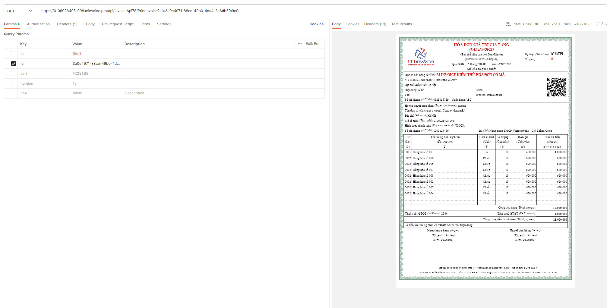
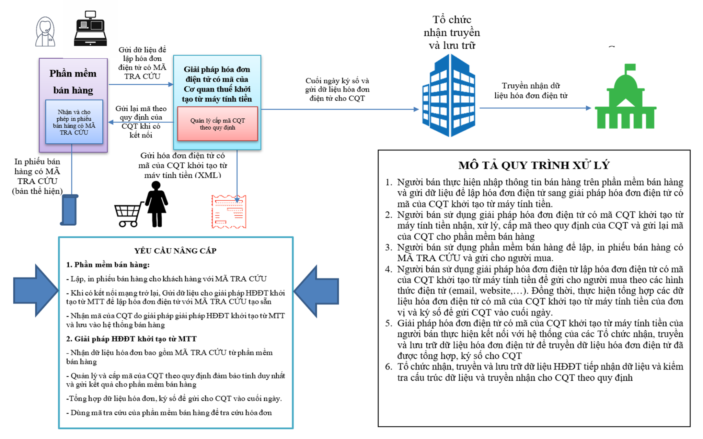

*Tài liệu tích hợp Phần mềm hóa đơn điện tử M-Invoice V1.0.9*

> {width="5.020833333333333in"
> height="3.725in"}
>
> **TÀI LIỆU HƯỚNG DẪN**\
> **TÍCH HỢP HỆ THỐNG M-INVOICE 2.0 v1.0.7**

Trang **1** / **38**

*Tài liệu tích hợp Phần mềm hóa đơn điện tử M-Invoice V1.0.9*

**THEO DÕI PHIÊN BẢN TÀI LIỆU**

+-----------+-----------+-----------+-----------+-----------+-----------+
| **No**    | *         | **Phiên   | **Date**  | **Info**  | **Task**  |
|           | *Author** | bản**     |           |           |           |
+===========+===========+===========+===========+===========+===========+
| 1         | Khiếu     | v1.0.0    | 2         | Create    |           |
|           | Quỳnh     |           | 2/09/2022 | New       |           |
|           | Hưng      |           |           |           |           |
+-----------+-----------+-----------+-----------+-----------+-----------+
| 2         | Khiếu     | v1.0.1    | 1         | Edit      | > Bổ sung |
|           | Quỳnh     |           | 5/02/2023 |           | > 2       |
|           | Hưng      |           |           |           | > trường\ |
|           |           |           |           |           | > b       |
|           |           |           |           |           | uyerIdent |
|           |           |           |           |           | ityCard,\ |
|           |           |           |           |           | >         |
|           |           |           |           |           |  buyerTel |
|           |           |           |           |           | > cho máy |
|           |           |           |           |           | > tính    |
|           |           |           |           |           | > tiền    |
+-----------+-----------+-----------+-----------+-----------+-----------+
| 3         | Khiếu     | v1.0.2    | 2         | Edit      | > Cập     |
|           | Quỳnh     |           | 3.03.2023 |           | > nhật    |
|           | Hưng      |           |           |           | > hàm số​\ |
|           |           |           |           |           | > 1- Đăng |
|           |           |           |           |           | > nhập    |
|           |           |           |           |           | > lấy     |
|           |           |           |           |           | > token​7- |
|           |           |           |           |           | > Điều    |
|           |           |           |           |           | > chỉnh   |
|           |           |           |           |           | > hóa đơn |
+-----------+-----------+-----------+-----------+-----------+-----------+
| 4         | Khiếu     | v1.0.4    | 2         | Edit      | > Bổ sung |
|           | Quỳnh     |           | 6/04/2023 |           | > hàm 16. |
|           | Hưng      |           |           |           | > Lấy\    |
|           |           |           |           |           | > thông   |
|           |           |           |           |           | > tin bản |
|           |           |           |           |           | > quyền   |
|           |           |           |           |           | > của MST |
|           |           |           |           |           | > đang    |
|           |           |           |           |           | > làm     |
|           |           |           |           |           | > việc    |
+-----------+-----------+-----------+-----------+-----------+-----------+
| 5         | Khiếu     | v1.0.5    | 3         | Edit      | > Bổ sung |
|           | Quỳnh     |           | 0/06/2023 |           | > thêm    |
|           | Hưng      |           |           |           | > thẻ dữ  |
|           |           |           |           |           | > liệu​-   |
|           |           |           |           |           | > isDeduc |
|           |           |           |           |           | tionNQ43​\ |
|           |           |           |           |           | > -       |
|           |           |           |           |           | > tlptdo  |
|           |           |           |           |           | anhthu20​\ |
|           |           |           |           |           | > -       |
|           |           |           |           |           | >         |
|           |           |           |           |           |  tgtck20​\ |
|           |           |           |           |           | > áp dụng |
|           |           |           |           |           | > cho hóa |
|           |           |           |           |           | > đơn\    |
|           |           |           |           |           | > bán     |
|           |           |           |           |           | > hàng    |
|           |           |           |           |           | > giảm    |
|           |           |           |           |           | > thuế    |
|           |           |           |           |           | > suất    |
|           |           |           |           |           | > NQ101   |
+-----------+-----------+-----------+-----------+-----------+-----------+
| 6         | > Trần    | v1.0.6    | 0         | Edit      | > Bổ sung |
|           | > Quý Đức |           | 4/12/2023 |           | > thêm    |
|           |           |           |           |           | > tham số |
|           |           |           |           |           | > tìm     |
|           |           |           |           |           | > kiếm    |
|           |           |           |           |           | > keyApi  |
|           |           |           |           |           | > trong   |
|           |           |           |           |           | > các api |
|           |           |           |           |           | >         |
|           |           |           |           |           | > \-      |
|           |           |           |           |           | > GetIn   |
|           |           |           |           |           | foInvoice |
|           |           |           |           |           | >         |
|           |           |           |           |           | > \-      |
|           |           |           |           |           | > Pri     |
|           |           |           |           |           | ntInvoice |
|           |           |           |           |           | >         |
|           |           |           |           |           | > Bổ sung |
|           |           |           |           |           | > tính    |
|           |           |           |           |           | > năng tự |
|           |           |           |           |           | > động    |
|           |           |           |           |           | > tạo     |
|           |           |           |           |           | > 04ss    |
|           |           |           |           |           | > cho hóa |
|           |           |           |           |           | > đơn     |
|           |           |           |           |           | > thực    |
|           |           |           |           |           | > hiện    |
|           |           |           |           |           | > bởi api |
|           |           |           |           |           | >         |
|           |           |           |           |           | > \-      |
|           |           |           |           |           | >         |
|           |           |           |           |           | HuyHoaDon |
+-----------+-----------+-----------+-----------+-----------+-----------+
| 7         | > Trần    | v1.0.7    | 2         | Edit      | > Bổ sung |
|           | > Quý Đức |           | 9/01/2024 |           | > hàm     |
|           |           |           |           |           | > 12.1.   |
|           |           |           |           |           | > Lấy     |
|           |           |           |           |           | > thông   |
|           |           |           |           |           | > tin chi |
|           |           |           |           |           | > tiết    |
|           |           |           |           |           | > hóa đơn |
|           |           |           |           |           | > theo    |
|           |           |           |           |           | > điều    |
|           |           |           |           |           | > kiện từ |
|           |           |           |           |           | > ngày    |
|           |           |           |           |           | > đến     |
|           |           |           |           |           | > ngày và |
|           |           |           |           |           | > ký hiệu |
|           |           |           |           |           | >         |
|           |           |           |           |           | > \-      |
|           |           |           |           |           | > Ge      |
|           |           |           |           |           | tinvoices |
+-----------+-----------+-----------+-----------+-----------+-----------+

Trang **2** / **38**

*Tài liệu tích hợp Phần mềm hóa đơn điện tử M-Invoice V1.0.9*

+-----------+-----------+-----------+-----------+-----------+-----------+
| 8         | Khiếu     | v1.0.8    | 1         | Edit      | Thêm 3    |
|           | Quỳnh     |           | 0/06/2024 |           | trường dữ |
|           | Hưng      |           |           |           | liệu      |
|           |           |           |           |           | trong chi |
|           |           |           |           |           | tiết hóa  |
|           |           |           |           |           | đơn\      |
|           |           |           |           |           | phục vụ   |
|           |           |           |           |           | đơn vị    |
|           |           |           |           |           | bán vàng  |
|           |           |           |           |           |           |
|           |           |           |           |           | > in      |
|           |           |           |           |           | v_purity, |
|           |           |           |           |           | > in      |
|           |           |           |           |           | v_weight, |
|           |           |           |           |           | > inv_l   |
|           |           |           |           |           | abourCode |
+===========+===========+===========+===========+===========+===========+
| 9         | Khiếu     | v1.0.9    | 2         | Edit      | > Cập     |
|           | Quỳnh     |           | 3/10/2024 |           | > nhật    |
|           | Hưng      |           |           |           | > link    |
|           |           |           |           |           | > URL từ  |
|           |           |           |           |           | > min     |
|           |           |           |           |           | voice.pro |
|           |           |           |           |           | > về\     |
|           |           |           |           |           | > min     |
|           |           |           |           |           | voice.app |
+-----------+-----------+-----------+-----------+-----------+-----------+
| 10        | > Trần    | v1.0.10   | 2         | Edit      | Cập nhật  |
|           | > Hải     |           | 7/05/2025 |           | trường dữ |
|           | > Hưng    |           |           |           | liệu theo |
|           |           |           |           |           | ND70      |
+-----------+-----------+-----------+-----------+-----------+-----------+

Trang **3** / **38**

*Tài liệu tích hợp Phần mềm hóa đơn điện tử M-Invoice V1.0.9*

> **A. DANH SÁCH CÁC HÀM API**
>
> **1.​ Đăng nhập lấy token**

+-----------------------+-----------------------+-----------------------+
| > ●​\                  | > **Mục đích**: dùng  |                       |
| > ●​\                  | > để lấy token đăng   |                       |
| > ●​\                  | > nhập vào phần mềm\  |                       |
| > ●​                   | > **Link api**:       |                       |
|                       | > https://010         |                       |
| **●​**                 | 6026495-999.minvoice. |                       |
|                       | app/api/Account/Login |                       |
|                       | > **Method**: POST\   |                       |
|                       | > **Header**:         |                       |
+=======================+=======================+=======================+
|                       | -​                     | > Content-Type:       |
|                       |                       | > application/json    |
+-----------------------+-----------------------+-----------------------+
|                       | > **INPUT:**          |                       |
+-----------------------+-----------------------+-----------------------+

  -----------------------------------------------------------------------
  {
  -----------------------------------------------------------------------

  -----------------------------------------------------------------------

+-----------------------------------------------------------------------+
| > \"username\":\"user\",                                              |
+=======================================================================+
+-----------------------------------------------------------------------+

+-----------------------------------------------------------------------+
| > \"password\":\"password\",                                          |
+=======================================================================+
+-----------------------------------------------------------------------+

+-----------------------------------------------------------------------+
| > \"ma_dvcs\":\"VP\"                                                  |
+=======================================================================+
+-----------------------------------------------------------------------+

+-----------------------------------------------------------------------+
| > }                                                                   |
+=======================================================================+
+-----------------------------------------------------------------------+

+-----------------+-----------------+-----------------+-----------------+
| **Thông tin**   | **Kiểu dữ       | **Bắt buộc**    | **Mô tả**       |
|                 | liệu**          |                 |                 |
+=================+=================+=================+=================+
| > username      | string          | X               | > Tên truy cập  |
+-----------------+-----------------+-----------------+-----------------+
| > password      | string          | X               | > Mật khẩu      |
+-----------------+-----------------+-----------------+-----------------+
| > ma_dvcs       | string          |                 | > Mặc định mã   |
|                 |                 |                 | > đơn vị VP     |
+-----------------+-----------------+-----------------+-----------------+

+-----------------------+-----------------------+-----------------------+
| ●​                     | > **OUTPUT:**         |                       |
+=======================+=======================+=======================+
|                       | -​                     | > **Thành công** :    |
+-----------------------+-----------------------+-----------------------+

  -----------------------------------------------------------------------
  {
  -----------------------------------------------------------------------

  -----------------------------------------------------------------------

+-----------------------------------------------------------------------+
| > \"code\":\"00\",                                                    |
+=======================================================================+
+-----------------------------------------------------------------------+

+-----------------------------------------------------------------------+
| > \"message\":\"Thành công\",                                         |
+=======================================================================+
+-----------------------------------------------------------------------+

+-----------------------------------------------------------------------+
| > \"ok\":true,                                                        |
+=======================================================================+
+-----------------------------------------------------------------------+

+-----------------------------------------------------------------------+
| > \"token\":\"O87316arj5+Od3FhthththzdBfIuPk73eKqpAzBSvv8sY=\"        |
+=======================================================================+
+-----------------------------------------------------------------------+

+-----------------------+-----------------------+-----------------------+
| }                     | -​                     | > **Không thành       |
|                       |                       | > công**:             |
+=======================+=======================+=======================+
+-----------------------+-----------------------+-----------------------+

Trang **4** / **38**

*Tài liệu tích hợp Phần mềm hóa đơn điện tử M-Invoice V1.0.9*

  -----------------------------------------------------------------------
  {
  -----------------------------------------------------------------------

  -----------------------------------------------------------------------

+-----------------------------------------------------------------------+
| > \"code\":\"99\",                                                    |
+=======================================================================+
+-----------------------------------------------------------------------+

+-----------------------------------------------------------------------+
| > \"message\":\"Tên đăng nhập hoặc mật khẩu không đúng\",             |
+=======================================================================+
+-----------------------------------------------------------------------+

+-----------------------------------------------------------------------+
| > \"ok\":false,                                                       |
+=======================================================================+
+-----------------------------------------------------------------------+

+-----------------------------------------------------------------------+
| > \"error\":\"Tên đăng nhập hoặc mật khẩu không đúng\"                |
+=======================================================================+
+-----------------------------------------------------------------------+

+-----------------------------------------------------------------------+
| > }                                                                   |
+=======================================================================+
+-----------------------------------------------------------------------+

> **2.​ Lấy danh sách ký hiệu hóa đơn**
>
> ●​ **Mục đích**: dùng để lấy danh sách dải ký hiệu đã khai báo trên
> phần mềm hóa đơn. Ký hiệu này với mỗi mã số thuế là duy nhất, giúp
> nhận diện loại hóa đơn áp dụng

+-----------------+-----------------+-----------------+-----------------+
| > ●​\            | > **Link**:     |                 |                 |
| > ●​             | > https://01    |                 |                 |
|                 | 06026495-999.mi |                 |                 |
| ●​               | nvoice.app/api/ |                 |                 |
|                 | Invoice68/GetTy |                 |                 |
| **●​**           | peInvoiceSeries |                 |                 |
|                 | > **Method**:   |                 |                 |
|                 | > GET           |                 |                 |
|                 | >               |                 |                 |
|                 | > **Header**:   |                 |                 |
+=================+=================+=================+=================+
|                 | -​               | >               |                 |
|                 |                 |  Authorization: |                 |
|                 |                 | > **Bear        |                 |
|                 |                 | > Token**       |                 |
+-----------------+-----------------+-----------------+-----------------+
|                 | > **INPUT:**    |                 |                 |
+-----------------+-----------------+-----------------+-----------------+
|                 | -​               |                 | > Param: Type.  |
|                 |                 |                 | > Truyền thêm   |
|                 |                 |                 | > param để GET  |
|                 |                 |                 | > về 1 loại hóa |
|                 |                 |                 | > đơn nhất định |
+-----------------+-----------------+-----------------+-----------------+

+-----------------------------------+-----------------------------------+
| > Type                            | > Ý nghĩa                         |
+===================================+===================================+
| > 1                               | > Hóa đơn giá trị gia tăng        |
+-----------------------------------+-----------------------------------+
| > 2                               | > Hóa đơn bán hàng                |
+-----------------------------------+-----------------------------------+
| > 5                               | > Tem vé thẻ                      |
+-----------------------------------+-----------------------------------+
| > 6                               | > Phiếu xuất kho (Kiêm vận chuyển |
|                                   | > nội bộ, gửi bán đại lý)         |
+-----------------------------------+-----------------------------------+
| > 3                               | > Hóa đơn bán tài sản công        |
+-----------------------------------+-----------------------------------+
| > 4                               | > Hóa đơn bán hàng dự trữ quốc    |
|                                   | > gia                             |
+-----------------------------------+-----------------------------------+

+-----------------------+-----------------------+-----------------------+
| **●​**                 | > **OUTPUT:**         |                       |
+=======================+=======================+=======================+
|                       | **-​**                 | > **Trường hợp có kết |
|                       |                       | > quả trả về:**       |
+-----------------------+-----------------------+-----------------------+
|                       | **-​**                 | > **Trường hợp không  |
|                       |                       | > có kết quả:**       |
+-----------------------+-----------------------+-----------------------+

  -----------------------------------------------------------------------
  {
  -----------------------------------------------------------------------

  -----------------------------------------------------------------------

+-----------------------------------------------------------------------+
| > \"code\":\"00\",                                                    |
+=======================================================================+
+-----------------------------------------------------------------------+

+-----------------------------------------------------------------------+
| > \"message\":"Thành công",                                           |
+=======================================================================+
+-----------------------------------------------------------------------+

Trang **5** / **38**

*Tài liệu tích hợp Phần mềm hóa đơn điện tử M-Invoice V1.0.9*

+-----------------------------------------------------------------------+
| > \"ok\":true,                                                        |
+=======================================================================+
+-----------------------------------------------------------------------+

+-----------------------------------------------------------------------+
| > \"data\":\[\...\....\]                                              |
+=======================================================================+
+-----------------------------------------------------------------------+

+-----------------------------------+-----------------------------------+
| > }\                              | > Định nghĩa các field Output:    |
| > ●​                               |                                   |
+===================================+===================================+
+-----------------------------------+-----------------------------------+

+-----------------+-----------------+-----------------+-----------------+
| **Thông tin**   | > **Kiểu DL**   | **Độ dài**      | **Mô tả**       |
+=================+=================+=================+=================+
| > code          | String          |                 | > Mã lỗi. Mã 00 |
|                 |                 |                 | > là thành      |
|                 |                 |                 | > công. Khác 00 |
|                 |                 |                 | > lỗi mô tả ở   |
|                 |                 |                 | > node message. |
+-----------------+-----------------+-----------------+-----------------+
| > message       | String          |                 | > Mô tả lỗi nếu |
|                 |                 |                 | > code khác     |
|                 |                 |                 | > 00.zzz        |
+-----------------+-----------------+-----------------+-----------------+
| > ok            | boolea n        |                 | > Thành công:   |
|                 |                 |                 | > true          |
+-----------------+-----------------+-----------------+-----------------+
| > data          | JArray          |                 | > Mảng dữ liệu  |
|                 |                 |                 | > ký hiệu hóa   |
|                 |                 |                 | > đơn.          |
+-----------------+-----------------+-----------------+-----------------+
| > id            | GUID            | 36              | > id của ký     |
|                 |                 |                 | > hiệu hóa đơn  |
+-----------------+-----------------+-----------------+-----------------+
| > value         | string          | 7               | > Ký hiệu hóa   |
|                 |                 |                 | > đơn đơn dùng  |
|                 |                 |                 | > để truyền vào |
|                 |                 |                 | > khi tạo hóa   |
|                 |                 |                 | > đơn           |
+-----------------+-----------------+-----------------+-----------------+
| qu              | GUID            | 36              | > id của ký     |
| anlykyhieu68_id |                 |                 | > hiệu          |
+-----------------+-----------------+-----------------+-----------------+
| > khhdon        | string          | 8               | > Ký hiệu hóa   |
|                 |                 |                 | > đơn           |
+-----------------+-----------------+-----------------+-----------------+
| > invoiceForm   | string          | 1               | > Loại hóa đơn  |
+-----------------+-----------------+-----------------+-----------------+
| > invoiceYear   | string          | 2               | > Năm của ký    |
|                 |                 |                 | > hiệu hóa đơn  |
+-----------------+-----------------+-----------------+-----------------+
| >               | string          | 250             | > Tên loại hóa  |
| invoiceTypeName |                 |                 | > đơn           |
+-----------------+-----------------+-----------------+-----------------+

> **3.​ Thêm mới, sửa, xóa hóa đơn Chờ ký**
>
> ●​ **Mô tả**: Hàm này cho phép người dùng khởi tạo hóa đơn ở trạng thái
> Chờ ký. **Lưu ý khi test trên**
>
> **Môi trường này, M-Invoice sẽ thay thế 03 giá trị MÃ SỐ THUẾ - TÊN
> ĐƠN VỊ - ĐỊA CHỈ về**
>
> **thông tin của M-Invoice để tránh ảnh hưởng đến dữ liệu thực tế của
> các Doanh nghiệp.**
>
> ●​ **Link API**:
> https://0106026495-999.minvoice.app/api/InvoiceApi78/Save
>
> ●​ **Phương thức**: POST

Trang **6** / **38**

*Tài liệu tích hợp Phần mềm hóa đơn điện tử M-Invoice V1.0.9*

+-----------------+-----------------+-----------------+-----------------+
| ●​               | > **Header**:   |                 |                 |
|                 |                 |                 |                 |
| **●​**           |                 |                 |                 |
+=================+=================+=================+=================+
|                 | -​               |                 | > Content-Type: |
|                 |                 |                 | > a             |
|                 |                 |                 | pplication/json |
+-----------------+-----------------+-----------------+-----------------+
|                 | -​               | >               |                 |
|                 |                 |  Authorization: |                 |
|                 |                 | > **Bear        |                 |
|                 |                 | > Token**       |                 |
+-----------------+-----------------+-----------------+-----------------+
|                 | > **INPUT:**    |                 |                 |
+-----------------+-----------------+-----------------+-----------------+
|                 | **-​**           |                 | > **Định nghĩa  |
|                 |                 |                 | > các trường    |
|                 |                 |                 | > hợp input**   |
+-----------------+-----------------+-----------------+-----------------+

+-------------+-------------+-------------+-------------+-------------+
| **Tên       | **Kiểu DL** | **Độ dài**  | **Bắt       | **Mô tả**   |
| trường**    |             |             | buộc**      |             |
+=============+=============+=============+=============+=============+
| > editmode  | > String    | 1           | Bắt buộc    | > 1: Thêm   |
|             |             |             |             | > mới\      |
|             |             |             |             | > 2: Sửa\   |
|             |             |             |             | > 3: Xóa    |
+-------------+-------------+-------------+-------------+-------------+

> -​

+-------------+-------------+-------------+-------------+-------------+
| > **Tên     | **Kiểu DL** | **Độ dài**  | > **Ràng**\ | **Mô tả**   |
| > trường    |             |             | > **buộc**  |             |
| > ​**\       |             |             |             |             |
| > **tương   |             |             |             |             |
| > ứng       |             |             |             |             |
| > TT32**    |             |             |             |             |
+=============+=============+=============+=============+=============+
| >           | Datetime    |             | > Bắt buộc  | > Ngày hóa  |
|  inv_invoic |             |             |             | > đơn định  |
| eIssuedDate |             |             |             | > dạng      |
|             |             |             |             | >           |
|             |             |             |             |  yyyy-MM-dd |
+-------------+-------------+-------------+-------------+-------------+
| > inv_in    | > string    | 7           | > Bắt buộc  | > Ký hiệu   |
| voiceSeries |             |             |             | > hóa đơn   |
|             |             |             |             | > được lấy  |
|             |             |             |             | > từ Mục 2: |
|             |             |             |             | >           |
|             |             |             |             | > Ví du:    |
|             |             |             |             | > 1C21TYY   |
+-------------+-------------+-------------+-------------+-------------+
| > inv_in    | > number    | (8,0)       |             | > Số hoá    |
| voiceNumber |             |             |             | > đơn. Bắt  |
|             |             |             |             | > buộc nếu  |
|             |             |             |             | > là sửa    |
|             |             |             |             | > hoá đơn   |
+-------------+-------------+-------------+-------------+-------------+
| >           | > string    | 50          |             | > Số đơn    |
|  so_benh_an |             |             |             | > hàng      |
+-------------+-------------+-------------+-------------+-------------+
| > inv_c     | > string    | 3           | > Bắt buộc  | > Đơn vị    |
| urrencyCode |             |             |             | > tiền tệ\  |
|             |             |             |             | > -​ VND\    |
|             |             |             |             | > -​ USD     |
+-------------+-------------+-------------+-------------+-------------+
| > inv_e     | > decimal   | 7,2         | > Bắt buộc​\ | > Tỷ giá    |
| xchangeRate |             |             | > (nếu      |             |
|             |             |             | > dvtte /\  |             |
|             |             |             | >           |             |
|             |             |             |  inv_curren |             |
|             |             |             | > cyCode ​\  |             |
|             |             |             | > khác VND) |             |
+-------------+-------------+-------------+-------------+-------------+

Trang **7** / **38**

*Tài liệu tích hợp Phần mềm hóa đơn điện tử M-Invoice V1.0.9*

+-------------+-------------+-------------+-------------+-------------+
| >           | > string    | 50          | > Bắt buộc  | > Hình thức |
|  inv_paymen |             |             |             | > thanh     |
| tMethodName |             |             |             | > toán:     |
|             |             |             |             | > TM/CK\    |
|             |             |             |             | > Tiền mặt\ |
|             |             |             |             | > Chuyển    |
|             |             |             |             | > khoản     |
+=============+=============+=============+=============+=============+
| > inv_buyer | > string    | 100         | > Bắt buộc  | > Tên người |
| DisplayName |             |             | > ​(nếu là   | > mua       |
|             |             |             | > cá nhân)  |             |
+-------------+-------------+-------------+-------------+-------------+
| > ma_dt     | > string    | 50          |             | > Mã khách  |
|             |             |             |             | > hàng      |
+-------------+-------------+-------------+-------------+-------------+
| > inv_buy   | > string    | 400         | > Bắt buộc  | > Tên đơn   |
| erLegalName |             |             | > ​(nếu là\  | > vị mua    |
|             |             |             | > đơn vị)   |             |
+-------------+-------------+-------------+-------------+-------------+
| > inv_b     | > string    | 14          | > Bắt buộc  | > Mã số     |
| uyerTaxCode |             |             | > ​(nếu là\  | > thuế đơn  |
|             |             |             | > đơn vị)   | > vị mua    |
+-------------+-------------+-------------+-------------+-------------+
| > inv_buyer | > string    | 400         | > Bắt buộc  | > Địa chỉ   |
| AddressLine |             |             |             | > người mua |
+-------------+-------------+-------------+-------------+-------------+
| > inv       | > string    | 50          |             | > Email     |
| _buyerEmail |             |             |             | > người mua |
+-------------+-------------+-------------+-------------+-------------+
| > buyerI    | > string    | 20          |             | > Căn cước  |
| dentityCard |             |             |             | > công dân  |
|             |             |             |             | > ​\         |
|             |             |             |             | > (Dùng đối |
|             |             |             |             | > với loại  |
|             |             |             |             | > hình hóa  |
|             |             |             |             | > đơn khởi  |
|             |             |             |             | > tạo từ    |
|             |             |             |             | > máy tính  |
|             |             |             |             | > tiền)     |
+-------------+-------------+-------------+-------------+-------------+
| > buyerTel  | > string    | 20          |             | > Số điện   |
|             |             |             |             | > thoại     |
|             |             |             |             | > người mua |
|             |             |             |             | > ​\         |
|             |             |             |             | > (Dùng đối |
|             |             |             |             | > với loại  |
|             |             |             |             | > hình hóa  |
|             |             |             |             | > đơn khởi  |
|             |             |             |             | > tạo từ    |
|             |             |             |             | > máy tính  |
|             |             |             |             | > tiền)     |
+-------------+-------------+-------------+-------------+-------------+
| > sobaomat  | > string    | 16          |             | > Mã tra    |
|             |             |             |             | > cứu hóa   |
|             |             |             |             | > đơn (Chỉ  |
|             |             |             |             | > truyền    |
|             |             |             |             | > sang khi  |
|             |             |             |             | > phần mềm  |
|             |             |             |             | > bán hàng  |
|             |             |             |             | > tự quản   |
|             |             |             |             | > lý mã tra |
|             |             |             |             | > cứu).     |
|             |             |             |             | >           |
|             |             |             |             | > Mặc định  |
|             |             |             |             | > không     |
|             |             |             |             | > truyền    |
|             |             |             |             | > thì phần  |
|             |             |             |             | > mềm hóa   |
|             |             |             |             | > đơn       |
|             |             |             |             | > M-Invoice |
|             |             |             |             | > tự sinh   |
|             |             |             |             | > ra và trả |
|             |             |             |             | > về trong  |
|             |             |             |             | > Response  |
+-------------+-------------+-------------+-------------+-------------+
| > inv_buyer | > string    | 30          |             | > Số tài    |
| BankAccount |             |             |             | > khoản     |
|             |             |             |             | > người mua |
+-------------+-------------+-------------+-------------+-------------+
| > inv_bu    | > string    | 400         |             | > Ngân hàng |
| yerBankName |             |             |             | > người mua |
+-------------+-------------+-------------+-------------+-------------+

Trang **8** / **38**

*Tài liệu tích hợp Phần mềm hóa đơn điện tử M-Invoice V1.0.9*

+-------------+-------------+-------------+-------------+-------------+
| > amo       | > string    | 250         |             | > Tổng tiền |
| unt_to_word |             |             |             | > bằng chữ  |
+=============+=============+=============+=============+=============+
| > inv_      | > decimal   | 21,6        | > Bắt buộc  | > Tổng tiền |
| TotalAmount |             |             |             | > bằng số   |
+-------------+-------------+-------------+-------------+-------------+
| > inv_dis   | > decimal   | 21,6        | Bắt buộc    | > Tổng tiền |
| countAmount |             |             | (nếu có)    | > chiết     |
|             |             |             |             | > khấu      |
+-------------+-------------+-------------+-------------+-------------+
| > in        | > decimal   | 21,6        | > Bắt buộc  | > Tổng tiền |
| v_vatAmount |             |             |             | > thuế GTGT |
+-------------+-------------+-------------+-------------+-------------+
| inv         | > decimal   | 21,6        | > Bắt buộc  | > Tổng tiền |
| _TotalAmoun |             |             |             | > trước     |
| tWithoutVat |             |             |             | > thuế GTGT |
+-------------+-------------+-------------+-------------+-------------+
| >           | > decimal   | 21,6        |             | > Tổng tiền |
|  inv_Amount |             |             |             | > hàng      |
+-------------+-------------+-------------+-------------+-------------+
| > key_api   | > string    | 100         |             | > Là key    |
|             |             |             |             | > duy nhất  |
|             |             |             |             | > của phần  |
|             |             |             |             | > mềm bán   |
|             |             |             |             | > hàng để   |
|             |             |             |             | > check     |
|             |             |             |             | > trùng đơn |
|             |             |             |             | > hàng      |
|             |             |             |             | >           |
|             |             |             |             | > Nếu khách |
|             |             |             |             | > hàng muốn |
|             |             |             |             | > check     |
|             |             |             |             | > trùng có  |
|             |             |             |             | > thể đẩy   |
|             |             |             |             | > số đơn    |
|             |             |             |             | > hàng vào  |
|             |             |             |             | > đây để    |
|             |             |             |             | > validate  |
+-------------+-------------+-------------+-------------+-------------+
|   -----     | > int       |             |             | > (CHỈ ÁP   |
| ----------- |             |             |             | > DỤNG CHO  |
|   tlp       |             |             |             | > HÓA ĐƠN   |
| tdoanhthu20 |             |             |             | > BÁN HÀNG  |
|   -----     |             |             |             | > có giảm   |
| ----------- |             |             |             | > thuế GTGT |
|             |             |             |             | > theo      |
|   -----     |             |             |             | > NQ101     |
| ----------- |             |             |             | -2023/QH15) |
|             |             |             |             | >           |
|             |             |             |             | > Tỷ lệ %   |
|             |             |             |             | > thuế GTGT |
|             |             |             |             | > trên      |
|             |             |             |             | > doanh thu |
|             |             |             |             | > của mặt   |
|             |             |             |             | > hàng đang |
|             |             |             |             | > sử dụng,  |
|             |             |             |             | > nhận giá  |
|             |             |             |             | > trị:      |
|             |             |             |             | >           |
|             |             |             |             | > 1 - Phân  |
|             |             |             |             | > phối,     |
|             |             |             |             | > cung cấp  |
|             |             |             |             | > hàng      |
|             |             |             |             | > hóadịch   |
|             |             |             |             | > vụ        |
|             |             |             |             | >           |
|             |             |             |             | > 2 - Hoạt  |
|             |             |             |             | > động kinh |
|             |             |             |             | > doanh     |
|             |             |             |             | > khác      |
|             |             |             |             | >           |
|             |             |             |             | > 3 - Sản   |
|             |             |             |             | > xuất, vận |
|             |             |             |             | > tải, dịch |
|             |             |             |             | > vụ có gắn |
|             |             |             |             | > với hàng  |
|             |             |             |             | > hóa, xây  |
|             |             |             |             | > dựng có   |
|             |             |             |             | > bao thầu  |
|             |             |             |             | > nguyên    |
|             |             |             |             | > vật liệu  |
|             |             |             |             | >           |
|             |             |             |             | > 5 - Dịch  |
|             |             |             |             | > vụ xây    |
|             |             |             |             | > dựng      |
|             |             |             |             | > không bao |
|             |             |             |             | > thầu      |
|             |             |             |             | > nguyên    |
|             |             |             |             | > vật liệu  |
+-------------+-------------+-------------+-------------+-------------+
| > tgtck20   | > decimal   | 21,6        |             | > (CHỈ ÁP   |
|             |             |             |             | > DỤNG CHO  |
|             |             |             |             | > HÓA ĐƠN   |
|             |             |             |             | > BÁN HÀNG  |
|             |             |             |             | > có giảm   |
|             |             |             |             | > thuế GTGT |
|             |             |             |             | > theo      |
|             |             |             |             | > NQ101     |
|             |             |             |             | -2023/QH15) |
|             |             |             |             | >           |
|             |             |             |             | > Tổng tiền |
|             |             |             |             | > thuế GTGT |
|             |             |             |             | > được giảm |
|             |             |             |             | > đối với   |
|             |             |             |             | > HÓA ĐƠN   |
|             |             |             |             | > BÁN HÀNG  |
|             |             |             |             | > theo      |
|             |             |             |             | > NQ10      |
|             |             |             |             | 1/2023/QH15 |
+-------------+-------------+-------------+-------------+-------------+

Trang **9** / **38**

*Tài liệu tích hợp Phần mềm hóa đơn điện tử M-Invoice V1.0.9*

+-------------+-------------+-------------+-------------+-------------+
| > isDe      | > boolean   |             |             | > (CHỈ ÁP   |
| ductionNQ43 |             |             |             | > DỤNG CHO  |
|             |             |             |             | > HÓA ĐƠN   |
|             |             |             |             | > BÁN HÀNG  |
|             |             |             |             | > có giảm   |
|             |             |             |             | > thuế GTGT |
|             |             |             |             | > theo      |
|             |             |             |             | > NQ101     |
|             |             |             |             | -2023/QH15) |
|             |             |             |             | >           |
|             |             |             |             | > Có Áp     |
|             |             |             |             | > dụng giảm |
|             |             |             |             | > thuế cho  |
|             |             |             |             | > HÓA ĐƠN   |
|             |             |             |             | > BÁN HÀNG  |
|             |             |             |             | > theo NQ\  |
|             |             |             |             | > 101       |
|             |             |             |             | /2023/NĐ-CP |
|             |             |             |             | > không?    |
|             |             |             |             | >           |
|             |             |             |             | > -​ true:   |
|             |             |             |             | > có\       |
|             |             |             |             | > -​ false:  |
|             |             |             |             | > không     |
+=============+=============+=============+=============+=============+
| > **Các     |             |             |             |             |
| > trường bổ |             |             |             |             |
| > sung theo |             |             |             |             |
| > ND70 ( áp |             |             |             |             |
| > dụng từ   |             |             |             |             |
| > ngày      |             |             |             |             |
| >           |             |             |             |             |
|  01/06/2025 |             |             |             |             |
| > )**       |             |             |             |             |
+-------------+-------------+-------------+-------------+-------------+
| > ma_ch     | > string    | 250         |             | > Mã cửa    |
|             |             |             |             | > hàng      |
+-------------+-------------+-------------+-------------+-------------+
| > ten_ch    | > string    | 250         |             | > Tên cửa   |
|             |             |             |             | > hàng      |
+-------------+-------------+-------------+-------------+-------------+
| >           | > string    | 250         |             | > Địa chỉ   |
| dchicuahang |             |             |             | > cửa hàng  |
+-------------+-------------+-------------+-------------+-------------+
| > mdvq      | > string    | 7           | > Bắt buộc  | > Mã đơn vị |
| hnsach_nmua |             |             | > (nếu có)  | > Quan hệ   |
|             |             |             |             | > Ngân sách |
|             |             |             |             | > ( Theo    |
|             |             |             |             | > Khoản 7   |
|             |             |             |             | > điều 1    |
|             |             |             |             | > Nghị định |
|             |             |             |             | > 70 )      |
+-------------+-------------+-------------+-------------+-------------+
| > so_hchieu | > string    | 20          |             | > Số hộ     |
|             |             |             |             | > chiếu     |
|             |             |             |             | > người mua |
+-------------+-------------+-------------+-------------+-------------+
| > cccdan    | > string    | 20          |             | > Căn cước  |
|             |             |             |             | > công dân  |
|             |             |             |             | > người mua |
+-------------+-------------+-------------+-------------+-------------+
| >           | > decimal   | 21,6        |             | > Phí vận   |
|  socialDedu |             |             |             | > chuyển (  |
| ctionAmount |             |             |             | > Liên hệ   |
|             |             |             |             | > Kỹ thuật  |
|             |             |             |             | > để cấu    |
|             |             |             |             | > hình thêm |
|             |             |             |             | > )         |
+-------------+-------------+-------------+-------------+-------------+
| > rat       | > decimal   | 21,6        |             | > Thuế Tiêu |
| ioOrtherTax |             |             |             | > thụ đặc   |
|             |             |             |             | > biệt (    |
|             |             |             |             | > Liên hệ   |
|             |             |             |             | > Kỹ thuật  |
|             |             |             |             | > để cấu    |
|             |             |             |             | > hình thêm |
|             |             |             |             | > )         |
+-------------+-------------+-------------+-------------+-------------+
| > ortherFee | > decimal   | 21,6        |             | > Tiền thuế |
|             |             |             |             | > Tiêu thụ  |
|             |             |             |             | > đặc biệt  |
|             |             |             |             | > ( Liên hệ |
|             |             |             |             | > Kỹ thuật  |
|             |             |             |             | > để cấu    |
|             |             |             |             | > hình thêm |
|             |             |             |             | > )         |
+-------------+-------------+-------------+-------------+-------------+
| > mdvq      | > string    | 7           | > Bắt buộc  | > Mã đơn vị |
| hnsach_nban |             |             | > (Nếu có)  | > quan hệ   |
|             |             |             |             | > ngân      |
|             |             |             |             | > sách\     |
|             |             |             |             | > (Mã số    |
|             |             |             |             | > đơn vị có |
|             |             |             |             | > quan hệ   |
|             |             |             |             | > với\      |
|             |             |             |             | > ngân sách |
|             |             |             |             | > của đơn   |
|             |             |             |             | > vị bán    |
|             |             |             |             | > tài sản   |
|             |             |             |             | > công)     |
|             |             |             |             | >           |
|             |             |             |             | > ***( Chỉ  |
|             |             |             |             | > áp dụng   |
|             |             |             |             | > với loại  |
|             |             |             |             | > hóa đơn   |
|             |             |             |             | > bán tài   |
|             |             |             |             | > sản công  |
|             |             |             |             | > )***      |
+-------------+-------------+-------------+-------------+-------------+

Trang **10** / **38**

*Tài liệu tích hợp Phần mềm hóa đơn điện tử M-Invoice V1.0.9*

+-------------+-------------+-------------+-------------+-------------+
| > so_qdinh  | > string    | 50          |             | > Số quyết  |
|             |             |             |             | > định (Số  |
|             |             |             |             | > quyết     |
|             |             |             |             | > định bán  |
|             |             |             |             | > tài sản)  |
|             |             |             |             | >           |
|             |             |             |             | > ***( Chỉ  |
|             |             |             |             | > áp dụng   |
|             |             |             |             | > với loại  |
|             |             |             |             | > hóa đơn   |
|             |             |             |             | > bán tài   |
|             |             |             |             | > sản công  |
|             |             |             |             | > )***      |
+=============+=============+=============+=============+=============+
| >           | > date      |             |             | > Ngày      |
|  ngay_qdinh |             |             |             | > quyết     |
|             |             |             |             | > định      |
|             |             |             |             | > (Ngày     |
|             |             |             |             | > quyết     |
|             |             |             |             | > định bán  |
|             |             |             |             | > tài sản)  |
|             |             |             |             | >           |
|             |             |             |             | > ***( Chỉ  |
|             |             |             |             | > áp dụng   |
|             |             |             |             | > với loại  |
|             |             |             |             | > hóa đơn   |
|             |             |             |             | > bán tài   |
|             |             |             |             | > sản công  |
|             |             |             |             | > )***      |
+-------------+-------------+-------------+-------------+-------------+
| > cq        | > string    | 200         |             | > Cơ quan   |
| bhanh_qdinh |             |             |             | > ban hành  |
|             |             |             |             | > quyết     |
|             |             |             |             | > định (Cơ  |
|             |             |             |             | > quan ban  |
|             |             |             |             | > hành      |
|             |             |             |             | > quyết     |
|             |             |             |             | > định bán  |
|             |             |             |             | > tài sản)  |
|             |             |             |             | > ***( Chỉ  |
|             |             |             |             | > áp dụng   |
|             |             |             |             | > với loại  |
|             |             |             |             | > hóa đơn   |
|             |             |             |             | > bán tài   |
|             |             |             |             | > sản công  |
|             |             |             |             | > )***      |
+-------------+-------------+-------------+-------------+-------------+
| > hthuc_ban | > string    | 200         |             | Hình thức   |
|             |             |             |             | bán ***(    |
|             |             |             |             | Chỉ áp dụng |
|             |             |             |             | với loại    |
|             |             |             |             | hóa đơn bán |
|             |             |             |             | tài sản     |
|             |             |             |             | công )***   |
+-------------+-------------+-------------+-------------+-------------+
| >           | > string    | 400         |             | > Địa điểm  |
|  dd_vchuyen |             |             |             | > vận       |
|             |             |             |             | > chuyển    |
|             |             |             |             | > hàng đến  |
|             |             |             |             | > ***( Chỉ  |
|             |             |             |             | > áp dụng   |
|             |             |             |             | > với loại  |
|             |             |             |             | > hóa đơn   |
|             |             |             |             | > bán tài   |
|             |             |             |             | > sản công  |
|             |             |             |             | > )***      |
+-------------+-------------+-------------+-------------+-------------+
| >           | > date      |             |             | > Ngày bắt  |
|  tg_vchuyen |             |             |             | > đầu vận   |
|             |             |             |             | > chuyển\   |
|             |             |             |             | > ***( Chỉ  |
|             |             |             |             | > áp dụng   |
|             |             |             |             | > với loại  |
|             |             |             |             | > hóa đơn   |
|             |             |             |             | > bán tài   |
|             |             |             |             | > sản công  |
|             |             |             |             | > )***      |
+-------------+-------------+-------------+-------------+-------------+
| > tg_       | > date      |             |             | > Ngày vận  |
| vchuyen_den |             |             |             | > chuyển    |
|             |             |             |             | > đến\      |
|             |             |             |             | > ***( Chỉ  |
|             |             |             |             | > áp dụng   |
|             |             |             |             | > với loại  |
|             |             |             |             | > hóa đơn   |
|             |             |             |             | > bán tài   |
|             |             |             |             | > sản công  |
|             |             |             |             | > )***      |
+-------------+-------------+-------------+-------------+-------------+
| > **Các     |             |             |             |             |
| > trường    |             |             |             |             |
| > thêm đối  |             |             |             |             |
| > với phiếu |             |             |             |             |
| > xuất      |             |             |             |             |
| > kho**     |             |             |             |             |
+-------------+-------------+-------------+-------------+-------------+
| > lddnbo    | > string    | 255         | > Bắt buộc  | > Lệnh điều |
|             |             |             |             | > động nội  |
|             |             |             |             | > bộ        |
+-------------+-------------+-------------+-------------+-------------+
| > tnvchuyen | > string    | 100         | > Bắt buộc  | > Tên người |
|             |             |             |             | > vận       |
|             |             |             |             | > chuyển    |
+-------------+-------------+-------------+-------------+-------------+
| > ptvchuyen | > string    | 50          | > Bắt buộc  | > Phương    |
|             |             |             |             | > tiện vận  |
|             |             |             |             | > chuyển    |
+-------------+-------------+-------------+-------------+-------------+
| > dckhoxuat | > string    | 400         | > Bắt buộc  | > Địa chỉ   |
|             |             |             |             | > kho xuất  |
+-------------+-------------+-------------+-------------+-------------+

Trang **11** / **38**

*Tài liệu tích hợp Phần mềm hóa đơn điện tử M-Invoice V1.0.9*

+-------------+-------------+-------------+-------------+-------------+
| > dckhonhap | > string    | 400         | > Bắt buộc  | > Địa chỉ   |
|             |             |             |             | > kho nhập  |
+=============+=============+=============+=============+=============+
| > sohopdong | > string    | 255         | > Bắt buộc  | > Hợp đồng  |
|             |             |             |             | > vận       |
|             |             |             |             | > chuyển    |
+-------------+-------------+-------------+-------------+-------------+
| > hvtnxhang | > string    | 100         |             | > Tên người |
|             |             |             |             | > xuất hàng |
+-------------+-------------+-------------+-------------+-------------+
| > hdktso    | > string    | 100         |             | > Hợp đồng  |
|             |             |             |             | > kinh tế   |
|             |             |             |             | > số (Bắt   |
|             |             |             |             | > buộc đối  |
|             |             |             |             | > với PXK   |
|             |             |             |             | > hàng gửi  |
|             |             |             |             | > bán đại   |
|             |             |             |             | > lý)       |
+-------------+-------------+-------------+-------------+-------------+
| > hdktngay  | > date      |             |             | > Hợp đồng  |
|             |             |             |             | > kinh tế   |
|             |             |             |             | > ngày (Bắt |
|             |             |             |             | > buộc với  |
|             |             |             |             | > phiếu     |
|             |             |             |             | > xuất kho  |
|             |             |             |             | > hàng gửi  |
|             |             |             |             | > bán đại   |
|             |             |             |             | > lý)       |
+-------------+-------------+-------------+-------------+-------------+

+-----------------------------------+-----------------------------------+
| -​                                 | > Các trường dữ liệu **đầu phiếu  |
|                                   | > hóa đơn**Các trường dữ liệu     |
|                                   | > **chi tiết hóa đơn**            |
+===================================+===================================+
+-----------------------------------+-----------------------------------+

+-------------+-------------+-------------+-------------+-------------+
| > **Tên     | > **Kiểu    | > **Độ      | > **Ràng    | **Mô tả**   |
| > trường    | > DL**      | > dài**     | > buộc**    |             |
| > tương     |             |             |             |             |
| > ứngHĐ32** |             |             |             |             |
+=============+=============+=============+=============+=============+
| > tchat     | > int       | 1           | Bắt buộc    | > Tính chất |
|             |             |             |             | > hàng hóa: |
|             |             |             |             | >           |
|             |             |             |             | > -​ Hàng    |
|             |             |             |             | > hóa dịch  |
|             |             |             |             | > vụ ( giá  |
|             |             |             |             | > trị tchat |
|             |             |             |             | > là 1) -​   |
|             |             |             |             | > Khuyến    |
|             |             |             |             | > mại (giá  |
|             |             |             |             | > trị tchat |
|             |             |             |             | > là 2)\    |
|             |             |             |             | > -​ Chiết   |
|             |             |             |             | > khấu      |
|             |             |             |             | > thương    |
|             |             |             |             | > mại (giá  |
|             |             |             |             | > trị tchat |
|             |             |             |             | > là 3)\    |
|             |             |             |             | > -​ Ghi     |
|             |             |             |             | > chú/ diễn |
|             |             |             |             | > giải (giá |
|             |             |             |             | > trị tchat |
|             |             |             |             | > là 4)     |
|             |             |             |             | >           |
|             |             |             |             | > -​ Hàng    |
|             |             |             |             | > hóa đăc   |
|             |             |             |             | > trưng     |
|             |             |             |             | > (giá trị  |
|             |             |             |             | > tchat là  |
|             |             |             |             | > 5)        |
+-------------+-------------+-------------+-------------+-------------+
| > stt_rec0  | > string    | 4           | Bắt buộc    | > Số thứ tự |
|             |             |             |             | > dòng hàng |
|             |             |             |             | > hóa:      |
|             |             |             |             | > 0001,     |
|             |             |             |             | > 0002      |
+-------------+-------------+-------------+-------------+-------------+
| > i         | > string    | 50          | Bắt buộc    | > Mã hàng   |
| nv_itemCode |             |             | (nếu có)    | > hóa, dịch |
|             |             |             |             | > vụ        |
+-------------+-------------+-------------+-------------+-------------+
| > i         | > string    | 500         | Bắt buộc    | > Tên hàng  |
| nv_itemName |             |             |             | > hóa, dịch |
|             |             |             |             | > vụ        |
+-------------+-------------+-------------+-------------+-------------+
| > i         | decimal     | 21,6        | Bắt buộc    | > Số lượng  |
| nv_quantity |             |             | (nếu có)    |             |
+-------------+-------------+-------------+-------------+-------------+
| > in        | decimal     | 21,6        | Bắt buộc    | > Đơn giá   |
| v_unitPrice |             |             | (nếu có)    |             |
+-------------+-------------+-------------+-------------+-------------+
| >           | decimal     | 6,4         | Bắt buộc    | > Tỷ lệ     |
| inv_discoun |             |             |             | > chiết     |
| tPercentage |             |             |             | > khấu      |
+-------------+-------------+-------------+-------------+-------------+

Trang **12** / **38**

*Tài liệu tích hợp Phần mềm hóa đơn điện tử M-Invoice V1.0.9*

+-------------+-------------+-------------+-------------+-------------+
| > inv_dis   | decimal     | 21,6        | Bắt buộc    | > Số tiền   |
| countAmount |             |             |             | > chiết     |
|             |             |             |             | > khấu      |
+=============+=============+=============+=============+=============+
| >           | decimal     | 21,6        |             | > Cộng tiền |
|  inv_Amount |             |             |             | > hàng      |
+-------------+-------------+-------------+-------------+-------------+
| inv         | decimal     | 21,6        | Bắt buộc    | > Thành     |
| _TotalAmoun |             |             |             | > tiền      |
| tWithoutVat |             |             |             | > trước     |
|             |             |             |             | > thuế GTGT |
|             |             |             |             | > (sau khi  |
|             |             |             |             | > đã trừ    |
|             |             |             |             | > chiết     |
|             |             |             |             | > khấu)     |
+-------------+-------------+-------------+-------------+-------------+
| > ma_thue   | > string    |             | Bắt buộc    | > Truyền    |
|             |             |             |             | > các giá   |
|             |             |             |             | > trị cố    |
|             |             |             |             | > định      |
|             |             |             |             | > sau:\     |
|             |             |             |             | > 10: Thuế  |
|             |             |             |             | > suất 10%\ |
|             |             |             |             | > 8: Thuế   |
|             |             |             |             | > suất 8%\  |
|             |             |             |             | > 5: Thuế   |
|             |             |             |             | > suất 5%\  |
|             |             |             |             | > 0: Thuế   |
|             |             |             |             | > suất 0%\  |
|             |             |             |             | > -1: Không |
|             |             |             |             | > chịu      |
|             |             |             |             | > thuế\     |
|             |             |             |             | > -2: Không |
|             |             |             |             | > kê khai   |
|             |             |             |             | > nộp thuế\ |
|             |             |             |             | > ***Trường |
|             |             |             |             | > hợp phát  |
|             |             |             |             | > sinh thêm |
|             |             |             |             | > thuế suất |
|             |             |             |             | > khác      |
|             |             |             |             | > ngoài     |
|             |             |             |             | > danh sách |
|             |             |             |             | > liên hệ   |
|             |             |             |             | > với***\   |
|             |             |             |             | > ***M-     |
|             |             |             |             | Invoice***\ |
|             |             |             |             | > ***Bắt    |
|             |             |             |             | > buộc      |
|             |             |             |             | > truyền    |
|             |             |             |             | > nếu tchat |
|             |             |             |             | > là        |
|             |             |             |             | > 1,2,3​***\ |
|             |             |             |             | > ***Không  |
|             |             |             |             | > bắt buộc  |
|             |             |             |             | > nếu tchat |
|             |             |             |             | > là 4***   |
+-------------+-------------+-------------+-------------+-------------+
| > in        | decimal     | 21,6        | Bắt buộc    | > Tiền thuế |
| v_vatAmount |             |             |             | > GTGT      |
+-------------+-------------+-------------+-------------+-------------+
| > inv_      | decimal     | 21,6        | Bắt buộc    | > Thành     |
| TotalAmount |             |             |             | > tiền sau  |
|             |             |             |             | > thuế GTGT |
+-------------+-------------+-------------+-------------+-------------+
| > inv_vatRa | > int       |             |             | > (CHỈ ÁP   |
| teDeduction |             |             |             | > DỤNG CHO  |
|             |             |             |             | > HÓA ĐƠN   |
|             |             |             |             | > BÁN HÀNG  |
|             |             |             |             | > có giảm   |
|             |             |             |             | > thuế GTGT |
|             |             |             |             | > theo\     |
|             |             |             |             | > NQ101     |
|             |             |             |             | -2023/QH15) |
|             |             |             |             | >           |
|             |             |             |             | > Tỷ lệ %   |
|             |             |             |             | > thuế GTGT |
|             |             |             |             | > trên      |
|             |             |             |             | > doanh thu |
|             |             |             |             | > của mặt   |
|             |             |             |             | > hàng đang |
|             |             |             |             | > sử dụng,  |
|             |             |             |             | > nhận giá  |
|             |             |             |             | > trị:      |
|             |             |             |             | >           |
|             |             |             |             | > 1 - Phân  |
|             |             |             |             | > phối,     |
|             |             |             |             | > cung cấp  |
|             |             |             |             | > hàng hóa  |
|             |             |             |             | > dịch vụ   |
|             |             |             |             | >           |
|             |             |             |             | > 2 - Hoạt  |
|             |             |             |             | > động kinh |
|             |             |             |             | > doanh     |
|             |             |             |             | > khác      |
|             |             |             |             | >           |
|             |             |             |             | > 3 - Sản   |
|             |             |             |             | > xuất, vận |
|             |             |             |             | > tải, dịch |
|             |             |             |             | > vụ có gắn |
|             |             |             |             | > với hàng  |
|             |             |             |             | > hóa, xây  |
|             |             |             |             | > dựng có   |
|             |             |             |             | > bao thầu  |
|             |             |             |             | > nguyên    |
|             |             |             |             | > vật liệu  |
|             |             |             |             | >           |
|             |             |             |             | > 5 - Dịch  |
|             |             |             |             | > vụ xây    |
|             |             |             |             | > dựng      |
|             |             |             |             | > không bao |
|             |             |             |             | > thầu      |
|             |             |             |             | > nguyên    |
|             |             |             |             | > vật liệu  |
+-------------+-------------+-------------+-------------+-------------+
| >           | decimal     | 21,6        |             | > (CHỈ ÁP   |
| inv_vatAmou |             |             |             | > DỤNG CHO  |
| ntDeduction |             |             |             | > HÓA ĐƠN   |
|             |             |             |             | > BÁN HÀNG  |
|             |             |             |             | > có giảm   |
|             |             |             |             | > thuế GTGT |
|             |             |             |             | > theo\     |
|             |             |             |             | > NQ101     |
|             |             |             |             | -2023/QH15) |
+-------------+-------------+-------------+-------------+-------------+

Trang **13** / **38**

*Tài liệu tích hợp Phần mềm hóa đơn điện tử M-Invoice V1.0.9*

+-------------+-------------+-------------+-------------+-------------+
|             |             |             |             | > Tổng số   |
|             |             |             |             | > tiền thuế |
|             |             |             |             | > GTGT được |
|             |             |             |             | > giảm      |
+=============+=============+=============+=============+=============+
| >           | > string    | 30          |             | > Tuổi      |
|  inv_purity |             |             |             | > vàng, ví  |
|             |             |             |             | > dụ: 14K,  |
|             |             |             |             | > 18K, 24K  |
|             |             |             |             | > (Dành     |
|             |             |             |             | > riêng cho |
|             |             |             |             | > đơn vị    |
|             |             |             |             | > bán vàng) |
+-------------+-------------+-------------+-------------+-------------+
| >           | decimal     | 21,6        |             | > Trọng     |
|  inv_weight |             |             |             | > lượng sản |
|             |             |             |             | > phẩm      |
|             |             |             |             | > vàng​\     |
|             |             |             |             | > (Dành     |
|             |             |             |             | > riêng cho |
|             |             |             |             | > đơn vị    |
|             |             |             |             | > bán vàng) |
+-------------+-------------+-------------+-------------+-------------+
| > inv       | decimal     | 21,6        |             | > Tiền nhân |
| _labourCost |             |             |             | > công chế  |
|             |             |             |             | > tác​\      |
|             |             |             |             | > (Dành     |
|             |             |             |             | > riêng cho |
|             |             |             |             | > đơn vị    |
|             |             |             |             | > bán vàng) |
+-------------+-------------+-------------+-------------+-------------+
| > **Các     |             |             |             |             |
| > trường Bổ |             |             |             |             |
| > sung theo |             |             |             |             |
| > NĐ 70**   |             |             |             |             |
+-------------+-------------+-------------+-------------+-------------+
| > skhung    | > string    | 200         | Bắt buộc    | > Số khung\ |
|             |             |             |             | > ***( Đối  |
|             |             |             |             | > với hóa   |
|             |             |             |             | > đơn đặc   |
|             |             |             |             | > trưng Bán |
|             |             |             |             | > mô tô, xe |
|             |             |             |             | > mô tô     |
|             |             |             |             | > )***      |
+-------------+-------------+-------------+-------------+-------------+
| > smay      | > string    | 200         | Bắt buộc    | > Số Máy\   |
|             |             |             |             | > ***( Đối  |
|             |             |             |             | > với hóa   |
|             |             |             |             | > đơn đặc   |
|             |             |             |             | > trưng Bán |
|             |             |             |             | > mô tô, xe |
|             |             |             |             | > mô tô     |
|             |             |             |             | > )***      |
+-------------+-------------+-------------+-------------+-------------+
| > bien_sxe  | > string    | 200         | Bắt buộc    | > Biển số   |
|             |             |             |             | > xe\       |
|             |             |             |             | > ***( Đối  |
|             |             |             |             | > với hóa   |
|             |             |             |             | > đơn đặc   |
|             |             |             |             | > trưng Bán |
|             |             |             |             | > mô tô, xe |
|             |             |             |             | > mô tô     |
|             |             |             |             | > )***      |
+-------------+-------------+-------------+-------------+-------------+
| > ten_ngui  | > string    | 200         | Bắt buộc    | > Tên người |
|             |             |             |             | > gửi hàng\ |
|             |             |             |             | > ***( Đối  |
|             |             |             |             | > với Dịch  |
|             |             |             |             | > vụ vận    |
|             |             |             |             | > chuyển    |
|             |             |             |             | > trên nền  |
|             |             |             |             | > tảng số,  |
|             |             |             |             | > TMĐT )*** |
+-------------+-------------+-------------+-------------+-------------+
| > dc_ngui   | > string    | 200         | Bắt buộc    | > Địa chỉ   |
|             |             |             |             | > người gửi |
|             |             |             |             | > hàng\     |
|             |             |             |             | > ***( Đối  |
|             |             |             |             | > với Dịch  |
|             |             |             |             | > vụ vận    |
|             |             |             |             | > chuyển    |
|             |             |             |             | > trên nền  |
|             |             |             |             | > tảng số,  |
|             |             |             |             | > TMĐT )*** |
+-------------+-------------+-------------+-------------+-------------+
| > mst_ngui  | > string    | 200         | Bắt buộc    | > MST người |
|             |             |             |             | > gửi hàng\ |
|             |             |             |             | > ***( Đối  |
|             |             |             |             | > với Dịch  |
|             |             |             |             | > vụ vận    |
|             |             |             |             | > chuyển    |
|             |             |             |             | > trên nền  |
|             |             |             |             | > tảng số,  |
|             |             |             |             | > TMĐT )*** |
+-------------+-------------+-------------+-------------+-------------+
| >           | > string    | 200         | Bắt buộc    | > Căn cước  |
| sddanh_ngui |             |             |             | > công dân  |
|             |             |             |             | > người     |
|             |             |             |             | > gửi.      |
+-------------+-------------+-------------+-------------+-------------+

Trang **14** / **38**

*Tài liệu tích hợp Phần mềm hóa đơn điện tử M-Invoice V1.0.9*

+-------------+-------------+-------------+-------------+-------------+
|             |             |             |             | > ***( Đối  |
|             |             |             |             | > với Dịch  |
|             |             |             |             | > vụ vận    |
|             |             |             |             | > chuyển    |
|             |             |             |             | > trên nền  |
|             |             |             |             | > tảng số,  |
|             |             |             |             | > TMĐT )*** |
+=============+=============+=============+=============+=============+
+-------------+-------------+-------------+-------------+-------------+

+-----------------------+-----------------------+-----------------------+
| **●​**                 | > **OUTPUT**          |                       |
+=======================+=======================+=======================+
|                       | **-​**                 | > **Thành công:**     |
+-----------------------+-----------------------+-----------------------+

  -----------------------------------------------------------------------
  {
  -----------------------------------------------------------------------

  -----------------------------------------------------------------------

+-----------------------------------------------------------------------+
| > \"code\":\"00\",                                                    |
+=======================================================================+
+-----------------------------------------------------------------------+

+-----------------------------------------------------------------------+
| > \"message\":\"Thành công\",                                         |
+=======================================================================+
+-----------------------------------------------------------------------+

+-----------------------------------------------------------------------+
| > \"data\":{\...\...\...},                                            |
+=======================================================================+
+-----------------------------------------------------------------------+

+-----------------------+-----------------------+-----------------------+
| }                     | **-​**                 | > **Có lỗi:**         |
+=======================+=======================+=======================+
+-----------------------+-----------------------+-----------------------+

  -----------------------------------------------------------------------
  {
  -----------------------------------------------------------------------

  -----------------------------------------------------------------------

+-----------------------------------------------------------------------+
| > \"code\":\"xx\",                                                    |
+=======================================================================+
+-----------------------------------------------------------------------+

+-----------------------------------------------------------------------+
| > \"message\":\"\...\...\...\...\...\...\...\....\"                   |
+=======================================================================+
+-----------------------------------------------------------------------+

+-----------------+-----------------+-----------------+-----------------+
| **●​**           | > }\            |                 |                 |
|                 | > **Trường hợp  |                 |                 |
|                 | > 1: Thêm hóa   |                 |                 |
|                 | > đơn**         |                 |                 |
+=================+=================+=================+=================+
|                 | ***○​***         | > ***Thêm hóa   |                 |
|                 |                 | > đơn GTGT      |                 |
|                 |                 | > thông thường, |                 |
|                 |                 | > tem vé***     |                 |
+-----------------+-----------------+-----------------+-----------------+
|                 | **-​**           |                 | > **INPUT       |
|                 |                 |                 | > JSON:**       |
+-----------------+-----------------+-----------------+-----------------+
|                 | ***-​***         |                 | > **OUTPUT      |
|                 |                 |                 | > JSON:**       |
+-----------------+-----------------+-----------------+-----------------+
|                 | ***○​***         | > ***Thêm hóa   |                 |
|                 |                 | > đơn GTGT, tem |                 |
|                 |                 | > vé máy tính   |                 |
|                 |                 | > tiền***       |                 |
+-----------------+-----------------+-----------------+-----------------+
|                 | **-​**           |                 | > **INPUT       |
|                 |                 |                 | > JSON:**       |
+-----------------+-----------------+-----------------+-----------------+
|                 | **-​**           |                 | > **OUTPUT      |
|                 |                 |                 | > JSON:**       |
+-----------------+-----------------+-----------------+-----------------+
|                 | ***○​***         | > ***Tạo hóa    |                 |
|                 |                 | > đơn Bán hàng  |                 |
|                 |                 | > (Có giảm thuế |                 |
|                 |                 | > theo NQ       |                 |
|                 |                 | > 174)*:**      |                 |
+-----------------+-----------------+-----------------+-----------------+
|                 | ***■​***         |                 | > **INPUT       |
|                 |                 |                 | > JSON:**       |
+-----------------+-----------------+-----------------+-----------------+
|                 | ***■​***         |                 | > **OUTPUT      |
|                 |                 |                 | > JSON:**       |
+-----------------+-----------------+-----------------+-----------------+
|                 | ***○​***         | > ***Tạo Phiếu  |                 |
|                 |                 | > xuất kho Kiêm |                 |
|                 |                 | > vận chuyển    |                 |
|                 |                 | > nội bộ*:**    |                 |
+-----------------+-----------------+-----------------+-----------------+
|                 | **■​**           |                 | > **INOUT       |
|                 |                 |                 | > JSON:**       |
+-----------------+-----------------+-----------------+-----------------+
|                 | ***■​***         |                 | > **OUTPUT      |
|                 |                 |                 | > JSON:**       |
+-----------------+-----------------+-----------------+-----------------+
|                 | **○​**           | > ***Tạo phiếu  |                 |
|                 |                 | > xuất kho hàng |                 |
|                 |                 | > gửi bán đại   |                 |
|                 |                 | > lý***         |                 |
+-----------------+-----------------+-----------------+-----------------+

Trang **15** / **38**

*Tài liệu tích hợp Phần mềm hóa đơn điện tử M-Invoice V1.0.9*

+-----------------+-----------------+-----------------+-----------------+
| **●​**           | **■​**           |                 | > **INOUT       |
|                 |                 |                 | > JSON:**       |
+=================+=================+=================+=================+
|                 | **■​**           |                 | > **OUTPUT      |
|                 |                 |                 | > JSON:**       |
+-----------------+-----------------+-----------------+-----------------+
|                 | ***○​***         | > ***Tạo* hóa   |                 |
|                 |                 | > đơn Bán hàng  |                 |
|                 |                 | > máy tính      |                 |
|                 |                 | > tiền:**       |                 |
+-----------------+-----------------+-----------------+-----------------+
|                 | > **Trường hợp  |                 |                 |
|                 | > 2: Sửa hóa    |                 |                 |
|                 | > đơn Chờ ký    |                 |                 |
|                 | > vừa tạo**     |                 |                 |
+-----------------+-----------------+-----------------+-----------------+

> **( Chỉnh editmode = 2, Truyền thêm số hóa đơn hoặc id hóa đơn trong
> body)** -​ **INPUT JSON:**\
> ***-​*** **OUTPUT JSON:**\
> **●​** **Trường hợp 3: Xóa hóa đơn Chờ ký**\
> **- TH1: Đã có sẵn ký hiệu và số hóa đơn**\
> **-​** **INPUT**

  -----------------------------------------------------------------------
  {
  -----------------------------------------------------------------------

  -----------------------------------------------------------------------

+-----------------------------------------------------------------------+
| > \"editmode\":3,                                                     |
+=======================================================================+
+-----------------------------------------------------------------------+

+-----------------------------------------------------------------------+
| > \"data\":\[                                                         |
+=======================================================================+
+-----------------------------------------------------------------------+

+-----------------------------------------------------------------------+
| > {                                                                   |
+=======================================================================+
+-----------------------------------------------------------------------+

+-----------------------------------------------------------------------+
| > \"inv_invoiceSeries\":\"1C22TMX\",                                  |
+=======================================================================+
+-----------------------------------------------------------------------+

+-----------------------------------------------------------------------+
| > \"inv_invoiceNumber\":6                                             |
+=======================================================================+
+-----------------------------------------------------------------------+

+-----------------------------------------------------------------------+
| > }                                                                   |
+=======================================================================+
+-----------------------------------------------------------------------+

+-----------------------------------------------------------------------+
| > \]                                                                  |
+=======================================================================+
+-----------------------------------------------------------------------+

+-----------------------+-----------------------+-----------------------+
| }                     | **-​**                 | > **OUTPUT:**         |
+=======================+=======================+=======================+
+-----------------------+-----------------------+-----------------------+

  -----------------------------------------------------------------------
  {
  -----------------------------------------------------------------------

  -----------------------------------------------------------------------

+-----------------------------------------------------------------------+
| > \"code\":\"00\",                                                    |
+=======================================================================+
+-----------------------------------------------------------------------+

+-----------------------------------------------------------------------+
| > \"message\":\"Thành công\",                                         |
+=======================================================================+
+-----------------------------------------------------------------------+

+-----------------------------------------------------------------------+
| > \"data\":{                                                          |
+=======================================================================+
+-----------------------------------------------------------------------+

+-----------------------------------------------------------------------+
| > \"inv_invoiceSeries\":\"1C22TMX\",                                  |
+=======================================================================+
+-----------------------------------------------------------------------+

+-----------------------------------------------------------------------+
| > \"inv_invoiceNumber\":6,                                            |
+=======================================================================+
+-----------------------------------------------------------------------+

+-----------------------------------------------------------------------+
| > \"inv_discountAmount\":\"0\"                                        |
+=======================================================================+
+-----------------------------------------------------------------------+

+-----------------------------------------------------------------------+
| > }                                                                   |
+=======================================================================+
+-----------------------------------------------------------------------+

+-----------------------------------------------------------------------+
| > }                                                                   |
+=======================================================================+
+-----------------------------------------------------------------------+

Trang **16** / **38**

*Tài liệu tích hợp Phần mềm hóa đơn điện tử M-Invoice V1.0.9*

> **- TH2: Chưa có số hóa đơn, truyền id hóa đơn**
>
> **-​** **INPUT:**

  -----------------------------------------------------------------------
  {
  -----------------------------------------------------------------------

  -----------------------------------------------------------------------

+-----------------------------------------------------------------------+
| > \"editmode\":3,                                                     |
+=======================================================================+
+-----------------------------------------------------------------------+

+-----------------------------------------------------------------------+
| > \"data\":\[                                                         |
+=======================================================================+
+-----------------------------------------------------------------------+

+-----------------------------------------------------------------------+
| > {                                                                   |
+=======================================================================+
+-----------------------------------------------------------------------+

+-----------------------------------------------------------------------+
| > \"inv_invoiceSeries\":\"6C23NAB\",                                  |
+=======================================================================+
+-----------------------------------------------------------------------+

+-----------------------------------------------------------------------+
| > \"inv_invoiceAuth_Id\":\"3a0aaa84-3eb7-7fd7-5079-4f7e8f685a64\"     |
+=======================================================================+
+-----------------------------------------------------------------------+

+-----------------------------------------------------------------------+
| > }                                                                   |
+=======================================================================+
+-----------------------------------------------------------------------+

+-----------------------------------------------------------------------+
| > \]                                                                  |
+=======================================================================+
+-----------------------------------------------------------------------+

+-----------------------+-----------------------+-----------------------+
| }                     | **-​**                 | > **OUTPUT:**         |
+=======================+=======================+=======================+
+-----------------------+-----------------------+-----------------------+

  -----------------------------------------------------------------------
  {
  -----------------------------------------------------------------------

  -----------------------------------------------------------------------

+-----------------------------------------------------------------------+
| > \"code\":\"00\",                                                    |
+=======================================================================+
+-----------------------------------------------------------------------+

+-----------------------------------------------------------------------+
| > \"message\":null,                                                   |
+=======================================================================+
+-----------------------------------------------------------------------+

+-----------------------------------------------------------------------+
| > \"ok\":true,                                                        |
+=======================================================================+
+-----------------------------------------------------------------------+

+-----------------------------------------------------------------------+
| > \"data\":{                                                          |
+=======================================================================+
+-----------------------------------------------------------------------+

+-----------------------------------------------------------------------+
| > \"inv_invoiceSeries\":\"6C23NAB\",                                  |
+=======================================================================+
+-----------------------------------------------------------------------+

+-----------------------------------------------------------------------+
| > \"inv_invoiceAuth_Id\":\"3a0aaa84-3eb7-7fd7-5079-4f7e8f685a64\",    |
+=======================================================================+
+-----------------------------------------------------------------------+

+-----------------------------------------------------------------------+
| > \"key_api\":\"TICH_HOP\"                                            |
+=======================================================================+
+-----------------------------------------------------------------------+

+-----------------------------------------------------------------------+
| > }                                                                   |
+=======================================================================+
+-----------------------------------------------------------------------+

+-----------------------------------------------------------------------+
| > }                                                                   |
+=======================================================================+
+-----------------------------------------------------------------------+

> **4.​ Thêm mới, ký và gửi CQT ngay bằng FILE hoặc service**
>
> ●​ **Mục đích:** Tạo hóa đơn và ký gửi ngay lên CQT trong trường hợp ký
> bằng FILE p12 hoặc ký qua service EASY, ICA. Tham số hệ thống
> KY_TAP_TRUNG là FILE, EASY, ICA, NNCA\
> ●​ **Chú ý**: Hàm này chỉ áp dụng cho JSON đầu vào là các trường theo
> TT32\
> ●​ **Link
> api:**https://0106026495-999.minvoice.app/api/InvoiceApi78/SaveSign

Trang **17** / **38**

*Tài liệu tích hợp Phần mềm hóa đơn điện tử M-Invoice V1.0.9*

+-----------------+-----------------+-----------------+-----------------+
| > ●​\            | > **Phương thức |                 |                 |
| > ●​             | > :**POST\      |                 |                 |
| >               | > **Header:**   |                 |                 |
| > ●​\            |                 |                 |                 |
| > ●​             |                 |                 |                 |
+=================+=================+=================+=================+
|                 | -​               |                 | > Content-Type: |
|                 |                 |                 | > a             |
|                 |                 |                 | pplication/json |
+-----------------+-----------------+-----------------+-----------------+
|                 | -​               | >               |                 |
|                 |                 |  Authorization: |                 |
|                 |                 | > **Bear        |                 |
|                 |                 | > Token**       |                 |
+-----------------+-----------------+-----------------+-----------------+
|                 | -​               |                 | > TaxCode: \<Mã |
|                 |                 |                 | > số thuế\>     |
+-----------------+-----------------+-----------------+-----------------+
|                 | > **Input       |                 |                 |
|                 | > JSON:**\      |                 |                 |
|                 | > **Output      |                 |                 |
|                 | > JSON:**       |                 |                 |
+-----------------+-----------------+-----------------+-----------------+
|                 | -​               |                 | > **Thành công  |
|                 |                 |                 | > trả về cấu    |
|                 |                 |                 | > trúc:**       |
+-----------------+-----------------+-----------------+-----------------+

  -----------------------------------------------------------------------
  {
  -----------------------------------------------------------------------

  -----------------------------------------------------------------------

+-----------------------------------------------------------------------+
| > \"code\":\"00\",                                                    |
+=======================================================================+
+-----------------------------------------------------------------------+

+-----------------------------------------------------------------------+
| > \"message\":null,                                                   |
+=======================================================================+
+-----------------------------------------------------------------------+

+-----------------------------------------------------------------------+
| > \"data\":{\...}                                                     |
+=======================================================================+
+-----------------------------------------------------------------------+

+-----------------------+-----------------------+-----------------------+
| }                     | -​                     | > **Thất bại trả về   |
|                       |                       | > cấu trúc:**         |
+=======================+=======================+=======================+
+-----------------------+-----------------------+-----------------------+

  -----------------------------------------------------------------------
  {
  -----------------------------------------------------------------------

  -----------------------------------------------------------------------

+-----------------------------------------------------------------------+
| > \"code\":\"xx\",                                                    |
+=======================================================================+
+-----------------------------------------------------------------------+

+-----------------------------------------------------------------------+
| > \"me                                                                |
| ssage\":\"\...\...\...\...\...\...\...\...\...\...\...\...\...\...\", |
+=======================================================================+
+-----------------------------------------------------------------------+

+-----------------------------------------------------------------------+
| > }                                                                   |
+=======================================================================+
+-----------------------------------------------------------------------+

> **5.​ Ký hóa đơn và gửi CQT**
>
> ●​ **Mục đích:** Ký hóa đơn bằng token File và gửi hóa đơn lên CQT.
> Khai báo tham số hệ thống
>
> KY_TAP_TRUNG = FILE

+-----------------+-----------------+-----------------+-----------------+
| > ●​\            | > **Link        |                 |                 |
| > ●​\            | > api           |                 |                 |
| > ●​             | :**https://0106 |                 |                 |
|                 | 026495-999.minv |                 |                 |
| ●​               | oice.app/api/In |                 |                 |
|                 | voiceApi78/Sign |                 |                 |
|                 | > **Phương thức |                 |                 |
|                 | > :**POST\      |                 |                 |
|                 | > **Header:**   |                 |                 |
+=================+=================+=================+=================+
|                 | -​               |                 | > Content-Type: |
|                 |                 |                 | > a             |
|                 |                 |                 | pplication/json |
+-----------------+-----------------+-----------------+-----------------+
|                 | -​               | >               |                 |
|                 |                 |  Authorization: |                 |
|                 |                 | > **Bear        |                 |
|                 |                 | > Token**       |                 |
+-----------------+-----------------+-----------------+-----------------+
|                 | -​               |                 | > TaxCode: \<Mã |
|                 |                 |                 | > số thuế\>     |
+-----------------+-----------------+-----------------+-----------------+
|                 | > **Input       |                 |                 |
|                 | > JSON:**       |                 |                 |
+-----------------+-----------------+-----------------+-----------------+

  -----------------------------------------------------------------------
  {
  -----------------------------------------------------------------------

  -----------------------------------------------------------------------

+-----------------------------------------------------------------------+
| > \"hoadon68_id\":\"5fc578a6-1ca1-46f9-ab4f-6a0de4b54c32\"            |
+=======================================================================+
+-----------------------------------------------------------------------+

+-----------------------+-----------------------+-----------------------+
| ●​                     | > }\                  |                       |
|                       | > **Output:**         |                       |
+=======================+=======================+=======================+
|                       | -​                     | > **Thành công:**     |
+-----------------------+-----------------------+-----------------------+

  -----------------------------------------------------------------------
  {
  -----------------------------------------------------------------------

  -----------------------------------------------------------------------

+-----------------------------------------------------------------------+
| > \"code\":\"00\",                                                    |
+=======================================================================+
+-----------------------------------------------------------------------+

Trang **18** / **38**

*Tài liệu tích hợp Phần mềm hóa đơn điện tử M-Invoice V1.0.9*

+-----------------------------------------------------------------------+
| > \"message\":\"Thành công\"                                          |
+=======================================================================+
+-----------------------------------------------------------------------+

+-----------------------+-----------------------+-----------------------+
| }                     | -​                     | > **Thất bại: không   |
|                       |                       | > tìm thấy id hóa     |
|                       |                       | > đơn**               |
+=======================+=======================+=======================+
+-----------------------+-----------------------+-----------------------+

  -----------------------------------------------------------------------
  {
  -----------------------------------------------------------------------

  -----------------------------------------------------------------------

+-----------------------------------------------------------------------+
| > \"code\":\"xx\",                                                    |
+=======================================================================+
+-----------------------------------------------------------------------+

+-----------------------------------------------------------------------+
| > \"message\":\"\...\...\...\...\...\...\...\...\...\...\...\....\"   |
+=======================================================================+
+-----------------------------------------------------------------------+

+-----------------------------------------------------------------------+
| > }                                                                   |
+=======================================================================+
+-----------------------------------------------------------------------+

> **6.​ Hủy hóa đơn *( Sẽ Ngưng sử dụng sau ngày 01/06/2025) ***
>
> ●​ **Mục đích:** Hủy hóa đơn Đã gửi **thành công** đến ở trạng thái hóa
> đơn là Gốc, Giải trình và tự động tạo 04ss Hủy cho hóa đơn đó

+-----------------+-----------------+-----------------+-----------------+
| > ●​\            | > **Link        |                 |                 |
| > ●​\            | > api:**ht      |                 |                 |
| > ●​             | tps://010602649 |                 |                 |
|                 | 5-999.minvoice. |                 |                 |
| ●​               | app/api/Invoice |                 |                 |
|                 | Api78/HuyHoaDon |                 |                 |
|                 | > **Phương thức |                 |                 |
|                 | > :**POST\      |                 |                 |
|                 | > **Header:**   |                 |                 |
+=================+=================+=================+=================+
|                 | -​               |                 | > Content-Type: |
|                 |                 |                 | > a             |
|                 |                 |                 | pplication/json |
+-----------------+-----------------+-----------------+-----------------+
|                 | -​               | >               |                 |
|                 |                 |  Authorization: |                 |
|                 |                 | > **Bear        |                 |
|                 |                 | > Token**       |                 |
+-----------------+-----------------+-----------------+-----------------+
|                 | -​               |                 | > TaxCode: \<Mã |
|                 |                 |                 | > số thuế\>     |
+-----------------+-----------------+-----------------+-----------------+
|                 | > **Input       |                 |                 |
|                 | > JSON:**       |                 |                 |
+-----------------+-----------------+-----------------+-----------------+

  -----------------------------------------------------------------------
  {
  -----------------------------------------------------------------------

  -----------------------------------------------------------------------

+-----------------------------------------------------------------------+
| > \"inv_InvoiceAuth_id\":\"26da72ec-a3c4-49d0-90de-2d6a9fb2bdab\",    |
+=======================================================================+
+-----------------------------------------------------------------------+

+-----------------------------------------------------------------------+
| > \"ngayvb\":\"2022-09-11\",                                          |
+=======================================================================+
+-----------------------------------------------------------------------+

+-----------------------------------------------------------------------+
| > \"ghi_chu\":\"Sai thông tin tổng tiền hóa đơn, chưa gửi cho khách   |
| > hàng\"                                                              |
+=======================================================================+
+-----------------------------------------------------------------------+

+-----------------------+-----------------------+-----------------------+
| }                     | -​                     | > **Định dạng trường  |
|                       |                       | > input:**            |
+=======================+=======================+=======================+
+-----------------------+-----------------------+-----------------------+

+-------------+-------------+-------------+-------------+-------------+
| **Tên       | **Kiểu DL** | **Độ dài**  | **Bắt       | **Mô tả**   |
| trường**    |             |             | buộc**      |             |
+=============+=============+=============+=============+=============+
| inv_Inv     | > GUID      | 36          | > Bắt buộc  | > ID của    |
| oiceAuth_id |             |             |             | > hóa đơn   |
|             |             |             |             | > (h        |
|             |             |             |             | oadon68_id) |
+-------------+-------------+-------------+-------------+-------------+
| > ngayvb    | > date      |             | > Bắt buộc  | > Ngày hủy  |
|             |             |             |             | > hóa đơn   |
+-------------+-------------+-------------+-------------+-------------+
| > ghi_chu   | > string    | 255         | > Bắt buộc  | > Lý do sai |
|             |             |             |             | > sót       |
+-------------+-------------+-------------+-------------+-------------+

Trang **19** / **38**

*Tài liệu tích hợp Phần mềm hóa đơn điện tử M-Invoice V1.0.9*

+-----------------------+-----------------------+-----------------------+
| ●​                     | > **Output**          | > **Thành công:**     |
+=======================+=======================+=======================+
|                       | -​                     |                       |
+-----------------------+-----------------------+-----------------------+

  -----------------------------------------------------------------------
  {
  -----------------------------------------------------------------------

  -----------------------------------------------------------------------

+-----------------------------------------------------------------------+
| > \"code\":\"00\",                                                    |
+=======================================================================+
+-----------------------------------------------------------------------+

+-----------------------------------------------------------------------+
| > \"message\":\"Thành công\"                                          |
+=======================================================================+
+-----------------------------------------------------------------------+

+-----------------------+-----------------------+-----------------------+
| }                     | -​                     | > **Thất bại:**       |
+=======================+=======================+=======================+
+-----------------------+-----------------------+-----------------------+

  -----------------------------------------------------------------------
  {
  -----------------------------------------------------------------------

  -----------------------------------------------------------------------

+-----------------------------------------------------------------------+
| > \"code\":\"\....\",                                                 |
+=======================================================================+
+-----------------------------------------------------------------------+

+-----------------------------------------------------------------------+
| > \"message\":\"\...\...\...\...\...\...\...\...\...\...\...\"        |
+=======================================================================+
+-----------------------------------------------------------------------+

+-----------------------------------------------------------------------+
| > }                                                                   |
+=======================================================================+
+-----------------------------------------------------------------------+

> **7.​ Điều chỉnh hóa đơn**
>
> ●​ **Mục đích:** Điều chỉnh hóa đơn đã gửi thành công đến CQT (Chỉ điều
> chỉnh hóa đơn gốc và hóa đơn bị điều chỉnh). Có thể điều chỉnh thông
> tin khách hàng ở đầu phiếu hoặc chi tiết hàng hóa của hóa đơn\
> ●​ LƯU Ý MỘT SỐ CASE ĐẶC THÙ
>
> ○​ Điều chỉnh xuyên năm, điều chỉnh khác ký hiệu trong cùng năm: truyền
> thêm \"inv_invoiceSeries\" vào body request
>
> ○​ Điều chỉnh các trường trên đầu phiếu: Điều chỉnh trường nào thì
> truyền thêm trường đó vào Body Request, các trường còn lại sẽ tự động
> lấy theo thông tin hóa đơn cũ

+-----------------+-----------------+-----------------+-----------------+
| > ●​\            | > **Link        |                 |                 |
| > ●​\            | > api:**ht      |                 |                 |
| > ●​             | tps://010602649 |                 |                 |
|                 | 5-999.minvoice. |                 |                 |
| ●​               | app/api/Invoice |                 |                 |
|                 | Api78/DieuChinh |                 |                 |
|                 | > **Phương thức |                 |                 |
|                 | > :**POST\      |                 |                 |
|                 | > **Header:**   |                 |                 |
+=================+=================+=================+=================+
|                 | -​               |                 | > Content-Type: |
|                 |                 |                 | > a             |
|                 |                 |                 | pplication/json |
+-----------------+-----------------+-----------------+-----------------+
|                 | -​               | >               |                 |
|                 |                 |  Authorization: |                 |
|                 |                 | > **Bear        |                 |
|                 |                 | > Token**       |                 |
+-----------------+-----------------+-----------------+-----------------+
|                 | > **Input       |                 |                 |
|                 | > JSON:**       |                 |                 |
+-----------------+-----------------+-----------------+-----------------+

  -----------------------------------------------------------------------
  {
  -----------------------------------------------------------------------

  -----------------------------------------------------------------------

+-----------------------------------------------------------------------+
| > \"inv_InvoiceAuth_id\":\"1b3a0004-d862-430f-8435-05e210d8e9f5\",    |
+=======================================================================+
+-----------------------------------------------------------------------+

+-----------------------------------------------------------------------+
| > \"inv_invoiceIssuedDate\":\"2022-09-11\",                           |
+=======================================================================+
+-----------------------------------------------------------------------+

+-----------------------------------------------------------------------+
| > \"data\":\[                                                         |
+=======================================================================+
+-----------------------------------------------------------------------+

Trang **20** / **38**

*Tài liệu tích hợp Phần mềm hóa đơn điện tử M-Invoice V1.0.9*

> {\
> \"stt\":\"0001\",\
> \"tchat\":1,\
> \"ma\":\"MT001\",\
> \"inv_itemName\":\"Máy tính 001\",\
> \"inv_unitCode\":\"Chiếc\",\
> \"inv_unitName\":\"Chiếc\",\
> \"inv_quantity\":1,\
> \"inv_unitPrice\":9000000,\
> \"inv_discountPercentage\":0,\
> \"inv_discountAmount\":0,\
> \"inv_TotalAmountWithoutVat\":9000000,\
> \"ma_thue\":\"10\",\
> \"inv_vatAmount\":900000,\
> \"inv_TotalAmount\":9900000,\
> \"inv_promotion\":false\
> }\
> \]

+-----------------+-----------------+-----------------+-----------------+
| }               | -​               | > **Định dạng   |                 |
|                 |                 | > trường        |                 |
|                 |                 | > input:**      |                 |
+=================+=================+=================+=================+
|                 |                 | **+​**           | > **Điều chỉnh  |
|                 |                 |                 | > chi tiết:**   |
+-----------------+-----------------+-----------------+-----------------+
|                 |                 | **+​**           | > **Điều chỉnh  |
|                 |                 |                 | > đầu phiếu:**  |
+-----------------+-----------------+-----------------+-----------------+

+-------------+-------------+-------------+-------------+-------------+
| **Tên       | **Kiểu DL** | **Độ dài**  | **Bắt       | **Mô tả**   |
| trường**    |             |             | buộc**      |             |
+=============+=============+=============+=============+=============+
| > inv_Inv   | > GUID      |             | Bắt buộc    | > ID của    |
| oiceAuth_id |             |             |             | > hóa đơn   |
|             |             |             |             | > cần điều  |
|             |             |             |             | > chỉnh     |
|             |             |             |             | > (ho       |
|             |             |             |             | adon68_id). |
|             |             |             |             | > Lưu ý     |
|             |             |             |             | > không     |
|             |             |             |             | > thay thế  |
|             |             |             |             | > hóa đơn   |
|             |             |             |             | > khác hóa  |
|             |             |             |             | > đơn       |
|             |             |             |             | > **Gốc**   |
|             |             |             |             | > và hóa    |
|             |             |             |             | > đơn **bị  |
|             |             |             |             | > điều      |
|             |             |             |             | > chỉnh.**  |
+-------------+-------------+-------------+-------------+-------------+

Trang **21** / **38**

*Tài liệu tích hợp Phần mềm hóa đơn điện tử M-Invoice V1.0.9*

+-------------+-------------+-------------+-------------+-------------+
| >           | datetime    |             | Bắt buộc    | > Ngày hóa  |
|  inv_invoic |             |             |             | > đơn điều  |
| eIssuedDate |             |             |             | > chỉnh     |
+=============+=============+=============+=============+=============+
| > data      | > Array     |             |             | > Mảng dữ   |
|             |             |             |             | > liệu chi  |
|             |             |             |             | > tiết hóa  |
|             |             |             |             | > đơn       |
+-------------+-------------+-------------+-------------+-------------+
| > tchat     | > int       |             |             | > Tính chất |
|             |             |             |             | > dòng      |
|             |             |             |             | > hàng. Nếu |
|             |             |             |             | > không     |
|             |             |             |             | > input sẽ  |
|             |             |             |             | > mặc định  |
|             |             |             |             | > bằng 1.   |
|             |             |             |             | >           |
|             |             |             |             | > -​ Hàng    |
|             |             |             |             | > hóa dịch  |
|             |             |             |             | > vụ ( giá  |
|             |             |             |             | > trị\      |
|             |             |             |             | > tchat là  |
|             |             |             |             | > 1)\       |
|             |             |             |             | > -​ Khuyến  |
|             |             |             |             | > mại (giá  |
|             |             |             |             | > trị tchat |
|             |             |             |             | > là 2) -​   |
|             |             |             |             | > Chiết     |
|             |             |             |             | > khấu      |
|             |             |             |             | > thương    |
|             |             |             |             | > mại (giá  |
|             |             |             |             | > trị tchat |
|             |             |             |             | > là 3)\    |
|             |             |             |             | > -​ Ghi     |
|             |             |             |             | > chú/ diễn |
|             |             |             |             | > giải (giá |
|             |             |             |             | > trị tchat |
|             |             |             |             | > là 4)     |
+-------------+-------------+-------------+-------------+-------------+
| > stt       | > string    | 4           | Bắt buộc    | > Số thứ tự |
|             |             |             |             | > dòng hang |
+-------------+-------------+-------------+-------------+-------------+
| > i         | > string    |             |             | > Mã hàng   |
| nv_itemName |             |             |             |             |
+-------------+-------------+-------------+-------------+-------------+
| > i         | > string    |             | Bắt buộc    | > Tên hàng  |
| nv_itemName |             |             |             | > hóa       |
+-------------+-------------+-------------+-------------+-------------+
| > i         | > string    |             |             | > Đơn vị    |
| nv_unitCode |             |             |             | > tính      |
+-------------+-------------+-------------+-------------+-------------+
| > in        | > string    |             |             | > Đơn giá   |
| v_unitPrice |             |             |             |             |
+-------------+-------------+-------------+-------------+-------------+
| > i         | > Decimal   |             |             | > Số lượng  |
| nv_quantity |             |             |             |             |
+-------------+-------------+-------------+-------------+-------------+
| > i         | > Decimal   |             |             | > Thành     |
| nv_TotalAmo |             |             |             | > tiền chưa |
| untWithoutV |             |             |             | > thuế (Đã  |
| > at        |             |             |             | > chiết     |
|             |             |             |             | > khấu)     |
+-------------+-------------+-------------+-------------+-------------+
| > in        | > Decimal   |             |             | > Tiền thuế |
| v_vatAmount |             |             |             |             |
+-------------+-------------+-------------+-------------+-------------+
|   ------    | > Decimal   |             |             | > Thành     |
| ----------- |             |             |             | > tiền sau  |
|   inv_      |             |             |             | > thuế      |
| TotalAmount |             |             |             |             |
|   ------    |             |             |             |             |
| ----------- |             |             |             |             |
|             |             |             |             |             |
|   ------    |             |             |             |             |
| ----------- |             |             |             |             |
+-------------+-------------+-------------+-------------+-------------+
| > in        | > bool      |             |             | > Khuyến    |
| v_promotion |             |             |             | > mãi       |
+-------------+-------------+-------------+-------------+-------------+
| >           | > Decimal   |             |             | > Tỷ lệ     |
| inv_discoun |             |             |             | > chiết     |
| tPercentage |             |             |             | > khấu      |
+-------------+-------------+-------------+-------------+-------------+
| > inv_dis   | > Decimal   |             |             | > Tiền      |
| countAmount |             |             |             | > chiết     |
|             |             |             |             | > khấu      |
+-------------+-------------+-------------+-------------+-------------+
| > ma_thue   | > string    |             | Bắt buộc    | > Truyền    |
|             |             |             |             | > các giá   |
|             |             |             |             | > trị cố    |
|             |             |             |             | > định sau: |
|             |             |             |             | > 10: Thuế  |
|             |             |             |             | > suất 10%  |
+-------------+-------------+-------------+-------------+-------------+

Trang **22** / **38**

*Tài liệu tích hợp Phần mềm hóa đơn điện tử M-Invoice V1.0.9*

+-------------+-------------+-------------+-------------+-------------+
|             |             |             |             | > 5: Thuế   |
|             |             |             |             | > suất 5%\  |
|             |             |             |             | > 0: Thuế   |
|             |             |             |             | > suất 0%\  |
|             |             |             |             | > -1: Không |
|             |             |             |             | > chịu      |
|             |             |             |             | > thuế\     |
|             |             |             |             | > -2: Không |
|             |             |             |             | > kê khai   |
|             |             |             |             | > nộp thuế\ |
|             |             |             |             | > Trường    |
|             |             |             |             | > hợp phát  |
|             |             |             |             | > sinh thêm |
|             |             |             |             | > thuế suất |
|             |             |             |             | > khác      |
|             |             |             |             | > ngoài     |
|             |             |             |             | > danh sách |
|             |             |             |             | > liên hệ   |
|             |             |             |             | > với       |
|             |             |             |             | >           |
|             |             |             |             |  M-Invoice\ |
|             |             |             |             | > Bắt buộc  |
|             |             |             |             | > truyền    |
|             |             |             |             | > nếu tchat |
|             |             |             |             | > là        |
|             |             |             |             | >           |
|             |             |             |             |  1,2,3​Không |
|             |             |             |             | > bắt buộc  |
|             |             |             |             | > nếu tchat |
|             |             |             |             | > là 4      |
+=============+=============+=============+=============+=============+
+-------------+-------------+-------------+-------------+-------------+

+-----------------------+-----------------------+-----------------------+
| ●​                     | > **Output**          | > **Thành công trả về |
|                       |                       | > hóa đơn điều chỉnh  |
|                       |                       | > có JSON:**          |
+=======================+=======================+=======================+
|                       | -​                     |                       |
+-----------------------+-----------------------+-----------------------+
|                       | -​                     | > **Thất bại trả về   |
|                       |                       | > JSON có cấu trúc:** |
+-----------------------+-----------------------+-----------------------+

  -----------------------------------------------------------------------
  {
  -----------------------------------------------------------------------

  -----------------------------------------------------------------------

+-----------------------------------------------------------------------+
| > \"code\":\"xx\",                                                    |
+=======================================================================+
+-----------------------------------------------------------------------+

+-----------------------------------------------------------------------+
| > \"messag                                                            |
| e\":\"\...\...\...\...\...\...\...\...\...\...\...\...\...\...\...\", |
+=======================================================================+
+-----------------------------------------------------------------------+

+-----------------------------------------------------------------------+
| > }                                                                   |
+=======================================================================+
+-----------------------------------------------------------------------+

> **8.​ Thay thế hóa đơn**
>
> ●​ **Mục đích:** Thay thế hóa đơn đã gửi thành công đến CQT(Chỉ Thay
> thế hóa đơn gốc và hóa đơn Thay thế)\
> ●​ LƯU Ý MỘT SỐ CASE ĐẶC THÙ
>
> ○​ Thay thế xuyên năm, Thay thế khác ký hiệu trong cùng năm: truyền
> thêm \"inv_invoiceSeries\" vào Body request
>
> ○​ Thay thế có đổi lại các trường trên đầu phiếu: Thay đổi trường nào
> thì truyền thêm trường đó vào Body Request, các trường còn lại sẽ tự
> động lấy theo thông tin hóa đơn cũ

+-----------------------+-----------------------+-----------------------+
| > ●​\                  | > **Link              |                       |
| > ●​\                  | > api                 |                       |
| > ●​                   | :**https://0106026495 |                       |
|                       | -999.minvoice.app/api |                       |
| ●​                     | /InvoiceApi78/ThayThe |                       |
|                       | > **Phương thức       |                       |
|                       | > :**POST\            |                       |
|                       | > **Header:**         |                       |
+=======================+=======================+=======================+
|                       | -​                     | > Content-Type:       |
|                       |                       | > application/json    |
+-----------------------+-----------------------+-----------------------+
|                       | -​                     | > Authorization:      |
|                       |                       | > **Bear Token**      |
+-----------------------+-----------------------+-----------------------+
|                       | > **Input JSON:**     |                       |
+-----------------------+-----------------------+-----------------------+
|                       | **○​**                 |   ------------------  |
|                       |                       |   **Hóa đơn GTGT: ​**  |
|                       |                       |   ------------------  |
|                       |                       |                       |
|                       |                       |   ------------------  |
+-----------------------+-----------------------+-----------------------+
|                       | **○​**                 | > **Hóa đơn Bán hàng: |
|                       |                       | > ​**                  |
+-----------------------+-----------------------+-----------------------+
|                       | **○​**                 |   ------------------  |
|                       |                       |   **Hóa đơn PXK:**    |
|                       |                       |   ------------------  |
|                       |                       |                       |
|                       |                       |   ------------------  |
+-----------------------+-----------------------+-----------------------+
|                       | -​                     | > **Định dạng trường  |
|                       |                       | > input:**            |
+-----------------------+-----------------------+-----------------------+

Trang **23** / **38**

*Tài liệu tích hợp Phần mềm hóa đơn điện tử M-Invoice V1.0.9*

+-------------+-------------+-------------+-------------+-------------+
| **Tên       | **Kiểu DL** | **Độ dài**  | **Bắt       | **Mô tả**   |
| trường**    |             |             | buộc**      |             |
+=============+=============+=============+=============+=============+
| > inv       | > GUID      |             | Bắt buộc    | > ID của    |
| _originalId |             |             |             | > hóa đơn   |
|             |             |             |             | > cần thay  |
|             |             |             |             | > thế\      |
|             |             |             |             | > (ho       |
|             |             |             |             | adon68_id). |
|             |             |             |             | > Lưu ý     |
|             |             |             |             | > không     |
|             |             |             |             | > thay thế  |
|             |             |             |             | > hóa đơn   |
|             |             |             |             | > khác hóa  |
|             |             |             |             | > đơn       |
|             |             |             |             | > **Gốc**   |
|             |             |             |             | > và hóa    |
|             |             |             |             | > đơn       |
|             |             |             |             | > **Thay    |
|             |             |             |             | > thế**     |
+-------------+-------------+-------------+-------------+-------------+
| > ngayvb    | > date      |             |             | > Ngày làm  |
|             |             |             |             | > thay thế  |
|             |             |             |             | > hóa đơn.  |
|             |             |             |             | > Định      |
|             |             |             |             | > dạng:     |
|             |             |             |             | >           |
|             |             |             |             |  dd/MM/yyyy |
+-------------+-------------+-------------+-------------+-------------+
| > ghi_chu   | > string    | 250         |             | > Lý do sai |
|             |             |             |             | > sót       |
+-------------+-------------+-------------+-------------+-------------+
| > sovb      | > string    | 250         |             | > Số văn    |
|             |             |             |             | > bản       |
+-------------+-------------+-------------+-------------+-------------+
| > inv_in    | > string    | 7           | Bắt buộc    | > Ký hiệu   |
| voiceSeries |             |             |             |             |
+-------------+-------------+-------------+-------------+-------------+
| >           | datetime    |             | Bắt buộc    | > Ngày hóa  |
|  inv_invoic |             |             |             | > đơn       |
| eIssuedDate |             |             |             |             |
+-------------+-------------+-------------+-------------+-------------+
| > inv_c     | > string    |             | Bắt buộc    | > Mã tiền   |
| urrencyCode |             |             |             | > tệ        |
+-------------+-------------+-------------+-------------+-------------+
| > inv_e     | decimal     |             | Bắt buộc    | > Tỷ giá    |
| xchangeRate |             |             |             |             |
+-------------+-------------+-------------+-------------+-------------+
| > inv_buyer | > string    |             |             | > Tên người |
| DisplayName |             |             |             | > mua. Bắt  |
|             |             |             |             | > buộc      |
|             |             |             |             | > trong     |
|             |             |             |             | > trường    |
|             |             |             |             | > hợp không |
|             |             |             |             | > nhập tên  |
|             |             |             |             | > đơn vị.   |
+-------------+-------------+-------------+-------------+-------------+
| > inv_buy   | > string    |             |             | > Tên đơn   |
| erLegalName |             |             |             | > vị bên    |
|             |             |             |             | > mua. Bắt  |
|             |             |             |             | > buộc      |
|             |             |             |             | > trong     |
|             |             |             |             | > trường    |
|             |             |             |             | > hợp có mã |
|             |             |             |             | > số thuế.  |
+-------------+-------------+-------------+-------------+-------------+
| > inv_b     | > string    |             |             | > Mã số     |
| uyerTaxCode |             |             |             | > thuế bên  |
|             |             |             |             | > mua       |
+-------------+-------------+-------------+-------------+-------------+
| > inv_buyer | > string    |             |             | > Địa chỉ   |
| AddressLine |             |             |             | > bên mua,  |
|             |             |             |             | > bắt buộc  |
|             |             |             |             | > nếu có    |
|             |             |             |             | > tên đơn   |
|             |             |             |             | > vị mua    |
+-------------+-------------+-------------+-------------+-------------+
| > inv       | > string    |             |             | > Địa chỉ   |
| _buyerEmail |             |             |             | > email của |
|             |             |             |             | > người     |
|             |             |             |             | > mua. Chỉ  |
|             |             |             |             | > nhập 1    |
|             |             |             |             | > địa chỉ   |
|             |             |             |             | > email.    |
+-------------+-------------+-------------+-------------+-------------+
| > inv_buyer | > string    |             |             | > Tài khoản |
| BankAccount |             |             |             | > ngân hàng |
|             |             |             |             | > bên bán   |
+-------------+-------------+-------------+-------------+-------------+
| > inv_bu    | > string    |             |             | > Tên ngân  |
| yerBankName |             |             |             | > hàng bên  |
|             |             |             |             | > bán       |
+-------------+-------------+-------------+-------------+-------------+
| >           | > string    |             |             | > Hình thức |
|  inv_paymen |             |             |             | > thanh     |
| tMethodName |             |             |             | > toán      |
+-------------+-------------+-------------+-------------+-------------+

Trang **24** / **38**

*Tài liệu tích hợp Phần mềm hóa đơn điện tử M-Invoice V1.0.9*

+-------------+-------------+-------------+-------------+-------------+
| > details   | > Array     |             |             | > Dữ liệu   |
|             |             |             |             | > chi tiết  |
|             |             |             |             | > hóa đơn   |
+=============+=============+=============+=============+=============+
| > tchat     | > int       |             |             | > Tính chất |
|             |             |             |             | > hàng hóa: |
|             |             |             |             | >           |
|             |             |             |             | > -​ Hàng    |
|             |             |             |             | > hóa dịch  |
|             |             |             |             | > vụ ( giá  |
|             |             |             |             | > trị tchat |
|             |             |             |             | > là 1)\    |
|             |             |             |             | > -​ Khuyến  |
|             |             |             |             | > mại (giá  |
|             |             |             |             | > trị tchat |
|             |             |             |             | > là 2) -​   |
|             |             |             |             | > Chiết     |
|             |             |             |             | > khấu      |
|             |             |             |             | > thương    |
|             |             |             |             | > mại (giá  |
|             |             |             |             | > trị tchat |
|             |             |             |             | > là 3)\    |
|             |             |             |             | > -​ Ghi     |
|             |             |             |             | > chú/ diễn |
|             |             |             |             | > giải (giá |
|             |             |             |             | > trị tchat |
|             |             |             |             | > là 4)     |
|             |             |             |             | >           |
|             |             |             |             | > → Nếu     |
|             |             |             |             | > không     |
|             |             |             |             | > truyền gì |
|             |             |             |             | > nhận mặc  |
|             |             |             |             | > định giá  |
|             |             |             |             | > trị là 1  |
+-------------+-------------+-------------+-------------+-------------+
| > stt       | > string    | 4           | Bắt buộc    | > Số thứ tự |
+-------------+-------------+-------------+-------------+-------------+
| > i         | > string    |             |             | > Mã hàng   |
| nv_itemCode |             |             |             |             |
+-------------+-------------+-------------+-------------+-------------+
| > i         | > string    |             | Bắt buộc    | > Tên hàng  |
| nv_itemName |             |             |             | > hóa       |
+-------------+-------------+-------------+-------------+-------------+
| > i         | > string    |             |             | > Đơn vị    |
| nv_unitCode |             |             |             | > tính      |
+-------------+-------------+-------------+-------------+-------------+
| > in        | Decimal     |             |             | > Đơn giá   |
| v_unitPrice |             |             |             |             |
+-------------+-------------+-------------+-------------+-------------+
| > i         | Decimal     |             |             | > Số lượng  |
| nv_quantity |             |             |             |             |
+-------------+-------------+-------------+-------------+-------------+
| > in        | Decimal     |             |             | > Khuyến    |
| v_promotion |             |             |             | > mãi       |
+-------------+-------------+-------------+-------------+-------------+
| >           | Decimal     |             |             | > Tỷ lệ     |
| inv_discoun |             |             |             | > chiết     |
| tPercentage |             |             |             | > khấu      |
+-------------+-------------+-------------+-------------+-------------+
| > inv_dis   | Decimal     |             |             | > Tiền      |
| countAmount |             |             |             | > chiết     |
|             |             |             |             | > khấu      |
+-------------+-------------+-------------+-------------+-------------+
| inv         | Decimal     |             |             | > Thành     |
| _TotalAmoun |             |             |             | > tiền chưa |
| tWithoutVat |             |             |             | > thuế (Đã  |
|             |             |             |             | > chiết     |
|             |             |             |             | > khấu)     |
+-------------+-------------+-------------+-------------+-------------+
| > ma_thue   | > string    |             | Bắt buộc    | > Truyền    |
|             |             |             |             | > các giá   |
|             |             |             |             | > trị cố    |
|             |             |             |             | > định sau: |
|             |             |             |             | > 10: Thuế  |
|             |             |             |             | > suất 10%\ |
|             |             |             |             | > 5: Thuế   |
|             |             |             |             | > suất 5%\  |
|             |             |             |             | > 0: Thuế   |
|             |             |             |             | > suất 0%   |
+-------------+-------------+-------------+-------------+-------------+

Trang **25** / **38**

*Tài liệu tích hợp Phần mềm hóa đơn điện tử M-Invoice V1.0.9*

+-------------+-------------+-------------+-------------+-------------+
|             |             |             |             | > -1: Không |
|             |             |             |             | > chịu      |
|             |             |             |             | > thuế\     |
|             |             |             |             | > -2: Không |
|             |             |             |             | > kê khai   |
|             |             |             |             | > nộp thuế\ |
|             |             |             |             | > Trường    |
|             |             |             |             | > hợp phát  |
|             |             |             |             | > sinh thêm |
|             |             |             |             | > thuế suất |
|             |             |             |             | > khác      |
|             |             |             |             | > ngoài     |
|             |             |             |             | > danh sách |
|             |             |             |             | > liên hệ   |
|             |             |             |             | > với       |
|             |             |             |             | >           |
|             |             |             |             |  M-Invoice\ |
|             |             |             |             | > Bắt buộc  |
|             |             |             |             | > truyền    |
|             |             |             |             | > nếu tchat |
|             |             |             |             | > là        |
|             |             |             |             | >           |
|             |             |             |             |  1,2,3​Không |
|             |             |             |             | > bắt buộc  |
|             |             |             |             | > nếu tchat |
|             |             |             |             | > là 4      |
+=============+=============+=============+=============+=============+
| > in        | Decimal     |             |             | > Tiền thuế |
| v_vatAmount |             |             |             |             |
+-------------+-------------+-------------+-------------+-------------+
| > inv_      | Decimal     |             |             | > Thành     |
| TotalAmount |             |             |             | > tiền sau  |
|             |             |             |             | > thuế      |
+-------------+-------------+-------------+-------------+-------------+

+-----------------------+-----------------------+-----------------------+
| ●​                     | > **Output**:         |                       |
+=======================+=======================+=======================+
|                       | **-​**                 |   ------------------  |
|                       |                       |   **Hóa đơn GTGT:**   |
|                       |                       |   ------------------  |
|                       |                       |                       |
|                       |                       |   ------------------  |
+-----------------------+-----------------------+-----------------------+
|                       |                       |                       |
+-----------------------+-----------------------+-----------------------+
|                       | **-​**                 |   ------------------  |
|                       |                       |   **Hóa đơn Bán       |
|                       |                       |   hàng:**             |
|                       |                       |   ------------------  |
|                       |                       |                       |
|                       |                       |   ------------------  |
+-----------------------+-----------------------+-----------------------+
|                       | **-​**                 |   ------------------  |
|                       |                       |   **Hóa đơn PXK:**    |
|                       |                       |   ------------------  |
|                       |                       |                       |
|                       |                       |   ------------------  |
+-----------------------+-----------------------+-----------------------+
|                       | -​                     | > **Thất bại trả về   |
|                       |                       | > cấu trúc:**         |
+-----------------------+-----------------------+-----------------------+

  -----------------------------------------------------------------------
  {
  -----------------------------------------------------------------------

  -----------------------------------------------------------------------

+-----------------------------------------------------------------------+
| > \"code\":\"xx\",                                                    |
+=======================================================================+
+-----------------------------------------------------------------------+

+-----------------------------------------------------------------------+
| > \"message\":\"\...\...\...\...\...\...\...\...\...\...\...\...\"    |
+=======================================================================+
+-----------------------------------------------------------------------+

+-----------------------------------------------------------------------+
| > }                                                                   |
+=======================================================================+
+-----------------------------------------------------------------------+

> **9.​ Tra cứu Mã số thuế**
>
> ●​ **Mục đích**: Nhằm hạn chế các thông tin sai sót trong quá trình
> nhập liệu. M-Invoice hỗ trợ các tổ chức giải pháp API tra cứu Mã số
> thuế như sau:\
> ●​ **Link API**:
> https://mst.minvoice.com.vn/api/System/SearchTaxCodeV2?tax={masothue}
> ●​ **Method**: GET\
> ●​\
> **Param**: masothue (mã số thuế khách hàng muốn tra cứu) **●​**
> **Output:**

  -----------------------------------------------------------------------
  {
  -----------------------------------------------------------------------

  -----------------------------------------------------------------------

+-----------------------------------------------------------------------+
| > \"ma_so_thue\": \"0106026495\",                                     |
+=======================================================================+
+-----------------------------------------------------------------------+

+-----------------------------------------------------------------------+
| > \"masothue_id\": \"0106026495\",                                    |
+=======================================================================+
+-----------------------------------------------------------------------+

+-----------------------------------------------------------------------+
| > \"ten_cty\": \"CÔNG TY TNHH HÓA ĐƠN ĐIỆN TỬ M-INVOICE\",            |
+=======================================================================+
+-----------------------------------------------------------------------+

+-----------------------------------------------------------------------+
| > \"dia_chi\": \"Số nhà 16, ngõ 269/1, đường Giáp Bát, Phường Giáp    |
| > Bát, Quận Hoàng Mai, Thành phố Hà Nội,                              |
+=======================================================================+
+-----------------------------------------------------------------------+

+-----------------------------------------------------------------------+
| > Việt Nam\",                                                         |
+=======================================================================+
+-----------------------------------------------------------------------+

+-----------------------------------------------------------------------+
| > \"cqthuecap_tinh\": **null**,                                       |
+=======================================================================+
+-----------------------------------------------------------------------+

+-----------------------------------------------------------------------+
| > \"cqthue_ql\": \"Chi cục thuế Quận Hoàng Mai\",                     |
+=======================================================================+
+-----------------------------------------------------------------------+

+-----------------------------------------------------------------------+
| > \"nguoi_dai_dien\": \"Lê Thanh Dũng\",                              |
+=======================================================================+
+-----------------------------------------------------------------------+

Trang **26** / **38**

*Tài liệu tích hợp Phần mềm hóa đơn điện tử M-Invoice V1.0.9*

+-----------------------------------------------------------------------+
| > \"ngay_thanh_lap\": \"2012-11-02\"                                  |
+=======================================================================+
+-----------------------------------------------------------------------+

+-----------------------------------+-----------------------------------+
| ●​                                 | > }                               |
|                                   | >                                 |
|                                   | > **Chú ý**: Muốn thực hiện tra   |
|                                   | > cứu mã số thuế trên api của     |
|                                   | > M-invoice cung cấp, đối tác cần |
|                                   | > gửi IP cho                      |
+===================================+===================================+
+-----------------------------------+-----------------------------------+

> Admin M-Invoice để active IP.
>
> **10.​Lấy thông tin hoá đơn thông qua Ký hiệu và Số hoá đơn**
>
> ●​ **Mục đích:** Hàm này cho phép người dùng lấy thông tin hoá đơn đã
> lập bằng ký hiệu và số hoá đơn ●​ **Link API**:\
> https://0106026495-999.minvoice.app/api/InvoiceApi78/GetInfoInvoice?number=2&seri=1C22TMX

+-----------------------+-----------------------+-----------------------+
| > ●​\                  | > **Phương thức**:    |                       |
| > ●​                   | > GET\                |                       |
|                       | > **Header**:         |                       |
| ●​                     |                       |                       |
+=======================+=======================+=======================+
|                       | -​                     | > Authorization:      |
|                       |                       | > **Bear Token**      |
+-----------------------+-----------------------+-----------------------+
|                       | > **Param**:          |                       |
+-----------------------+-----------------------+-----------------------+

+-----------------+-----------------+-----------------+-----------------+
| Tham số         | > Kiểu dữ liệu  | > Ý nghĩa       | > Giá trị       |
+=================+=================+=================+=================+
| > seri          | > string (7)    | > Ký hiệu hóa   | Ví dụ: 1C22TMX  |
|                 |                 | > đơn theo nghị |                 |
|                 |                 | > định 123 cần  |                 |
|                 |                 | > lấy thông tin |                 |
+-----------------+-----------------+-----------------+-----------------+
| > number        | > int           | > Số hóa đơn    | > 1,2,3....     |
|                 |                 | > cần lấy thông |                 |
|                 |                 | > tin           |                 |
+-----------------+-----------------+-----------------+-----------------+

+-----------------------+-----------------------+-----------------------+
| **●​**                 | > **OUTPUT:**         |                       |
+=======================+=======================+=======================+
|                       | -​                     | > Thành công trả về   |
|                       |                       | > cấu trúc:           |
+-----------------------+-----------------------+-----------------------+
|                       | -​                     | > Thất bại trả về mã  |
|                       |                       | > lỗi 01 cấu trúc:    |
+-----------------------+-----------------------+-----------------------+

  -----------------------------------------------------------------------
  {
  -----------------------------------------------------------------------

  -----------------------------------------------------------------------

+-----------------------------------------------------------------------+
| > \"code\":\"XX\",                                                    |
+=======================================================================+
+-----------------------------------------------------------------------+

+-----------------------------------------------------------------------+
| > \"message\":\"\...\...\...\...\",                                   |
+=======================================================================+
+-----------------------------------------------------------------------+

+-----------------------------------------------------------------------+
| > }                                                                   |
+=======================================================================+
+-----------------------------------------------------------------------+

> **11.​Lấy thông tin hoá đơn thông qua id hóa đơn hoặc keyApi tích hợp
> từ đối tác**
>
> ●​ **Mục đích:** Hàm này cho phép người dùng lấy thông tin hoá đơn đã
> lập bằng ký hiệu và số hoá đơn ●​ **Link API Get thông tin qua id hóa
> đơn** :\
> https://0106026495-999.minvoice.app/api/InvoiceApi78/GetInfoInvoice?id=3a06a343-ff4d-21cd-fe31-
> 2c5a0824636f\
> ●​ **Link API Get thông thông tin qua keyApi đối tác truyền lên:**\
> https://0106026495-999.minvoice.app/api/invoiceapi78/GetInfoInvoice?keyApi=720rv2222Q●​
> **Phương thức**: GET\
> ●​ **Header**:

Trang **27** / **38**

*Tài liệu tích hợp Phần mềm hóa đơn điện tử M-Invoice V1.0.9*

+-----------------------+-----------------------+-----------------------+
| ●​                     | -​                     | > Authorization:      |
|                       |                       | > **Bear Token**      |
+=======================+=======================+=======================+
|                       | > **Param**:          |                       |
+-----------------------+-----------------------+-----------------------+

+-----------------+-----------------+-----------------+-----------------+
| Tham số         | > Kiểu dữ liệu  | > Ý nghĩa       | > Giá trị       |
+=================+=================+=================+=================+
| > id            | > UUID          | > ID hóa đơn do | > Ví dụ\        |
|                 |                 | > M-Invoice trả | > 3             |
|                 |                 | > về            | a06a343-ff4d-21 |
|                 |                 |                 | >               |
|                 |                 |                 | cd-fe31-2c5a082 |
|                 |                 |                 | > 4636f         |
+-----------------+-----------------+-----------------+-----------------+
| > keyApi        | > string        | > Key tích hợp  | > 720rv2222Q    |
|                 |                 | > từ đối tác    |                 |
|                 |                 | > truyền sang   |                 |
+-----------------+-----------------+-----------------+-----------------+

+-----------------------+-----------------------+-----------------------+
| ●​                     | > **OUTPUT:**         |                       |
+=======================+=======================+=======================+
|                       | -​                     | > Thành công trả về   |
|                       |                       | > cấu trúc:           |
+-----------------------+-----------------------+-----------------------+
|                       | -​                     | > Thất bại trả về mã  |
|                       |                       | > lỗi 01 cấu trúc:    |
+-----------------------+-----------------------+-----------------------+

  -----------------------------------------------------------------------
  {
  -----------------------------------------------------------------------

  -----------------------------------------------------------------------

+-----------------------------------------------------------------------+
| > \"code\":\"XX\",                                                    |
+=======================================================================+
+-----------------------------------------------------------------------+

+-----------------------------------------------------------------------+
| > \"message\":\"\...\...\...\...\",                                   |
+=======================================================================+
+-----------------------------------------------------------------------+

+-----------------------------------+-----------------------------------+
| > }\                              |                                   |
| > **12.​Lấy thông tin hóa đơn từ   |                                   |
| > ngày - đến ngày và ký hiệu**    |                                   |
+===================================+===================================+
| ●​                                 | > **Mục đích:** Hàm này cho phép  |
|                                   | > người dùng lấy thông tin chi    |
|                                   | > tiết hoá đơn đã lập có số bằng  |
|                                   | > các tham                        |
+-----------------------------------+-----------------------------------+

> số từ ngày-đến ngày và ký hiệu hóa đơn

+-----------------+-----------------+-----------------+-----------------+
| > ●​\            | > **Link API**: |                 |                 |
| > ●​\            | > http          |                 |                 |
| > ●​             | s://0106026495- |                 |                 |
|                 | 999.minvoice.ap |                 |                 |
| **●​**           | p/api/InvoiceAp |                 |                 |
|                 | i78/GetInvoices |                 |                 |
|                 | > **Phương      |                 |                 |
|                 | > thức**: POST\ |                 |                 |
|                 | > **Header**:   |                 |                 |
+=================+=================+=================+=================+
|                 | -​               | >               |                 |
|                 |                 |  Authorization: |                 |
|                 |                 | > **Bear        |                 |
|                 |                 | > Token**       |                 |
+-----------------+-----------------+-----------------+-----------------+
|                 | -​               |                 | > Content-Type: |
|                 |                 |                 | > a             |
|                 |                 |                 | pplication/json |
+-----------------+-----------------+-----------------+-----------------+
|                 | > **INPUT:**    |                 |                 |
+-----------------+-----------------+-----------------+-----------------+

  -----------------------------------------------------------------------
  **{**
  -----------------------------------------------------------------------

  -----------------------------------------------------------------------

+-----------------------------------------------------------------------+
| > **\"tuNgay\":\"2024-01-01\",**                                      |
+=======================================================================+
+-----------------------------------------------------------------------+

+-----------------------------------------------------------------------+
| > **\"denngay\":\"2024-01-29\",**                                     |
+=======================================================================+
+-----------------------------------------------------------------------+

+-----------------------------------------------------------------------+
| > **\"khieu\":\"1K24TDN\",**                                          |
+=======================================================================+
+-----------------------------------------------------------------------+

+-----------------------------------------------------------------------+
| > **\"start\":0,**                                                    |
+=======================================================================+
+-----------------------------------------------------------------------+

+-----------------------------------------------------------------------+
| > **\"count\":20,**                                                   |
+=======================================================================+
+-----------------------------------------------------------------------+

+-----------------------------------------------------------------------+
| > **\"coChiTiet\":true**                                              |
+=======================================================================+
+-----------------------------------------------------------------------+

+-----------------------------------------------------------------------+
| > **}**                                                               |
+=======================================================================+
+-----------------------------------------------------------------------+

> **LƯU Ý:**

Trang **28** / **38**

*Tài liệu tích hợp Phần mềm hóa đơn điện tử M-Invoice V1.0.9*

> Giá trị **count** tối đa là 300, trường hợp không truyền count hoặc
> truyền \> 300 thì phần mềm sẽ trả về mặc định là 300 bản ghi
>
> **●​** **OUTPUT**:

**13.​Xem in hoá đơn thông qua id của hoá đơn và keyApi tích hợp từ đối
tác**

> **●​** **Link API**:\
> https://0106026495-999.minvoice.app/api/InvoiceApi78/PrintInvoice?id=3a067658-5799-658b-b5a5-
> 32c62cf56c9e

+-----------------------+-----------------------+-----------------------+
| > **●​**\              | > **Mô tả**: Hàm này  |                       |
| > **●​**\              | > cho phép người dùng |                       |
| > **●​**               | > xem in hoá đơn đã   |                       |
|                       | > lập bằng id hoá đơn |                       |
| ●​                     | > **Phương thức**:    |                       |
|                       | > GET\                |                       |
|                       | > **Header**:         |                       |
+=======================+=======================+=======================+
|                       | -​                     | > Authorization: Bear |
|                       |                       | > Token;VP            |
+-----------------------+-----------------------+-----------------------+
|                       | > **Param:**          |                       |
+-----------------------+-----------------------+-----------------------+

+-----------------+-----------------+-----------------+-----------------+
| Tham số         | > Kiểu dữ liệu  | > Ý nghĩa       | > Giá trị       |
+=================+=================+=================+=================+
| > id            | > GUID          | > id hóa đơn    | > ví du:\       |
|                 |                 | > trả về khi    | >               |
|                 |                 | > tạo mới hóa   | 4482cb35-075a-4 |
|                 |                 | > đơn           | >               |
|                 |                 |                 | fe3-b349-8049a6 |
|                 |                 |                 | > 78a67e        |
+-----------------+-----------------+-----------------+-----------------+
| > keyApi        | > string        | > Key tích hợp  | > PO12345       |
|                 |                 | > từ đối tác    |                 |
|                 |                 | > truyền sang   |                 |
+-----------------+-----------------+-----------------+-----------------+

+-----------------------+-----------------------+-----------------------+
| **●​**                 | > **Output:**         |                       |
+=======================+=======================+=======================+
|                       | -​                     | > **Thành công**: trả |
|                       |                       | > ra dữ liệu PDF hóa  |
|                       |                       | > đơn dạng byteArray  |
+-----------------------+-----------------------+-----------------------+

> {width="6.6875in"
> height="3.3847222222222224in"}
>
> **-​** **Thất bại:**

Trang **29** / **38**

*Tài liệu tích hợp Phần mềm hóa đơn điện tử M-Invoice V1.0.9*

  -----------------------------------------------------------------------
  {
  -----------------------------------------------------------------------

  -----------------------------------------------------------------------

+-----------------------------------------------------------------------+
| > \"code\":\"xx\",                                                    |
+=======================================================================+
+-----------------------------------------------------------------------+

+-----------------------------------------------------------------------+
| > \"message\":\"\...\...\...\...\...\...\...\...\...\...\...\"        |
+=======================================================================+
+-----------------------------------------------------------------------+

+-----------------------------------------------------------------------+
| > }                                                                   |
+=======================================================================+
+-----------------------------------------------------------------------+

> **14.​Lấy file xml thông qua id của hoá đơn**
>
> **●​** **Link API**:\
> https://0106026495-999.minvoice.app/api/InvoiceApi78/ExportXml?id=3a067658-5799-658b-b5a5-3
> 2c62cf56c9e

+-----------------------+-----------------------+-----------------------+
| > **●​**\              | > **Mô tả**: Hàm này  |                       |
| > **●​**\              | > cho phép người dùng |                       |
| > **●​**               | > lấy file xml hoá    |                       |
|                       | > đơn Đã ký bằng id   |                       |
| ●​                     | > hoá đơn **Phương    |                       |
|                       | > thức**: GET\        |                       |
|                       | > **Header**:         |                       |
+=======================+=======================+=======================+
|                       | -​                     | > Authorization: Bear |
|                       |                       | > Token               |
+-----------------------+-----------------------+-----------------------+
|                       | > **Param**:          |                       |
+-----------------------+-----------------------+-----------------------+

+-----------------+-----------------+-----------------+-----------------+
| Tham số         | > Kiểu dữ liệu  | > Ý nghĩa       | > Giá trị       |
+=================+=================+=================+=================+
| > id            | > GUID          | > id hóa đơn    | > ví du:\       |
|                 |                 | > trả về khi    | >               |
|                 |                 | > tạo mới hóa   | 4482cb35-075a-4 |
|                 |                 | > đơn           | >               |
|                 |                 |                 | fe3-b349-8049a6 |
|                 |                 |                 | > 78a67e        |
+-----------------+-----------------+-----------------+-----------------+

+-----------------------+-----------------------+-----------------------+
| ●​                     | > **Output**:         |                       |
+=======================+=======================+=======================+
|                       | -​                     | > **Thành công**: Trả |
|                       |                       | > về dữ liệu XML dạng |
|                       |                       | > base64:             |
+-----------------------+-----------------------+-----------------------+

  -----------------------------------------------------------------------
  {
  -----------------------------------------------------------------------

  -----------------------------------------------------------------------

+-----------------------------------------------------------------------+
| > \"code\":\"00\",                                                    |
+=======================================================================+
+-----------------------------------------------------------------------+

+-----------------------------------------------------------------------+
| > \"message\":\"Thành công\",                                         |
+=======================================================================+
+-----------------------------------------------------------------------+

+-----------------------------------------------------------------------+
| > \"data\":{ \"Chuỗi XML Base64\"}                                    |
+=======================================================================+
+-----------------------------------------------------------------------+

+-----------------------+-----------------------+-----------------------+
| }                     | -​                     | > **Thất bại: trả về  |
|                       |                       | > JSON có cấu trúc**  |
+=======================+=======================+=======================+
+-----------------------+-----------------------+-----------------------+

  -----------------------------------------------------------------------
  {
  -----------------------------------------------------------------------

  -----------------------------------------------------------------------

+-----------------------------------------------------------------------+
| > \"code\":\"xx\",                                                    |
+=======================================================================+
+-----------------------------------------------------------------------+

+-----------------------------------------------------------------------+
| > \"message\":\"\...\...\...\...\...\...\...\...\...\....\",          |
+=======================================================================+
+-----------------------------------------------------------------------+

+-----------------------------------------------------------------------+
| > }                                                                   |
+=======================================================================+
+-----------------------------------------------------------------------+

Trang **30** / **38**

*Tài liệu tích hợp Phần mềm hóa đơn điện tử M-Invoice V1.0.9*

> **15.​ Sample code tích hợp ký hóa đơn bằng USB token thông qua Plugin
> ký của**
>
> **M-Invoice**
>
> ●​ **Link Sample code:**
>
> ●​ **Ngôn ngữ sử dụng: C#**
>
> **B. DANH SÁCH MÃ LỖI**
>
> 1.​ **Danh sách mã lỗi**

+-----------------------------------+-----------------------------------+
| **Mã lỗi**                        | **Mô tả**                         |
+===================================+===================================+
| > 02                              | > Lỗi không xác định              |
+-----------------------------------+-----------------------------------+
| > 88                              | > Trùng key tích hợp              |
+-----------------------------------+-----------------------------------+
| > 111                             | > Dữ liệu sản phẩm không hợp lệ   |
+-----------------------------------+-----------------------------------+
| > 296                             | > Không thể tạo hóa đơn trước     |
|                                   | > ngày hóa đơn lớn nhất           |
+-----------------------------------+-----------------------------------+
| > 11404                           | > Không tìm thấy sản phẩm, vui    |
|                                   | > lòng kiểm tra lại               |
+-----------------------------------+-----------------------------------+
| > 11409                           | > Mã hàng hóa, dịch vụ đã tồn tại |
+-----------------------------------+-----------------------------------+
| > 11432                           | > Hàng hóa, dịch vụ đã được sử    |
|                                   | > dụng                            |
+-----------------------------------+-----------------------------------+
| > 11433                           | > Dữ liệu excel sản phẩm không    |
|                                   | > hợp lệ                          |
+-----------------------------------+-----------------------------------+
| > 12404                           | > Khách hàng không tồn tại        |
+-----------------------------------+-----------------------------------+
| > 12409                           | > Mã khách hàng đã tồn tại        |
+-----------------------------------+-----------------------------------+
| > 151                             | > Dữ liệu không hợp lệ            |
+-----------------------------------+-----------------------------------+
| > 15409                           | > Mã đơn vị tính đã tồn tại       |
+-----------------------------------+-----------------------------------+
| > 15432                           | > Mã đơn vị tính đã được sử dụng  |
+-----------------------------------+-----------------------------------+
| > 19400                           | > Dữ liệu không hợp lệ vui lòng   |
|                                   | > kiểm tra lại                    |
+-----------------------------------+-----------------------------------+
| > 19409                           | > Trùng bộ mẫu số ký hiệu         |
+-----------------------------------+-----------------------------------+
| > 19432                           | > Mẫu hóa đơn đã được sử dụng,    |
|                                   | > không được sửa,xóa              |
+-----------------------------------+-----------------------------------+
| > 20404                           | > Không tìm thấy mẫu hóa đơn      |
+-----------------------------------+-----------------------------------+
| > 21404                           | > Không tìm thấy loại hóa đơn     |
+-----------------------------------+-----------------------------------+

Trang **31** / **38**

*Tài liệu tích hợp Phần mềm hóa đơn điện tử M-Invoice V1.0.9*

+-----------------------------------+-----------------------------------+
| > 23404                           | > Không tìm thấy cấu hình mẫu hóa |
|                                   | > đơn                             |
+===================================+===================================+
| > 25404                           | > Không tìm thấy đơn vị theo tiêu |
|                                   | > chí tìm kiếm                    |
+-----------------------------------+-----------------------------------+
| > 291                             | > Dữ liệu hóa đơn không hợp lệ    |
+-----------------------------------+-----------------------------------+
| > 294                             | > Ngày hóa đơn không hợp lệ       |
+-----------------------------------+-----------------------------------+
| > 29404                           | > Không tìm thấy hóa đơn cần xem  |
+-----------------------------------+-----------------------------------+
| > 29405                           | Không thể điều chỉnh, thay thế    |
|                                   | hóa đơn đối với hóa đơn chưa gửi  |
|                                   | cơ quan thuế                      |
+-----------------------------------+-----------------------------------+
| > 29435                           | > Không tìm thấy file theo yêu    |
|                                   | > cầu                             |
+-----------------------------------+-----------------------------------+
| > 29439                           | > Trùng bộ mẫu số ký hiệu         |
+-----------------------------------+-----------------------------------+
| > 29440                           | > Đơn vị đang upload dữ liệu      |
|                                   | > excel hóa đơn, vui lòng đợi hết |
|                                   | > tiến trình                      |
+-----------------------------------+-----------------------------------+
| > 29441                           | > Chỉ có thể hủy hóa đơn ở trạng  |
|                                   | > thái cấp mã thành công          |
+-----------------------------------+-----------------------------------+
| > 29442                           | > Chỉ được phép xóa dữ liệu ở     |
|                                   | > trạng thái nháp,hủy             |
+-----------------------------------+-----------------------------------+
| > 29443                           | > Chỉ có thể phê duyệt dữ liệu    |
|                                   | > trong khi chờ phê duyệt         |
+-----------------------------------+-----------------------------------+
| > 29444                           | > Chỉ có thể từ chối dữ liệu      |
|                                   | > trong khi chờ phê duyệt         |
+-----------------------------------+-----------------------------------+
| > 29451                           | > Không thế xóa hóa đơn có số hóa |
|                                   | > đơn không tuần tự               |
+-----------------------------------+-----------------------------------+
| > 295                             | > Ngày hóa đơn không được phép    |
|                                   | > lớn hơn ngày hiện tại           |
+-----------------------------------+-----------------------------------+
| > 29501                           | > Vượt quá số lượng hóa đơn đăng  |
|                                   | > ký vui lòng liên hệ nhà cung    |
|                                   | > cấp dịch vụ                     |
+-----------------------------------+-----------------------------------+
| > 29503                           | > Vui lòng lập tờ khai đăng ký và |
|                                   | > nộp cơ quan thuế trước khi tạo  |
|                                   | > hóa đơn                         |
+-----------------------------------+-----------------------------------+
| > 29504                           | > Ngày hóa đơn không được nhỏ hơn |
|                                   | > ngày của tờ khai. Vui lòng kiểm |
|                                   | > tra lại                         |
+-----------------------------------+-----------------------------------+
| > 29505                           | > Năm của hóa đơn không được lớn  |
|                                   | > hơn năm của ký hiệu. Vui lòng   |
|                                   | > kiểm tra lại.                   |
+-----------------------------------+-----------------------------------+
| > 29507                           | > Chỉ được điều chỉnh hóa đơn Gốc |
|                                   | > hoặc Bị điều chỉnh              |
+-----------------------------------+-----------------------------------+
| > 29508                           | > Không thể thay thế hóa đơn do   |
|                                   | > trạng thái hóa đơn gốc không ở  |
|                                   | > trạng thái Gốc, Thay thế        |
+-----------------------------------+-----------------------------------+
| > 296                             | > Ngày hóa đơn lớn hơn hoặc nhỏ   |
|                                   | > hơn ngày hóa đơn trước, sau     |
+-----------------------------------+-----------------------------------+
| > 301                             | > Dữ liệu cấp bản quyền không hợp |
|                                   | > lệ                              |
+-----------------------------------+-----------------------------------+
| > 30404                           | > Không tìm thấy mã số thuế cần   |
|                                   | > tìm                             |
+-----------------------------------+-----------------------------------+
| > 30405                           | > Không thể điều chỉnh hoặc thay  |
|                                   | > thế vì hóa đơn gốc không ở      |
|                                   | > trạng thái \[đã ký, thành       |
|                                   | > công\]                          |
+-----------------------------------+-----------------------------------+

Trang **32** / **38**

*Tài liệu tích hợp Phần mềm hóa đơn điện tử M-Invoice V1.0.9*

+-----------------------------------+-----------------------------------+
| > 330                             | > Lỗi không xác định              |
+===================================+===================================+
| > 331                             | > Dữ liệu không hợp lệ            |
+-----------------------------------+-----------------------------------+
| > 33404                           | > Không tìm thấy tờ khai theo yêu |
|                                   | > cầu                             |
+-----------------------------------+-----------------------------------+
| > 33435                           | > Không tìm thấy file tờ khai     |
+-----------------------------------+-----------------------------------+
| > 33441                           | > Trạng thái tờ khai không cho    |
|                                   | > phép chỉnh sửa                  |
+-----------------------------------+-----------------------------------+
| > 33442                           | > Trạng thái tờ khai không cho    |
|                                   | > phép xóa bỏ                     |
+-----------------------------------+-----------------------------------+
| > 33445                           | > Trạng thái tờ khai không cho    |
|                                   | > phép ký số                      |
+-----------------------------------+-----------------------------------+
| > 33502                           | > Định dạng file không hợp lệ     |
+-----------------------------------+-----------------------------------+
| > 371                             | > Ký hiệu .... không tồn tại trên |
|                                   | > phần mềm                        |
+-----------------------------------+-----------------------------------+
| > 381                             | > Dữ liệu tờ khai không hợp lệ    |
+-----------------------------------+-----------------------------------+
| > 38404                           | > Không tìm thấy tờ khai          |
+-----------------------------------+-----------------------------------+
| > 38435                           | > Không tìm thấy file xml cần ký  |
+-----------------------------------+-----------------------------------+
| > 38442                           | > Chỉ có thể xóa dữ liệu ở trạng  |
|                                   | > thái chưa gửi                   |
+-----------------------------------+-----------------------------------+
| > 38444                           | > Chỉ có thể cập nhật dữ liệu ở   |
|                                   | > trạng thái chưa gửi             |
+-----------------------------------+-----------------------------------+
| > 38445                           | > Không thể ký tờ khai với trạng  |
|                                   | > thái khác trạng thái chờ ký     |
+-----------------------------------+-----------------------------------+
| > 391                             | > Dữ liệu cấu hình không hợp lệ   |
+-----------------------------------+-----------------------------------+
| > 39435                           | > Không tìm thấy file cấu hình    |
+-----------------------------------+-----------------------------------+
| > 404                             | > Không tìm thấy file cấu hình    |
+-----------------------------------+-----------------------------------+
| > 41404                           | > Không tìm thấy email của đơn vị |
+-----------------------------------+-----------------------------------+
| > 9001                            | > Mã lệnh không tồn tại           |
+-----------------------------------+-----------------------------------+
| > 9002                            | > Tải hóa đơn xml bị lỗi          |
+-----------------------------------+-----------------------------------+
| > 9003                            | > Không lấy được thời gian ký     |
+-----------------------------------+-----------------------------------+
| > 9004                            | > Không upload được file Xml lên  |
|                                   | > server                          |
+-----------------------------------+-----------------------------------+
| > 9005                            | > Không đăng ký được token        |
+-----------------------------------+-----------------------------------+
| > 9006                            | > Không tải được xml thông báo    |
|                                   | > hóa đơn điện tử có sai          |
|                                   | > sót(SS04)                       |
+-----------------------------------+-----------------------------------+
| > 9007                            | > Không tải xml tờ khai đăng ký   |
|                                   | > thay đổi                        |
+-----------------------------------+-----------------------------------+

Trang **33** / **38**

*Tài liệu tích hợp Phần mềm hóa đơn điện tử M-Invoice V1.0.9*

+-----------------------------------+-----------------------------------+
| > 9008                            | > Không đăng ký được token        |
+===================================+===================================+
| > 9009                            | > Token đã hết hạn hoặc chưa đến  |
|                                   | > thời gian được phép sử dụng     |
+-----------------------------------+-----------------------------------+
| > 9010                            | > Bạn chưa chọn token             |
+-----------------------------------+-----------------------------------+
| > 9011                            | > Dữ liệu không hợp lệ            |
+-----------------------------------+-----------------------------------+
| > 9014                            | > Đăng nhập không thành công      |
+-----------------------------------+-----------------------------------+
| > 9015                            | > Không lấy được                  |
|                                   | > RequestVerificationToken        |
+-----------------------------------+-----------------------------------+

> 2.​ **Danh sách trạng thái hóa đơn**

+-----------------------------------+-----------------------------------+
| ●​                                 | > Trạng thái hóa đơn (trường      |
|                                   | > is_tthdon) khi GET dữ liệu hóa  |
|                                   | > đơn bao gồm các trường hợp:     |
+===================================+===================================+
+-----------------------------------+-----------------------------------+

+-----------------------------------+-----------------------------------+
| **Mã**                            | **Tên**                           |
+===================================+===================================+
| > 0                               | > Gốc                             |
+-----------------------------------+-----------------------------------+
| > 1                               | > Hủy                             |
+-----------------------------------+-----------------------------------+
| > 2                               | > Điều chỉnh                      |
+-----------------------------------+-----------------------------------+
| > 3                               | > Thay thế                        |
+-----------------------------------+-----------------------------------+
| > 4                               | > Giải trình                      |
+-----------------------------------+-----------------------------------+
| > 5                               | > Bị thay thế                     |
+-----------------------------------+-----------------------------------+
| > 6                               | > Bị điều chỉnh                   |
+-----------------------------------+-----------------------------------+

+-----------------------------------+-----------------------------------+
| ●​                                 | > Trạng thái gửi CQT (trường      |
|                                   | > tthai) khi GET dữ liệu hóa đơn  |
|                                   | > bao gồm các trường hợp:         |
+===================================+===================================+
+-----------------------------------+-----------------------------------+

+-----------------------------------+-----------------------------------+
| > **tthai**                       | > Ý nghĩa                         |
+===================================+===================================+
| > 0                               | > Chờ duyệt                       |
+-----------------------------------+-----------------------------------+
| > 1                               | > Chờ ký                          |
+-----------------------------------+-----------------------------------+
| > 2                               | > Đã ký                           |
+-----------------------------------+-----------------------------------+
| > 3                               | > Đã gửi                          |
+-----------------------------------+-----------------------------------+
| > 4                               | > Thành công                      |
+-----------------------------------+-----------------------------------+
| > 5                               | > Có lỗi                          |
+-----------------------------------+-----------------------------------+
| > 6                               | > Từ chối                         |
+-----------------------------------+-----------------------------------+

Trang **34** / **38**

*Tài liệu tích hợp Phần mềm hóa đơn điện tử M-Invoice V1.0.9*

> **C. VALIDATE TRƯỜNG DỮ LIỆU**
>
> **1.​ Validate định dạng mã số thuế**

+-----------------------------------+-----------------------------------+
| **●​**                             | > **Cấu trúc MST 10 số :          |
|                                   | > N1N2N3N4N5N6N7N8N9N10**         |
+===================================+===================================+
+-----------------------------------+-----------------------------------+

+-----------------+-----------------+-----------------+-----------------+
| 1               | > N1N2          | > là ký hiệu mã | > Xem Danh mục  |
|                 |                 | > tỉnh cấp mã   | > quy định tại  |
|                 |                 | > số thuế\      | > sheet- Mã các |
|                 |                 | > được quy định | > đơn vị thuộc  |
|                 |                 | > theo danh mục | > CCT - Quy\    |
|                 |                 | > hành\         | > định tại      |
|                 |                 | > chính cấp     | > trang 42 Phụ  |
|                 |                 | > tỉnh          | > lục TT39/2014 |
+=================+=================+=================+=================+
| 2               | > N3N4N5N6N7N   | > là số thứ tự  |                 |
|                 | > 8N9           | > từ            |                 |
|                 |                 | >               |                 |
|                 |                 | > 0.000.001\    |                 |
|                 |                 | > đến\          |                 |
|                 |                 | > 9.999.999     |                 |
+-----------------+-----------------+-----------------+-----------------+
| 3               | > N10           | > là số kiểm    | > **Cách tính   |
|                 |                 | > tra.          | > số kiểm       |
|                 |                 |                 | > tra:**        |
|                 |                 |                 | >               |
|                 |                 |                 | > **B1**=       |
|                 |                 |                 | > (N1\*31)+     |
|                 |                 |                 | > (N2\*29) +(   |
|                 |                 |                 | > N3\* 23) +    |
|                 |                 |                 | > (N4 \*19) +   |
|                 |                 |                 | > (N5\*17) +    |
|                 |                 |                 | > (N6 \*13)     |
|                 |                 |                 | > +(N7 \* 7) +( |
|                 |                 |                 | > N8 \* 5) + (  |
|                 |                 |                 | > N9\           |
|                 |                 |                 | > \* 3)\        |
|                 |                 |                 | > **B2**        |
|                 |                 |                 | > =**B1**/11=   |
|                 |                 |                 | > kết quả + số  |
|                 |                 |                 | > dư\           |
|                 |                 |                 | > =\> N10 = 10- |
|                 |                 |                 | > số dư\        |
|                 |                 |                 | > *Ví dụ : 9 số |
|                 |                 |                 | > đầu của MST:  |
|                 |                 |                 | > 0 1 0 0 0 4 7 |
|                 |                 |                 | > 5 1 ​*\        |
|                 |                 |                 | > *B1 =*\       |
|                 |                 |                 | > *31\*0+1\     |
|                 |                 |                 | *29+0\*23+0\*17 |
|                 |                 |                 | +4\*13+7\*7+5\* |
|                 |                 |                 | > 5+1\*3 =      |
|                 |                 |                 | > 158*\         |
|                 |                 |                 | > *B2 = 158: 11 |
|                 |                 |                 | > = 14 dư 4*\   |
|                 |                 |                 | > *Số thứ 10    |
|                 |                 |                 | > của MST là:   |
|                 |                 |                 | > 10 - 4 = 6*\  |
|                 |                 |                 | > ***MST đúng   |
|                 |                 |                 | > là:           |
|                 |                 |                 | > 0100047516*** |
+-----------------+-----------------+-----------------+-----------------+

> **Cấu trúc Mã số thuế 13 số: N1N2N3N4N5N6N7N8N9N10 -- N11N12N13**

Trang **35** / **38**

*Tài liệu tích hợp Phần mềm hóa đơn điện tử M-Invoice V1.0.9*

+-----------------+-----------------+-----------------+-----------------+
| 1               | > N1-\> N10     | > Theo công     |                 |
|                 |                 | > thức 10 số    |                 |
+=================+=================+=================+=================+
| 2               | > Dấu gạch      | > Đây là ký tự  |                 |
|                 | > ngang (-)     | > bắt buộc      |                 |
+-----------------+-----------------+-----------------+-----------------+
| 3               | > N11N12N13     | > là các số thứ |                 |
|                 |                 | > tự từ 001 đến |                 |
|                 |                 | > 999 được đánh |                 |
|                 |                 | > theo từng đơn |                 |
|                 |                 | > vị trực       |                 |
|                 |                 | > thuộc, chi\   |                 |
|                 |                 | > nhánh của     |                 |
|                 |                 | > người\        |                 |
|                 |                 | > nộp thuế độc  |                 |
|                 |                 | > lập và đơn vị |                 |
|                 |                 | > chính         |                 |
+-----------------+-----------------+-----------------+-----------------+

> **D. MÁY TÍNH TIỀN - MÔ HÌNH**
>
> Đối với hóa đơn điện tử khởi tạo từ máy tính tiền là một loại hóa đơn
> mới và có bổ sung thêm 1 số thông tin
>
> khác với các loại hóa đơn chứng từ khác như sau:

Trang **36** / **38**

*Tài liệu tích hợp Phần mềm hóa đơn điện tử M-Invoice V1.0.9*

> **1.​ Mô hình tích hợp hóa đơn điện tử khởi tạo từ Máy tính tiền**

{width="7.655555555555556in"
height="4.781944444444444in"}

> **2.​ Mã hóa Mã tra cứu**
>
> ●​ Mã tra cứu được sinh theo 2 cách:\
> -​ Phần mềm hóa đơn tự tạo ra khi tạo hóa đơn (từ bộ key MST, ký hiệu,
> số hóa đơn) -​ Phần mềm bán hàng của đối tác tự sinh và truyền sang\
> ●​ Mã tra cứu cần đảm bảo tính duy nhất đối với từng Mã số thuế của
> doanh nghiệp và ngắn gọn nhất có thể để thuận tiện trong quá trình tra
> cứu.

+-----------------------+-----------------------+-----------------------+
| ●​                     | > Quy tắc sinh mã tra |                       |
|                       | > cứu:                |                       |
+=======================+=======================+=======================+
|                       | -​                     | > Tối đa 16 ký tự gồm |
|                       |                       | > chữ và số, không    |
|                       |                       | > chứa ký tự đặc biệt |
+-----------------------+-----------------------+-----------------------+
|                       | -​                     | > Upper chuỗi ký tự   |
|                       |                       | > cho đồng nhất       |
+-----------------------+-----------------------+-----------------------+
|                       | -​                     | > Sinh dựa vào 1 bộ   |
|                       |                       | > key nhất định,      |
|                       |                       | > không bị trùng giữa |
|                       |                       | > các đơn vị​          |
+-----------------------+-----------------------+-----------------------+

Trang **37** / **38**

*Tài liệu tích hợp Phần mềm hóa đơn điện tử M-Invoice V1.0.9*

> **3.​ Mã cơ quan thuế cấp**
>
> ●​ Sau khi phần mềm bán hàng gửi dữ liệu lên M-Invoice, M-invoice sẽ
> sinh mã cơ quan thuế
>
> để phần mềm bán hàng lưu và hiển thị lên bill cho khách hàng
>
> ●​ Quy tắc sinh mã cơ quan thuế
>
> -​ Mã của cơ quan thuế trên hóa đơn điện tử khởi tạo từ máy tính tiền
> là dải ký tự bao

gồm 23 ký tự có cấu trúc như sau:

**C1C2-C3C4-C5C6C7C8C9-C10C11C12C13C14C15C16C17C18C19C20**

Trong đó:

> ●​ Một ký tự đầu **C1**: làchữ cái M cố định để thể hiện dấu hiệu nhận
> biết hóa

đơn điện tử được khởi tạo từ máy tính tiền theo quy định tại điểm b
khoản 1

Điều 4 Thông tư số 78/2021/TT-BTC;

> ●​ Một ký tự **C2**:là ký hiệu được gắn cố định để thể hiện loại hóa
> đơn điện tử

từ 1 đến 6 theo quy định tại điểm a khoản 1 Điều 4 Thông tư số

78/2021/TT-BTC;

> ●​ Hai ký tự **C3C4**: là 02 số cuối của năm phát hành hóa đơn được
> sinh tự

động từ phần mềm bán hàng của NNT;

> ●​ Năm ký tự **C5C6C7C8C9**: là một chuỗi 05 ký tự do CQT cấp theo hình
> thức tự

sinh từ hệ thống HĐĐT của CQT đảm bảo tính duy nhất;

> ●​ Mười một ký tự **C10C11C12C13C14C15C16C17C18C19C20**: là chuỗi 11 số
> tăng liên

tục được tự sinh từ phần mềm bán hàng;

> ●​ Dấu gạch ngang (-): là ký tự để phân tách các nhóm ký tự thể hiện
> loại hóa

đơn, năm phát hành hóa đơn tự sinh từ phần mềm bán hàng, ký tự do CQT

cấp, chuỗi số tăng liên tục được tạo ra bởi M-Invoice.

Trang **38** / **38**
