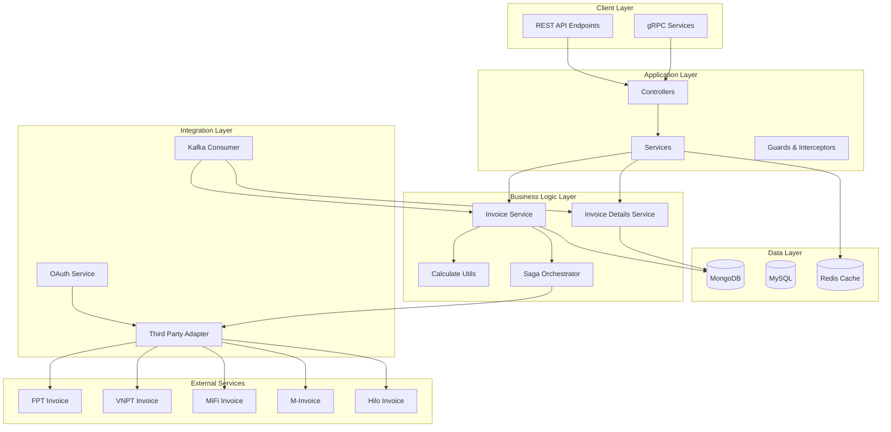
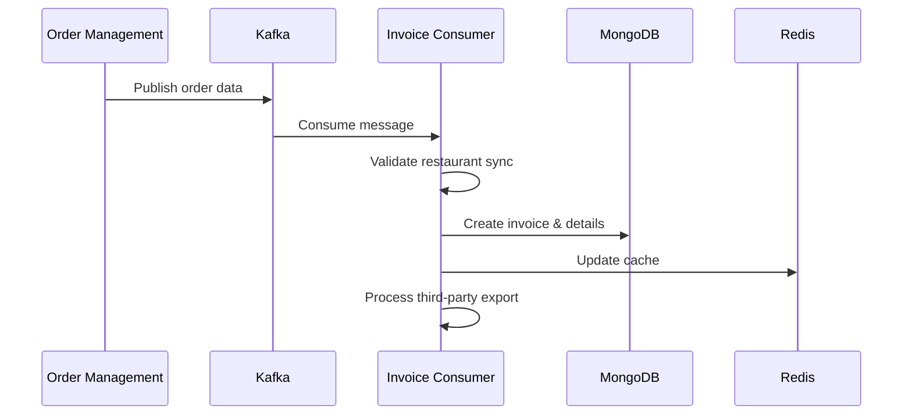
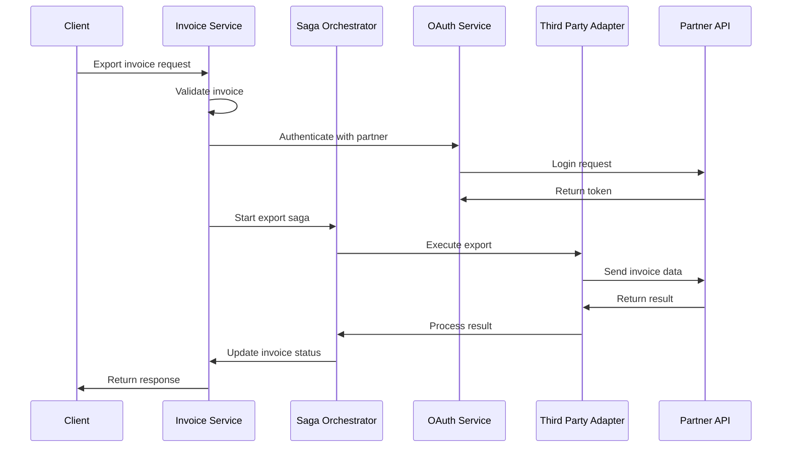
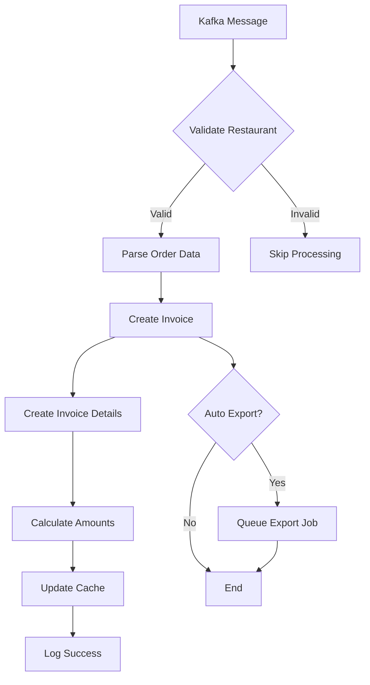
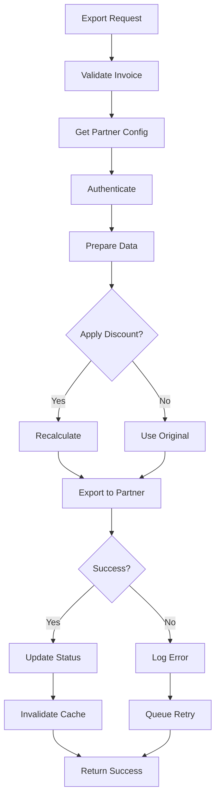
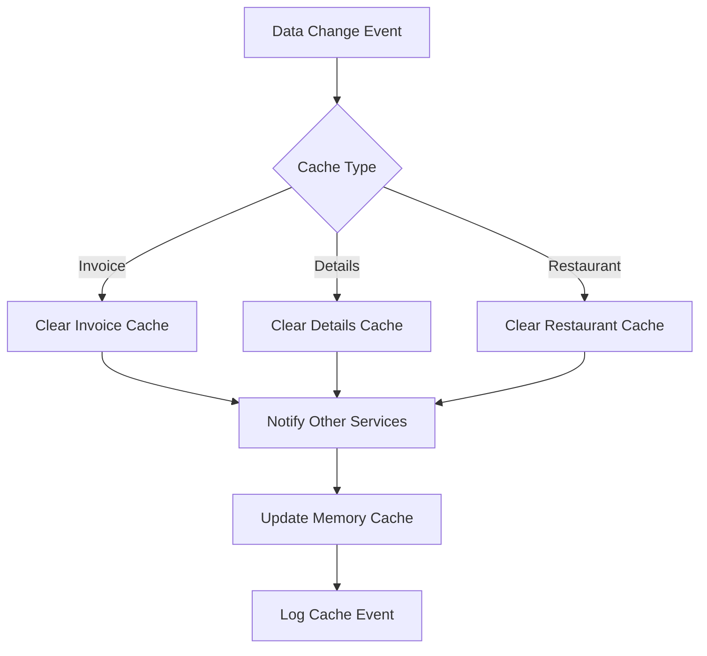

# Kiến Trúc Hệ Thống Invoice - TechRes

## Tổng Quan Kiến Trúc



## 1. API Architecture

### REST API Endpoints
- **Invoice Management**: `/v3/invoices`
- **Invoice Details**: `/v3/invoice-details`
- **Health Check**: `/health-check`

### gRPC Services
- Token validation
- Data validation
- Inter-service communication

## 2. Database Architecture

### MongoDB Collections
```
invoices/
├── _id: ObjectId
├── restaurant_id: number
├── order_id: number
├── customer_info: object
├── amounts: object
├── status: number
└── timestamps: object

invoice_details/
├── _id: ObjectId
├── order_id: number
├── food_info: object
├── pricing: object
└── calculations: object

invoice_send_failed/
├── _id: ObjectId
├── invoice_id: string
├── error_info: object
└── retry_count: number
```

### MySQL Entities
```
restaurant_partner_invoice/
├── id: number
├── restaurant_id: number
├── partner_type: enum
├── credentials: object
└── configuration: object

employee/
├── id: number
├── name: string
├── permissions: object
└── restaurant_id: number
```

## 3. Caching Strategy

### Redis Cache Layers
```
Cache Keys:
├── processed_order_ids (24h TTL)
├── restaurant_invoice_info (1h TTL)
├── invoice_details:order_{orderId} (3min TTL)
└── restaurant_partner_data (1h TTL)
```

### Cache Invalidation
- **Kafka-based**: Clear cache messages
- **Event-driven**: On invoice/detail updates
- **TTL-based**: Automatic expiration

## 4. Kafka Integration

### Topics
```
kafka.topic.invoice-sync
├── Producer: Order Management System
├── Consumer: Invoice Service
└── Message: Order data for invoice creation

kafka.topic.invoice-clear-restaurant-invoice-cache
├── Producer: Various services
├── Consumer: Cache Clear Service
└── Message: Cache invalidation commands
```

### Consumer Groups
- `electric-invoices-techres-local`
- `electric-invoices-clear-cache`

### Message Processing Flow


## 5. Third-Party Integration Flow

### Supported Partners
1. **FPT Invoice**
2. **VNPT Invoice**
3. **MiFi Invoice**
4. **M-Invoice**
5. **Hilo Invoice**

### Integration Pattern


### Saga Pattern Implementation
```
Export Invoice Saga Steps:
1. Validate Invoice
2. Create Log Entry
3. Call Third Party API
4. Update Invoice Status

Compensation Actions:
- Remove log entry
- Compensate third party call
- Revert invoice status
```

## 6. Luồng Xử Lý Chi Tiết

### 6.1 Invoice Creation Flow


### 6.2 Invoice Export Flow


### 6.3 Cache Management Flow


## 7. Error Handling & Monitoring

### Error Handling Strategy
- **Retry Mechanism**: 3 attempts with exponential backoff
- **Circuit Breaker**: Prevent cascade failures
- **Dead Letter Queue**: Failed message handling
- **Compensation**: Saga pattern for rollback

### Monitoring Points
- Kafka consumer lag
- Third-party API response times
- Cache hit/miss ratios
- Invoice processing metrics
- Error rates by partner

## 8. Performance Optimizations

### Batch Processing
- **Batch Size**: 20 invoices
- **Concurrency**: 15 parallel processes
- **Memory Cache**: 10-minute cleanup cycle

### Database Optimizations
- **Indexes**: Compound indexes on frequently queried fields
- **Aggregation**: Optimized pipeline for calculations
- **Connection Pooling**: Efficient resource usage

### Caching Strategy
- **Multi-level**: Memory + Redis
- **TTL-based**: Different expiration for different data types
- **Invalidation**: Event-driven cache clearing

## 9. Security Considerations

### Authentication & Authorization
- **OAuth 2.0**: Partner authentication
- **JWT Tokens**: API authentication
- **Role-based**: Access control

### Data Protection
- **Encryption**: Sensitive data encryption
- **Audit Logs**: All operations logged
- **Rate Limiting**: API protection

## 10. Deployment Architecture

### Containerization
- **Docker**: Application containerization
- **Environment**: Development/Staging/Production
- **Configuration**: Environment-based config

### Scalability
- **Horizontal**: Multiple consumer instances
- **Vertical**: Resource scaling
- **Load Balancing**: Request distribution

Cấu trúc này đảm bảo tính mở rộng, độ tin cậy và hiệu suất cao cho hệ thống xử lý hóa đơn điện tử.